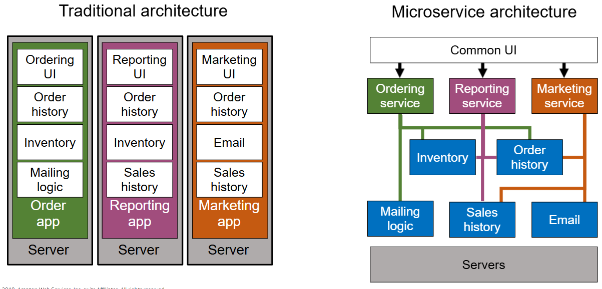
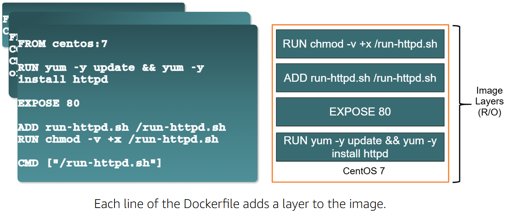

## 1. Introduction
### 1.1 What is a Container?
- In the <b>physical world</b>, container is a standardized unit of storage in the shipping industry. <u>Standardized containers provide a consistent, predictable unit of storage</u> that can be easily transferred to truck or rail transportation. By focusing on containers instead of individual pieces of cargo, we have improved efficiency,increased productivity, and reduced costs for consumers.This is a great example of using <u>abstraction</u> to increase agility.
- While in the <b>virtual world</b>, a container is <u>a standardized unit of software</u> designed to run quickly and reliably on any computing environment that is running the containerization platform.
- Containers are a form of virtualization that is implemented at the operating system level. ==Containers are lightweight, standalone packages that include everything needed to run an application=={!info}, such as code, runtime, system tools, system libraries, and settings.
- A single server can host <u>several containers that all share the underlying host system's OS Kernel</u>. These containers might be services that are part of a larger enterprise application, or they might be separate applications that are running in their isolated environment.

### 1.2 History of Virtualization
<u>Technical maturity is often associated with increasec levels of abstraction.</u> 

#### 1.2.1 Bare-metal servers
Bare metal refers to ==a physical computer=={.info}, specifically a server, that has one and only one operating system. <u>The distinction is important in modern computing because many, if not most, servers are virtual machines.</u> A physical server is typically a fairly large computer with powerful hardware built-in. 
Installing an operating system and running applications directly on that physical hardware, without virtualization, is referred to as running on “bare metal.”
- workstyle: With bare metal servers the architectural layers, such as the infrastructure and application software layers are built. For example: you install an operating system on top of your server hardware, install any shared libraries on top of that operating system, and then install your applications that use those libraries. 
- downside: 
    - it's massively inefficient: your hardware costs are the same whether you are running at 0% utilization or 100% utilization. 
    - keep the versions of your libraries <u>in sync with all your applications</u>: lf one application requires an updated version of a library that is incompatible with other applications running on that host, then you run into problems.

#### 1.2.2 Virtual machines
A virtual machine, commonly shortened to just VM, is no different than any other physical computer like a laptop, smart phone, or server. It has a CPU, memory, disks to store your files, and can connect to the internet if needed. While the parts that make up your computer (called hardware) are physical and tangible, ==VMs are often thought of as virtual computers or software-defined computers within physical servers, existing only as code.=={.info}
Virtual machines (VMs) are a way to run multiple applications on a single server. Each VM runs on top of a **hypervisor**, which is a piece of software that that can carve up the host resources into multiple isolated virtual hardware configuration which you can then treat as their own systems (each with an OS, binaries/libraries, and applications).
You can increase agility by <u>putting a **virtualization platform** over the operating system</u>. 
- workstyles: Now you have isolated applications and their libraries with their own full operating system into avirtual machine (VM). This improves utilization.
- downside:
    - the virtualization layer is "heavy": you may have four operating systemson the host instead of one.That means <u>more patching,more updates, significantly more space being taken upon the physical host.</u> 
    - significant redundancy: you've installed potentially the same OS four times, and potentially the same library three times.

#### 1.2.3 Containers
 Containers are a way to run multiple applications on a single server without the overhead of a hypervisor. Each container runs on top of a **container engine** (software that manages the lifecycle of containers), which oversees and isolates processes using the host operating system’s kernel features.
  - workstyles: The container runtime shares the operating systems kernel, enabling you to create container images using file system layers. 
  - advantages:
    - lightweight, efficient, and fast: They can be spun up and spun down faster than virtual machines, allowing for better utilization of the underlying hardware.
    - share libraries: You can share libraries when needed, but you can also have library isolation for your applications. 
    - highly portable: Because containers isolate software from the other layers, their code runs identically across different environments: from development and staging, all the way to production.

:::


And ==Docker=={.info} makes CONTAINER popular again.


### 1.3 What are the advantages of a microservice environment?
#### 1.3.1 Traditional vs microservice architecture
- Traditional architecture
Consider this example of atraditional architecture. All the processes for one of the applications are tightly coupled and run as a single service. 
    - This means that <u>if one process of the application experiences a spike in demand, the entire architecture must be scaled.</u>
    - Adding or improving features becomes more complex as the code base grows, which limits experimentation and makes it difficult to implement new ideas.
    - Monolithic architectures also add risk for application availability because many dependent and tightly coupled processes increase the impact of a single process failure. 
    - And you cansee where there is a lot of<u> redundancy of function across different applications.</u>
- Microservice architecture
Now consider the same three applications running ina microservice architecture: ==Each application is built as an independent component that runs as a service and communicates by using lightweight APl operations.=={.info}
    - Each service performs a single function that can support multiple applications. 
    - We also see <u>a migration away from dedicated servers to an abstracted hardware layer</u> where micro services can be intelligently placed based on needs, such as performance and resilience.


#### 1.3.2 Characteristics of microservices
- Decentralized,evolutionary design
    - Each container uses ==the language and technology that is best suited for the functioning of the service=={.info} instead of requiring users to use a specific language or a specific technology. 
    - Each component or system in the architecture is ==evolved separately=={.info} rather than updating the system in amonolithic style.
- Smart endpoints, dumb pipes

    There is no enterprise service bus(企业服务总线); data is not transformed when it's going between services. ==The service receiving the data should be smart enough to handle whatever it is sent.=={.info}
- Independent products, not projects

    Going against the traditional waterfall project model, think of a microservice as ==a separate product with its own inputs and outputs=={.info}. Containers help with this by enabling you to package all your dependencies and your libraries into a single immutable object.
- Designed for failure

    Everything fails all the time. Services are designed to be resilient, redundant, and to handle bad input, or if the service the microservice wants to communicate with is not there.
- Disposability可处理性

    We start fast, fail fast, and release any file handlers. Containers are added and removed, workloads change, and resources are temporary because they constantly change.
- Development and production parity对等

    ==Development, testing and production environments can be made consistent using containers.=={.info} 

To sum it all up,microservices and containers go well together. Containers are the underlying technology that powers modern microservices, and with microservice architectures, developers can take full advantage of containers.

### 1.4 Open Container Initiative (OCI)
The OCI is an industry collaboration that ==aims to create **open industry standards** for container formats and runtimes.=={.info} It was founded by companies like Docker, Google, VMware, Microsoft, Dell, IBM, and Oracle. 

The OCI's primary goal is to ensure the compatibility and interoperability of container environments through three defined technical specifications，which includes:

1. Image Specification: Defines the image's metadata and format, including a serializable file system.
2. Runtime Specification: Describes how to run a container using an image adhering to the Image Specification.
3. Distribution Specification: Outlines how images should be distributed, such as through registries, pushing, and pulling images.

Docker is a specific implementation of the OCI standard. When referring to Docker images or Docker container images, it means the Docker implementation of the OCI specification.


## 2. Underlying Technologies

### 2.1 Namespaces
Docker namespaces are a fundamental feature of Linux that ==Docker uses to create isolated environments for containers=={.info}. They provide a layer of isolation by <u>creating separate instances of global system resources, making each container believe it has its own unique set of resources.</u> 
Docker utilizes several types of namespaces, including PID (Process ID), NET (Network), MNT (Mount), UTS (Unix Timesharing System), IPC (InterProcess Communication), and USER namespaces and by leveraging these namespaces, Docker can create lightweight, portable, and secure containers that run consistently across different environments.

The best way to prevent privilege-escalation attacks from within a container is ==to configure your container's applications to run as unprivileged users.=={.info} For containers whose processes must run as the root user within the container, you can re-map this user to a less-privileged user on the Docker host. The mapped user is assigned a range of UIDs which function within the namespace as normal UIDs from 0 to 65536, but have no privileges on the host machine itself.

### 2.2 cgroups
cgroups or "control groups" are a Linux kernel feature that allows you to allocate and manage resources, such as CPU, memory, network bandwidth, and I/O, among groups of processes running on a system. It plays a crucial role in ==providing resource isolation and limiting the resources that a running container can use.=={.info} Docker utilizes cgroups to **enforce resource constraints on containers**, allowing them to have a consistent and predictable behavior. 

### 2.3 Union File systems
Union file systems, also known as UnionFS, play a crucial role in the overall functioning of Docker. It's a unique type of filesystem that ==creates a virtual, layered file structure by overlaying multiple directories.=={.info} Instead of modifying the original file system or merging directories, UnionFS enables the **simultaneous mounting of multiple directories on a single mount point while keeping their contents separate**. 
This feature is especially beneficial in the context of Docker, as it allows us to manage and optimize storage performance by minimizing duplication and reducing the container image size.


## 3. Docker Basics
### 3.1 Docker Components
There are ==3 key components=={.info} in the Docker ecosystem:

1. Dockerfile

    A text file containing instructions (commands) to build a Docker image.
    Each instruction in a Dockerfile creates <u>a read-only layer</u> in the image, making the container image an immutable object.
    If you change the Dockerfile and rebuild the image, ==only those layers that have changed are rebuilt.=={.info} This is part of what makes container images so lightweight, small, and fast, when compared to other virtualization technologies.

2. Docker Image

    A snapshot of a container, <u>created from a Dockerfile</u>. Images are stored in a registry, like Docker Hub, and can be pulled or pushed to the registry.
    An image is ==a read-only template=={.info} with instructions for creating a container. <u>A running container is an instance of an image.</u> 
    - You can create images from scratch
    - or you can use images that were created by others and published to a public or private registry. 
    An image is usually based on another image, with some customization.

3. Docker Container

    A running instance of a Docker image.



### 3.2 Docker Commands
Some essential Docker commands will be used frequently:
- ```bash
  docker pull <image>
    ```
    Download an image from a registry, like Docker Hub.

- ```bash
  docker build -t <image_name> <path>
    ```
    Build an image from a Dockerfile, where ```<path>``` is the directory containing the Dockerfile.

- ```bash
  docker image ls
    ```
    List all images available on your local machine.

- ```bash
  docker run -d -p <host_port>:<container_port> --name <container_name> <image>
    ```
    Run a container from an image, mapping host ports to container ports.

- ```bash
  docker container ls
    ```
    List all running containers.

- ```bash
  docker container stop <container>
    ```
    Stop a running container.

- ```bash
  docker container rm <container>
    ```
    Remove a stopped container.

- ```bash
  docker image rm <image>
    ```
    Remove an image from your local machine.


## 4. Data Persistence in Docker
When a container starts, it uses the files and configuration provided by the image. Each container is able to create, modify, and delete files and does so without affecting any other containers. When the container is deleted, these file changes are also deleted.

While this ephemeral nature of containers is great, ==it poses a challenge when you want to persist the data=={.info}. For example, if you restart a database container, you might not want to start with an empty database. So, how do you persist files?

### 4.1 Container Volumes
==Volumes are a storage mechanism that provide the ability to persist data beyond the lifecycle of an individual container.=={.note} Think of it like providing a shortcut or symlink from inside the container to outside the container. ==And it is created and managed by Docker.=={.note}That means When you create a volume, it's stored within a directory on the Docker host. 

#### 4.1.1 Mounting a volume over existing data
- If you mount a ```non-empty``` volume into a directory in the container in which files or directories exist, the pre-existing files are <u>obscured by the mount.</u> 

    This is similar to if you were to save files into /mnt on a Linux host, and then mounted a USB drive into /mnt. The contents of /mnt would be obscured by the contents of the USB drive until the USB drive was unmounted.

    With containers, there's no straightforward way of removing a mount to reveal the obscured files again. Your best option is to recreate the container without the mount.

- If you mount an ```empty``` volume into a directory in the container in which files or directories exist, these files or directories are <u>propagated (copied) into the volume by default.</u> Similarly, if you start a container and specify a volume which does not already exist, an empty volume is created for you. This is a good way to pre-populate data that another container needs.

- To prevent Docker from copying a container's pre-existing files into an empty volume, use the ```volume-nocopy``` option.

#### 4.1.2 Named and anonymous volumes
A volume may be named or anonymous. Anonymous volumes are given a random name that's guaranteed to be unique within a given Docker host. Just like named volumes, anonymous volumes persist even if you remove the container that uses them, except if you use the ```--rm``` flag when creating the container, in which case the anonymous volume associated with the container is destroyed.

If you create multiple containers consecutively that each use anonymous volumes, each container creates its own volume. Anonymous volumes aren't reused or shared between containers automatically. To share an anonymous volume between two or more containers, you must mount the anonymous volume using the random volume ID.

#### 4.1.3 Syntax
To mount a volume with the ```docker run ```command, you can use either the ```--mount``` or ```--volume``` flag.
```bash
$ docker run --mount type=volume,src=<volume-name>,dst=<mount-path>
$ docker run --volume <volume-name>:<mount-path>
```
In general, ==```--mount``` is preferred.=={.note} The main difference is that the ```--mount``` flag is more explicit and supports all the available options.

#### 4.1.4 Create and manage volumes
Unlike a bind mount, you can create and manage volumes <u>outside the scope of any container.</u>

- **Create** a volume: create a volume named ```log-data```.
    ```bash
    $ docker volume create log-data
    ```
- **List** volumes:
    ```bash
    $ docker volume ls

    local          my-vol
    ```
- **Inspect** a volume:
    ```bash
    $ docker volume inspect my-vol
    [
        {
            "Driver": "local",
            "Labels": {},
            "Mountpoint": "/var/lib/docker/volumes/my-vol/_data",
            "Name": "my-vol",
            "Options": {},
            "Scope": "local"
        }
    ]
    ```
- **Remove** a volume:
    ```bash
    docker volume rm my-vol
    ```

#### 4.1.5 Start a container with a volume
If you start a container with a volume that doesn't yet exist, Docker will <u>automatically create it</u> for you.

The following example mounts the volume ```myvol2``` into ```/app/``` in the container.

The following ```-v``` and ```--mount``` examples produce the same result.

::: code-tabs
@tab --mount
```bash
docker run -d \
  --name devtest \
  --mount source=myvol2,target=/app \
  nginx:latest
```

@tab -v
```bash
docker run -d \
  --name devtest \
  -v myvol2:/app \
  nginx:latest
```
:::

When the container runs, ==all files it writes into the ```/app``` folder will be saved in this volume,=={.note} outside of the container. If you delete the container and start a new container using the same volume, the files will still be there.

::: tip Sharing files using volumes
You can <u>attach the same volume to multiple containers to share files between containers.</u> This might be helpful in scenarios such as log aggregation, data pipelines, or other event-driven applications.
:::

### 4.2 Bind mounts
When you use a bind mount, a file or directory ==on the host machine=={.note} is mounted from the host into a container. 

By contrast, when you use a volume, a new directory is created <u>within Docker's storage directory on the host machine, and Docker manages that directory's contents.</u>

#### 4.2.1 Bind-mounting over existing data
If you bind mount file or directory into a directory in the container <u>in which files or directories exist</u>, the pre-existing files are <u>obscured by the mount.</u> 

This is similar to if you were to save files into ```/mnt``` on a Linux host, and then mounted a USB drive into ```/mnt```. The contents of ```/mnt``` would be obscured by the contents of the USB drive until the USB drive was unmounted.

With containers, there's no straightforward way of removing a mount to reveal the obscured files again. Your best option is to recreate the container without the mount.

#### 4.2.2 Considerations and constraints
- Bind mounts ==have write access=={.info} to files on the host by default.

    One side effect of using bind mounts is that you can change the host filesystem via processes running in a container, including creating, modifying, or deleting important system files or directories. This capability can have <u>security implications</u>. For example, it may affect non-Docker processes on the host system.
    
    You can use the readonly or ro option to prevent the container from writing to the mount.

- Bind mounts are created to the Docker daemon host, not the client.

    If you're using a remote Docker daemon, you can't create a bind mount to access files on the client machine in a container.

    For Docker Desktop, the daemon runs inside a Linux VM, not directly on the native host. Docker Desktop has built-in mechanisms that transparently handle bind mounts, allowing you to share native host filesystem paths with containers running in the virtual machine.

- Containers with bind mounts are ==strongly tied to the host=={.info}.

    Bind mounts rely on the host machine's filesystem <u>having a specific directory structure available</u>. This reliance means that containers with bind mounts <u>may fail if run on a different host without the same directory structure.</u>

#### 4.2.3 Syntax
To create a bind mount, you can use either the ```--mount``` or ```--volume``` flag.
```bash
$ docker run --mount type=bind,src=<host-path>,dst=<container-path>
$ docker run --volume <host-path>:<container-path>
```
In general, ==```--mount``` is preferred.=={.note} The main difference is that the ```--mount``` flag is more explicit and supports all the available options.

- If you use ```--volume``` to bind-mount a file or directory that <u>does not yet exist</u> on the Docker host, Docker <u>automatically creates</u> the directory on the host for you. It's always created as a directory.

- ```--mount``` ==does not automatically create a directory=={.note} if the specified mount path does not exist on the host. Instead, it produces an error.

#### 4.2.4 Start a container with a bind mount
Consider a case where you have a directory ```source``` and that when you build the source code, the artifacts are saved into another directory, ```source/target/```. You want the artifacts to be available to the container at ```/app/```, and you want the container to get access to a new build each time you build the source on your development host. 

Use the following command to bind-mount the ```target/``` directory into your container at ```/app/```. Run the command from <u>within the ```source directory```</u>. The ```$(pwd)``` sub-command <u>expands to the current working directory on Linux or macOS hosts.</u> If you're on Windows, see also [Path conversions on Windows](https://docs.docker.com/desktop/troubleshoot-and-support/troubleshoot/topics/).


The following ```-v``` and ```--mount``` examples produce the same result. You can't run them both unless you remove the ```devtest```container after running the first one.

::: code-tabs
@tab --mount
```bash
docker run -d \
  -it \
  --name devtest \
  --mount type=bind source="$(pwd)"/target,target=/app \
  nginx:latest
```

@tab -v
```bash
docker run -d \
  -it \
  --name devtest \
  -v "$(pwd)"/target:/app \
  nginx:latest
```
:::


### 4.3 Difference between volumes and bind mounts

#### 4.3.1 When to use bind mounts
Bind mounts are appropriate for the following types of use case:

- ==Sharing source code or build artifacts=={.note} between a development environment on the Docker host and a container.

- When you want to create or generate files in a container and <u>persist the files onto the host's filesystem</u>.

- Sharing configuration files <u>from the host machine to containers.</u> This is how Docker provides DNS resolution to containers by default, by mounting ```/etc/resolv.conf``` from the host machine into each container.

- Bind mounts are also available for builds: you can bind mount source code from the host into the build container to test, lint, or compile a project.

#### 4.3.2 When to use volumes
Volumes are a good choice for the following use cases:

- Volumes are <u>easier to back up or migrate</u> than bind mounts.
- You can manage volumes using Docker CLI commands or the Docker API.
- Volumes work on both Linux and Windows containers.
- Volumes can be more safely shared among multiple containers.
- New volumes can <u>have their content pre-populated by a container or build.</u>
- When your application <u>requires high-performance I/O.</u>

::: warning
Volumes are **not** a good choice if you need to access the files from the host, as the volume is completely managed by Docker. Use bind mounts if you need to access files or directories from both containers and the host.
:::


## 5. Using 3rd Party Container Images
### 5.1 Databases
Using a local containerized database offers flexibility and ease of setup, letting you mirror production environments closely without the overhead of traditional database installations. Docker simplifies this process, enabling you to deploy, manage, and scale databases in isolated containers with just a few commands.

The following wil use the MySQL image for examples, but the concepts can be applied to other database images.
#### 5.1.1 Run a local containerized database
Most popular database systems, including MySQL, PostgreSQL, and MongoDB, have a Docker Official Image available on Docker Hub. (Though I can't access the page)

To run a database container, you can use either the Docker Desktop GUI or CLI. (Just write down how to use CLI)

To run a container using the CLI, run the following command in a terminal:
```bash
$ docker run --name my-mysql -e MYSQL_ROOT_PASSWORD=my-secret-pw -e MYSQL_DATABASE=mydb -d mysql:latest
```
In this command:
- ```--name my-mysql``` assigns the name my-mysql to your container for easier reference.
- ```-e MYSQL_ROOT_PASSWORD=my-secret-pw``` sets the root password for MySQL to my-secret-pw. 
- ```-e MYSQL_DATABASE=mydb``` optionally creates a database named mydb. 
- ```-d``` runs the container in <u>detached mode, meaning it runs in the background</u>.
- ```mysql:latest``` specifies that you want to use the latest version of the MySQL image.

To verify that you container is running, run docker ps in a terminal

#### 5.1.2 Access the shell of a containerized database
When you have a database running inside a Docker container, you may need to <u>access its shell to manage the database, execute commands, or perform administrative tasks.</u> Docker provides a straightforward way to do this using the ```docker exec```command. Additionally, if you prefer a graphical interface, you can use Docker Desktop's GUI.

To access the terminal of a MySQL container **using the CLI**, you can use the following ```docker exec``` command.
```bash
$ docker exec -it my-mysql bash
```
In this command:
- ```docker exec``` tells Docker you want to **execute a command in a running container**.
- ```-it``` ensures that the terminal you're **accessing is interactive**, so you can type commands into it.
- ```my-mysql``` is the name of your MySQL container. If you named your container differently when you ran it, use that name instead.
- ```bash``` is <u>the command you want to run inside the container</u>. It opens up a bash shell that lets you interact with the container's file system and installed applications.

After executing this command, you will ==be given access to the bash shell inside your MySQL container, from which you can manage your MySQL server directly.=={.info} You can run ```exit``` to return to your terminal.

---
Once you've accessed the container's terminal, you can run <u>any tools</u> available in that container. The following example shows using mysql in the container to list the databases.
```sql
# mysql -u root -p
Enter password: my-secret-pw

mysql> SHOW DATABASES;

+--------------------+
| Database           |
+--------------------+
| information_schema |
| mydb               |
| mysql              |
| performance_schema |
| sys                |
+--------------------+
5 rows in set (0.00 sec)
```

#### 5.1.3 Connect to a containerized database from your host
Connecting to a containerized database from your host machine involves **mapping a port inside the container to a port on your host machine**. This process ensures that the database inside the container is accessible <u>via the host machine's network</u>. For MySQL, the default port is 3306. By exposing this port, you can use various database management tools or applications on your host machine to interact with your MySQL database.

Run the following command in a terminal:
```bash 
docker run -p 3307:3306 --name my-mysql -e MYSQL_ROOT_PASSWORD=my-secret-pw -e MYSQL_DATABASE=mydb -d mysql:latest
```
In this command, ```-p 3307:3306``` ==maps port 3307 on the host to port 3306 in the container.=={.note}

To verify the port is mapped, run the following command.
``` bash
docker ps
```
You should see output like the following:
``` bash
CONTAINER ID   IMAGE          COMMAND                  CREATED          STATUS          PORTS                               NAMES
6eb776cfd73c   mysql:latest   "docker-entrypoint.s…"   17 minutes ago   Up 17 minutes   33060/tcp, 0.0.0.0:3307->3306/tcp   my-mysql
```
At this point, <u>**any** application running on your host</u> can access the MySQL service in the container at ```localhost:3307```.

#### 5.1.4 Connect to a containerized database from another container
Connecting to a containerized database from another container is a common scenario in microservices architecture and during development processes. **Docker's networking** capabilities make it easy to establish this connection without having to expose the database to the host network. ==This is achieved by placing both the database container and the container that needs to access it on the same Docker network.=={.note}

As a result, **you should create a network first** and run containers on it. To achieve it:
1. Run the following command to create a Docker network named my-network.
    ```bash
    docker network create my-network
    ```
2. Run your database container and ==specify the network using the ```--network``` option=={.note}. This runs the container on the my-network network.
    ``` bash
    docker run --name my-mysql -e MYSQL_ROOT_PASSWORD=my-secret-pw -e MYSQL_DATABASE=mydb --network my-network -d mysql:latest
    ```
3. Run your other containers and specify the network using the ```--network option```. For this example, you'll run a phpMyAdmin container that can connect to your database.
    
    Run a phpMyAdmin container. Use the ```--network``` option to specify the network, the ```-p``` option to let you access the container from your host machine, and the ```-e``` option to specify a required environment variable for this image.
    ```bash
    docker run --name my-phpmyadmin -d --network my-network -p 8080:80 -e PMA_HOST=my-mysql phpmyadmin
    ```
4. Verify that the containers can communicate. For this example, you'll access phpMyAdmin and verify that it connects to the database.
- Open http://localhost:8080 to access your phpMyAdmin container.
- Log in using ```root``` as the username and ```my-secret-pw``` as the password. You should connect to the MySQL server and see your database listed.

At this point, **any application running on your ```my-network``` container network** can access the MySQL service in the container at ```my-mysql:3306```.

#### 5.1.5 Persist database data in a volume
Persisting database data in a Docker volume is necessary for ensuring that your data survives container restarts and removals. A Docker volume lets you store database files outside the container's writable layer, making it possible to upgrade the container, switch bases, and share data without losing it. Here’s how you can attach a volume to your database container using either the Docker CLI or the Docker Desktop GUI.

To run your database container **with a volume attached**, include the ```-v``` option with your ```docker run``` command, specifying a volume name and the path where the database stores its data inside the container. If the volume doesn't exist, Docker automatically creates it for you.

To run a database container with a volume attached, and then verify that the data persists:
1. Run the container and attach the volume.
    ```bash
    docker run --name my-mysql -e MYSQL_ROOT_PASSWORD=my-secret-pw -e MYSQL_DATABASE=mydb -v my-db-volume:/var/lib/mysql -d mysql:latest
    ```
    This command mounts the volume named ```my-db-volume``` to the ```/var/lib/mysql``` directory in the container.
2. Create some data in the database. Use the ```docker exec``` command to run ```mysql``` inside the container and create a table.
    ```bash
    docker exec my-mysql mysql -u root -p my-secret-pw -e "CREATE TABLE IF NOT EXISTS mydb.mytable (column_name VARCHAR(255)); INSERT INTO mydb.mytable (column_name) VALUES ('value');"
    ```
    This command uses the ```mysql``` tool in the container to create a table named ```mytable``` with a column named ```column_name```, and finally inserts a value of ```value```.
3. Stop and remove the container. Without a volume, the table you created would be lost when removing the container.
    ```bash
    docker remove --force my-mysql
    ```
4. Start a new container with the volume attached. This time, ==you don't need to specify any environment variables as the configuration is saved in the volume=={.note}.
    ```bash
    docker run --name my-mysql -v my-db-volume:/var/lib/mysql -d mysql:latest
    ```
5. Verify that the table you created still exists. Use the ```docker exec``` command again to run ```mysql``` inside the container.
    ```bash 
    docker exec my-mysql mysql -u root -p my-secret-pw -e "SELECT * FROM mydb.mytable;"
    ```
    This command uses the ```mysql``` tool in the container to select all the records from the ```mytable``` table.
    
    You should see output like the following.
    ```bash 
    column_name
    value
    ```
At this point, any MySQL container that mounts the ```my-db-volume``` will be able to access and save persisted data.

#### 5.1.6 Build a customized database image
Customizing your database image lets you **include additional configuration, scripts, or tools alongside the base database server**. This is particularly useful for creating a Docker image that matches your specific development or production environment needs. The following example outlines how to build and run a custom MySQL image that includes a table initialization script.

To build and run your custom image:
1. ==Create a Dockerfile=={.note}.
- Create a file named ```Dockerfile``` in your project directory. For this example, you can create the ```Dockerfile``` in an empty directory of your choice. <u>This file will define how to build your custom MySQL image.</u>
- Add the following content to the Dockerfile.
    ```dockerfile
    # syntax=docker/dockerfile:1

    # Use the base image mysql:latest
    FROM mysql:latest

    # Set environment variables
    ENV MYSQL_DATABASE mydb

    # Copy custom scripts or configuration files from your host to the container
    COPY ./scripts/ /docker-entrypoint-initdb.d/
    ```
    In this Dockerfile, you've set the environment variable for the MySQL database name. You can also use the ```COPY``` instruction to add custom configuration files or scripts into the container. In this example, ==files from your host's ```./scripts/``` directory are copied into the container's ```/docker-entrypoint-initdb.d/``` directory=={.note}. In this directory, ```.sh```, ```.sql```, and ```.sql.gz``` scripts are executed when the container is started for the first time.
- Create a script file to initialize a table in the database. <u>In the directory where your ```Dockerfile``` is located, create a subdirectory named ```scripts```,</u> and then create a file named ```create_table.sql``` with the following content.
    ```sql
    CREATE TABLE IF NOT EXISTS mydb.myothertable (
    column_name VARCHAR(255)
    );

    INSERT INTO mydb.myothertable (column_name) VALUES ('other_value');
    ```
    You should now have the following directory structure.
    ```
    ├── your-project-directory/
    │ ├── scripts/
    │ │ └── create_table.sql
    │ └── Dockerfile
    ```
2. ==Build your image=={.note}.
- In a terminal, change directory to the directory where your ```Dockerfile``` is located.
- Run the following command to build the image.
    ```bash
    docker build -t my-custom-mysql .
    ```
    In this command, ==```-t my-custom-mysql``` tags (names) your new image as ```my-custom-mysql```=={.note}. The period (.) at the end of the command ==specifies the current directory as the context for the build=={.note}, where **Docker looks for the Dockerfile and any other files needed for the build**.
3. Run your image. This time, <u>specify your image's name</u> instead of ```mysql:latest```. Also, you no longer need to specify the ```MYSQL_DATABASE``` environment variable as it's now defined by your Dockerfile.
    ```bash
    docker run --name my-mysql -e MYSQL_ROOT_PASSWORD=my-secret-pw -d my-custom-mysql
    ```
4. Verify that your container is running with the following command.
    ```bash
    docker ps
    ```
5. Verify that your initialization script was ran. Run the following command in a terminal to show the contents of the myothertable table.
    ```bash
    docker exec my-mysql mysql -u root -p my-secret-pw -e "SELECT * FROM mydb.myothertable;"
    ```
    You should see output like the following.
    ```bash
    column_name
    other_value
    ```
Any container ran using your ```my-custom-mysql``` image will have the table initialized when first started.

#### 5.1.7 Use Docker Compose to run a database
Docker Compose is a tool for defining and running multi-container Docker applications. With a single command, you can configure all your application's services (like databases, web apps, etc.) and manage them. In this example, you'll create a Compose file and use it to run a MySQL database container and a phpMyAdmin container.

To run your containers with Docker Compose:
1. Create a **Docker Compose file**.
- Create a file named ```compose.yaml``` in your project directory. This file will define the services, networks, and volumes.
- Add the following content to the ```compose.yaml``` file.
    ```yaml
    services:
    db:
        image: mysql:latest
        environment:
        MYSQL_ROOT_PASSWORD: my-secret-pw
        MYSQL_DATABASE: mydb
        ports:
        - 3307:3306
        volumes:
        - my-db-volume:/var/lib/mysql

    phpmyadmin:
        image: phpmyadmin/phpmyadmin:latest
        environment:
        PMA_HOST: db
        PMA_PORT: 3306
        MYSQL_ROOT_PASSWORD: my-secret-pw
        ports:
        - 8080:80
        depends_on:
        - db

    volumes:
    my-db-volume:
    ```
    For the database service:
    - ```db``` is the name of the service.
    - ```image: mysql:latest``` specifies that the service uses the latest MySQL image from Docker Hub.
    - ```environment``` lists the environment variables used by MySQL to initialize the database, such as the root password and the database name.
    - ```ports``` maps port 3307 on the host to port 3306 in the container, allowing you to connect to the database from your host machine.
    - ```volumes``` mounts ```my-db-volume``` to ```/var/lib/mysql``` inside the container to persist database data.
    
    In addition to the database service, there is a phpMyAdmin service. <u>By default Compose sets up a single network for your app. Each container for a service joins the default network and is both reachable by other containers on that network, and discoverable by the service's name. </u>Therefore, in the ```PMA_HOST``` environment variable, you can specify the service name, ```db```, in order to connect to the database service. 
2. Run Docker Compose.
- Open a terminal and change directory to the directory where your ```compose.yaml``` file is located.
- Run Docker Compose using the following command.
    ```bash
    docker compose up
    ```
    You can now access phpMyAdmin at http://localhost:8080 and connect to your database using ```root``` as the username and ```my-secret-pw``` as the password.
- To stop the containers, press ```ctrl+c``` in the terminal.

Now, with Docker Compose you can <u>start your database and app, mount volumes, configure networking, and more,</u> all with a **single** command.

### 5.2 Interactive Test Environments
#### 5.2.1 Source
You can launch a dev environment from a:
- Git repository
- Branch or tag of a Git repository
- Sub-folder of a Git repository
- Local folder

This does not conflict with any of the local files or local tooling set up on your host. 

#### 5.2.2 Launch a dev environment from a Git repository

To launch a dev environment:

1. From the **Dev Environments** tab in Docker Dashboard, select **Create**. The **Create a Dev Environment** dialog displays.
2. Select **Get Started**. 
3. Optional: Provide a name for you dev environment.
4. Select **Existing Git repo** as the source and then paste your Git repository link into the field provided: https://github.com/dockersamples/single-dev-env
5. Choose your IDE. You can choose either:
    - **Visual Studio Code**. The Git repository is cloned into a Volume and attaches to your containers. This allows you to develop directly inside of them using Visual Studio Code.
    - **Other**. The Git repository is cloned into your chosen local directory and attaches to your containers as a bind mount. This shares the directory from your computer to the container, and allows you to develop using any local editor or IDE.
6. Select **Continue**.

To launch the application, run the command `make run` in your terminal. This opens an http server on port 8080. Open [http://localhost:8080](http://localhost:8080) in your browser to see the running application.

> Tip
>
> To use the `make` command in Windows, try `Makefile Tool` in VS Code.


### 5.3 Command Line Utilities
About some command line references.
- `Docker Images ls`: List images, most of the options allow users to look into details like digest, image ID, tag, repository, etc. Refer to [Docker image ls](https://docs.docker.com/engine/reference/commandline/images/) for more information.
- `Docker Run`: Create and run a new container, pulling the image if needed and starting the container. There are lots of options here, and can't list all out. Refer to [Docker run](https://docs.docker.com/reference/cli/docker/container/run/).
- `Docker Image Pull`: Download an image from a registry, and options in this command allow users to choose which image should be pulled, using repository/tag/digest and so on. Refer to [Docker image pull](https://docs.docker.com/engine/reference/commandline/pull/).


## 6. Building Container Images
### 6.1 Dockerfiles
Docker can build images automatically by reading the instructions from a Dockerfile. A Dockerfile is a text document that contains all the commands a user could call on the command line to assemble an image. 

#### 6.1.1 Commands Overview
The Dockerfile supports the following instructions. And here I would not list all the usages regarding every command, since it's pretty too long. Refer to [Dockerfile Reference](https://docs.docker.com/reference/dockerfile/#overview) to view details:

| Instruction                            | Description                                                 |
| :------------------------------------- | :---------------------------------------------------------- |
| [`ADD`](#add)                          | Add local or remote files and directories.                  |
| [`ARG`](#arg)                          | Use build-time variables.                                   |
| [`CMD`](#cmd)                          | Specify default commands.                                   |
| [`COPY`](#copy)                        | Copy files and directories.                                 |
| [`ENTRYPOINT`](#entrypoint)            | Specify default executable.                                 |
| [`ENV`](#env)                          | Set environment variables.                                  |
| [`EXPOSE`](#expose)                    | Describe which ports your application is listening on.      |
| [`FROM`](#from)                        | Create a new build stage from a base image.                 |
| [`HEALTHCHECK`](#healthcheck)          | Check a container's health on startup.                      |
| [`LABEL`](#label)                      | Add metadata to an image.                                   |
| [`MAINTAINER`](#maintainer-deprecated) | Specify the author of an image.                             |
| [`ONBUILD`](#onbuild)                  | Specify instructions for when the image is used in a build. |
| [`RUN`](#run)                          | Execute build commands.                                     |
| [`SHELL`](#shell)                      | Set the default shell of an image.                          |
| [`STOPSIGNAL`](#stopsignal)            | Specify the system call signal for exiting a container.     |
| [`USER`](#user)                        | Set user and group ID.                                      |
| [`VOLUME`](#volume)                    | Create volume mounts.                                       |
| [`WORKDIR`](#workdir)                  | Change working directory.                                   |

#### 6.1.2 Format
Here is the format of the Dockerfile:
```dockerfile
# Comment
INSTRUCTION arguments
```
The instruction is **not case-sensitive**. However, convention is for them to be **UPPERCASE** to distinguish them from arguments more easily.

Docker runs instructions in a Dockerfile <u>in order</u>. A Dockerfile **must begin with a `FROM` instruction**. This may be after parser
directives, comments, and globally scoped ARGs. The `FROM` instruction specifies the [base image](https://docs.docker.com/glossary/#base-image) from which you are building. 

For comments, buildKit treats <u>lines that begin with `#` as a comment</u>, unless the line is a valid parser directive. A `#` marker anywhere else in a line is treated as an argument. This allows statements like:

```dockerfile
# Comment
RUN echo 'we are running some # of cool things'
```

Comment lines are **removed** before the Dockerfile instructions are executed. The comment in the following example is removed before the shell executes the `echo` command.

```dockerfile
RUN echo hello \
# comment
world
```

The following examples is equivalent.

```dockerfile
RUN echo hello \
world
```

Comments don't support line continuation characters.

> [!NOTE]
> **Note on whitespace**
>
> For backward compatibility, leading whitespace before comments (`#`) and
> instructions (such as `RUN`) are ignored, but discouraged. Leading whitespace
> is not preserved in these cases, and the following examples are therefore
> equivalent:
>
> ```dockerfile
>         # this is a comment-line
>     RUN echo hello
> RUN echo world
> ```
>
> ```dockerfile
> # this is a comment-line
> RUN echo hello
> RUN echo world
> ```
>
> Whitespace in instruction arguments, however, isn't ignored.
> The following example prints `    hello    world`
> with leading whitespace as specified:
>
> ```dockerfile
> RUN echo "\
>      hello\
>      world"
> ```

#### 6.1.3 Parser directives
Parser directives are optional, and affect the way in which subsequent lines in a Dockerfile are handled. Parser directives don't add layers to the build, and don't show up as build steps. Parser directives are written as a special type of comment in the form `# directive=value`. **A single directive may only be used once.**

The following parser directives are supported:

- `syntax`
- `escape`
- `check` (since Dockerfile v1.8.0)

**All parser directives must be at the top of a Dockerfile.**


##### 6.1.3.1 syntax
Use the `syntax` parser directive to <u>declare the Dockerfile syntax version to use for the build</u>. If unspecified, BuildKit uses a bundled version of the Dockerfile frontend. 

Most users will want to set this parser directive to `docker/dockerfile:1`, which causes BuildKit to pull the ==latest stable version of the Dockerfile syntax=={.info} before the build.

```dockerfile
# syntax=docker/dockerfile:1
```

For more information about how the parser directive works, see
[Custom Dockerfile syntax](https://docs.docker.com/build/buildkit/dockerfile-frontend/).

##### 6.1.3.2 escape

```dockerfile
# escape=\
```

Or

```dockerfile
# escape=`
```

The `escape` directive sets the character used to escape characters in a Dockerfile. If not specified, the default escape character is `\`.

The escape character is used both to escape characters in a line, and to escape a newline. This allows a Dockerfile instruction to
span multiple lines. Note that regardless of whether the `escape` parser directive is included in a Dockerfile, escaping is not performed in a `RUN` command, except at the end of a line.

Setting the escape character to `` ` `` is especially useful on
`Windows`, where `\` is the directory path separator. `` ` `` is consistent with Windows PowerShell.

##### 6.1.3.3 check
```dockerfile
# check=skip=<checks|all>
# check=error=<boolean>
```

The `check` directive is used to configure how build checks are evaluated. By default, all checks are run, and failures are treated as
warnings.

You can disable specific checks using `#check=skip=<check-name>`. To specify multiple checks to skip, separate them with a comma:
```dockerfile
# check=skip=JSONArgsRecommended,StageNameCasing
```
To disable all checks, use `#check=skip=all`.

#### 6.1.2 Building best practices
##### 6.1.2.1 Use **multi-stage builds**

Multi-stage builds let you reduce the size of your final image, by creating a cleaner separation between the building of your image and the final output. Split your Dockerfile instructions into distinct stages to make sure that the resulting output only contains the files that are needed to run the application.

Using multiple stages can also let you build more efficiently by executing build steps in parallel.

##### 6.1.2.2 Create reusable stages
If you have multiple images with a lot in common, consider **creating a reusable stage that includes the shared components**, and basing your unique stages on that. Docker only needs to build the common stage once. This means that your derivative images use memory
on the Docker host more efficiently and load more quickly.

It's also easier to maintain a common base stage ("Don't repeat yourself"), than it is to have multiple different stages doing similar things.

##### 6.1.2.3 Choose the right base image
The first step towards achieving a secure image is to choose the right base image. When choosing an image, ensure it's built from a trusted source and keep it small.

- [Docker Official Images](https://hub.docker.com/search?image_filter=official) are a curated collection that have clear documentation, promote best practices, and are regularly updated. They provide a trusted starting point for many applications.
- [Verified Publisher](https://hub.docker.com/search?image_filter=store) images are high-quality images published and maintained by the organizations partnering with Docker, with Docker verifying the authenticity of the content in their repositories.
- [Docker-Sponsored Open Source](https://hub.docker.com/search?image_filter=open_source) are published and maintained by open source projects sponsored by Docker through an open source program.

You should also consider using two types of base image: one for building and unit testing, and another (typically slimmer) image for production. In the later stages of development, your image may not require build tools such as compilers, build systems, and debugging tools. A small image with minimal dependencies can considerably lower the attack surface.

##### 6.1.2.4 Rebuild your images often
Docker images are immutable. Building an image is taking a snapshot of that image at that moment. That includes any base images, libraries, or other software you use in your build. <u>To keep your images up-to-date and secure, make sure to rebuild your image often, with updated dependencies.</u>

To ensure that you're getting the latest versions of dependencies in your build, you can use the `--no-cache` option to avoid cache hits.
```console
$ docker build --no-cache -t my-image:my-tag .
```

The following Dockerfile uses the `24.04` tag of the `ubuntu` image. Over time, that tag may resolve to a different underlying version of the `ubuntu` image, as the publisher rebuilds the image with new security patches and updated libraries. Using the `--no-cache`, you can avoid cache hits and ensure a fresh download of base images and dependencies.

```dockerfile
# syntax=docker/dockerfile:1
FROM ubuntu:24.04
RUN apt-get -y update && apt-get install -y --no-install-recommends python3
```

##### 6.1.2.5 Exclude with .dockerignore
To exclude files not relevant to the build, without restructuring your source repository, use a `.dockerignore` file. This file supports exclusion patterns similar to `.gitignore` files.

For example, to exclude all files with the `.md` extension:
```plaintext
*.md
```
For information on creating one, see
[Dockerignore file](/manuals/build/concepts/context.md#dockerignore-files).

##### 6.1.2.6 Create ephemeral containers
The image defined by your Dockerfile should generate containers that are as ephemeral as possible. Ephemeral means that the container can be stopped and destroyed, then rebuilt and replaced with an absolute minimum set up and configuration.

Refer to [Processes](https://12factor.net/processes) under _The Twelve-factor App_ methodology to get a feel for the motivations of running containers in such a stateless fashion.

##### 6.1.2.7 Don't install unnecessary packages

Avoid installing extra or unnecessary packages just because they might be nice to have. For example, you don’t need to include a text editor in a database image.

When you avoid installing extra or unnecessary packages, your images have reduced complexity, reduced dependencies, reduced file sizes, and reduced build times.

##### 6.1.2.8 **Decouple** applications
Each container should have only one concern. Decoupling applications into multiple containers makes it easier to scale horizontally and reuse containers.

For instance, a web application stack might consist of three separate
containers, each with its own unique image, to manage the web application, database, and an in-memory cache in a decoupled manner.

Use your best judgment to keep containers as clean and modular as possible. If containers depend on each other, you can use [Docker container networks](/manuals/engine/network/_index.md)
to ensure that these containers can communicate.

##### 6.1.2.9 Sort multi-line arguments
Whenever possible, sort multi-line arguments **alphanumerically** to make maintenance easier. This helps to avoid duplication of packages and make the list much easier to update. This also makes PRs a lot easier to read and review. Adding a space before a backslash (`\`) helps as well.

Here’s an example from the [buildpack-deps image](https://github.com/docker-library/buildpack-deps):

```dockerfile
RUN apt-get update && apt-get install -y --no-install-recommends \
  bzr \
  cvs \
  git \
  mercurial \
  subversion \
  && rm -rf /var/lib/apt/lists/*
```

##### 6.1.2.10 Leverage build cache
When building an image, Docker steps through the instructions in your
Dockerfile, executing each in the order specified. <u>For each instruction, Docker checks whether it can reuse the instruction from the build cache.</u>

For more information about the Docker build cache and how to optimize your builds, see [Docker build cache](/manuals/build/cache/_index.md).

##### 6.1.2.11 Pin base image versions
Image tags are mutable, meaning a publisher can update a tag to point to a new image. This is useful because it lets publishers update tags to point to newer versions of an image. And as an image consumer, it means you automatically get the new version when you re-build your image.

For example, if you specify `FROM alpine:3.21` in your Dockerfile, `3.21`
resolves to the latest patch version for `3.21`.

```dockerfile
# syntax=docker/dockerfile:1
FROM alpine:3.21
```

At one point in time, the `3.21` tag might point to version 3.21.1 of the image. If you rebuild the image 3 months later, <u>the same tag might point to a different version, such as 3.19.4.</u> This publishing workflow is best practice, and most publishers use this tagging strategy, but it isn't enforced.

The downside with this is that <u>you're not guaranteed to get the same for every build.</u> This could result in breaking changes, and it means you also don't have an audit trail of the exact image versions that you're using.

To fully secure your supply chain integrity, you can ==pin the image version to a specific digest.=={tip} By pinning your images to a digest, you're guaranteed to always use the same image version, even if a publisher replaces the tag with a new image. 

For example, the following Dockerfile pins the Alpine image to the
same tag as earlier, `3.21`, but this time with a digest reference as well.
```dockerfile
# syntax=docker/dockerfile:1
FROM alpine:3.21@sha256:a8560b36e8b8210634f77d9f7f9efd7ffa463e380b75e2e74aff4511df3ef88c
```
With this Dockerfile, even if the publisher updates the `3.21` tag, your builds would still use the pinned image version:
`a8560b36e8b8210634f77d9f7f9efd7ffa463e380b75e2e74aff4511df3ef88c`.

While this helps you avoid unexpected changes, it's also more tedious to have to look up and include the image digest for base image versions manually each time you want to update it. And you're opting out of automated security fixes, which is likely something you want to get.

##### 6.1.2.12 Build and test your images in CI
When you check in a change to source control or create a pull request, use [GitHub Actions](../ci/github-actions/_index.md) or another CI/CD pipeline to automatically build and tag a Docker image and test it.

#### 6.1.3 Dockerfile Examples
It **must** be a useful tool for me.

[Dockerfile Examples](https://github.com/dockersamples)

### 6.2 Efficient Layer Caching
When you build the same Docker image multiple times, knowing how to optimize the build cache is a great tool for making sure the builds run fast.

So, **how does the build cache work**?

The following example shows a small Dockerfile for a program written in C.

```dockerfile
# syntax=docker/dockerfile:1
FROM ubuntu:latest

RUN apt-get update && apt-get install -y build-essentials
COPY main.c Makefile /src/
WORKDIR /src/
RUN make build
```

==Each instruction in this Dockerfile translates to a layer=={.info} in your final image. You can think of image layers as a *stack*, with each layer adding more content on top of the layers that came before it:

Whenever a layer changes, that layer will need to be re-built. For example, suppose you make a change to your program in the `main.c` file. After this change, the `COPY` command will have to run again in order for those changes to appear in the image. In other words, Docker will invalidate the cache for this
layer.

If a layer changes, ==all other layers that come after it are also affected=={.tip}. When the layer with the `COPY` command gets invalidated, all layers that follow will need to run again, too:


And that's the Docker build cache in a nutshell. Once a layer changes, then <u>all downstream layers need to be rebuilt as well</u>. Even if they wouldn't build anything differently, they still need to re-run.

### 6.3 Image Size and Security
#### 6.3.1 Multi-stage builds
Multi-stage builds are useful to anyone who has struggled to optimize Dockerfiles while keeping them easy to read and maintain.

##### 6.3.1.1 Use multi-stage builds
With multi-stage builds, you use **multiple `FROM` statements** in your Dockerfile. Each `FROM` instruction can use a different base, and ==each of them begins a new stage of the build=={.tip}. You can selectively copy artifacts from one stage to
another, leaving behind everything you don't want in the final image.

The following Dockerfile has two separate stages: one for building a binary,and <u>another where the binary gets copied from the first stage into the next stage</u>.
```dockerfile
# syntax=docker/dockerfile:1
FROM golang:{}
WORKDIR /src
COPY <<EOF ./main.go
package main

import "fmt"

func main() {
  fmt.Println("hello, world")
}
EOF
RUN go build -o /bin/hello ./main.go

FROM scratch
COPY --from=0 /bin/hello /bin/hello
CMD ["/bin/hello"]
```

You only need the **single** Dockerfile. No need for a separate build script. Just run `docker build`.

```console
$ docker build -t hello .
```

The end result is a tiny production image with nothing but the binary inside.None of the build tools required to build the application are included in the resulting image.

How does it work? The second `FROM` instruction starts a new build stage with
the `scratch` image as its base. **The `COPY --from=0` line copies just the built artifact from the previous stage into this new stage.** The Go SDK and any intermediate artifacts are left behind, and not saved in the final image.

##### 6.3.1.2 Name your build stages

By default, the stages aren't named, and you refer to them by their integer
number, starting with 0 for the first `FROM` instruction. However, you can
name your stages, by adding an `AS <NAME>` to the `FROM` instruction. This
example improves the previous one by naming the stages and using the name in
the `COPY` instruction. This means that even if the instructions in your
Dockerfile are re-ordered later, the `COPY` doesn't break.

```dockerfile
# syntax=docker/dockerfile:1
FROM golang:{} AS build
WORKDIR /src
COPY <<EOF /src/main.go
package main

import "fmt"

func main() {
  fmt.Println("hello, world")
}
EOF
RUN go build -o /bin/hello ./main.go

FROM scratch
COPY --from=build /bin/hello /bin/hello
CMD ["/bin/hello"]
```

##### 6.3.1.3 Stop at a specific build stage

When you build your image, you don't necessarily need to build the entire Dockerfile including every stage. You can **specify a target build stage**. The following command assumes you are using the previous `Dockerfile` but <u>stops at the stage named `build`</u>:
```console
$ docker build --target build -t hello .
```
A few scenarios where this might be useful are:
- Debugging a specific build stage
- Using a `debug` stage with all debugging symbols or tools enabled, and a
  lean `production` stage
- Using a `testing` stage in which your app gets populated with test data, but
  building for production using a different stage which uses real data

##### 6.3.1.4 Use an external image as a stage
When using multi-stage builds, ==you aren't limited to copying from stages you created earlier in your Dockerfile.=={.tip} You can use the `COPY --from` instruction to **copy from a separate image**, either using the **local image name, a tag available locally or on a Docker registry, or a tag ID**. The Docker client pulls the image if necessary and copies the artifact from there. The syntax is:

```dockerfile
COPY --from=nginx:latest /etc/nginx/nginx.conf /nginx.conf
```

##### 6.3.1.5 Use a previous stage as a new stage

You can pick up where a previous stage left off by referring to it when using the `FROM` directive. For example:

```dockerfile
# syntax=docker/dockerfile:1

FROM alpine:latest AS builder
RUN apk --no-cache add build-base

FROM builder AS build1
COPY source1.cpp source.cpp
RUN g++ -o /binary source.cpp

FROM builder AS build2
COPY source2.cpp source.cpp
RUN g++ -o /binary source.cpp
```

##### 6.3.1.6 Differences between legacy builder and BuildKit
The **legacy** Docker Engine builder processes **all stages of a Dockerfile leading up to the selected `--target`.** It will build a stage even if the selected target <u>doesn't depend on that stage</u>.

BuildKit <u>only builds the stages that the target stage depends on</u>.

For example, given the following Dockerfile:
```dockerfile
# syntax=docker/dockerfile:1
FROM ubuntu AS base
RUN echo "base"

FROM base AS stage1
RUN echo "stage1"

FROM base AS stage2
RUN echo "stage2"
```
With BuildKit enabled, building the `stage2` target in this Dockerfile means <u>only `base` and `stage2` are processed. There is no dependency on `stage1`, so it's skipped</u>.

```console
$ DOCKER_BUILDKIT=1 docker build --no-cache -f Dockerfile --target stage2 .
[+] Building 0.4s (7/7) FINISHED                                                                    
 => [internal] load build definition from Dockerfile                                            0.0s
 => => transferring dockerfile: 36B                                                             0.0s
 => [internal] load .dockerignore                                                               0.0s
 => => transferring context: 2B                                                                 0.0s
 => [internal] load metadata for docker.io/library/ubuntu:latest                                0.0s
 => CACHED [base 1/2] FROM docker.io/library/ubuntu                                             0.0s
 => [base 2/2] RUN echo "base"                                                                  0.1s
 => [stage2 1/1] RUN echo "stage2"                                                              0.2s
 => exporting to image                                                                          0.0s
 => => exporting layers                                                                         0.0s
 => => writing image sha256:f55003b607cef37614f607f0728e6fd4d113a4bf7ef12210da338c716f2cfd15    0.0s
```

On the other hand, building the same target without BuildKit results in <u>all stages being processed</u>:

```console
$ DOCKER_BUILDKIT=0 docker build --no-cache -f Dockerfile --target stage2 .
Sending build context to Docker daemon  219.1kB
Step 1/6 : FROM ubuntu AS base
 ---> a7870fd478f4
Step 2/6 : RUN echo "base"
 ---> Running in e850d0e42eca
base
Removing intermediate container e850d0e42eca
 ---> d9f69f23cac8
Step 3/6 : FROM base AS stage1
 ---> d9f69f23cac8
Step 4/6 : RUN echo "stage1"
 ---> Running in 758ba6c1a9a3
stage1
Removing intermediate container 758ba6c1a9a3
 ---> 396baa55b8c3
Step 5/6 : FROM base AS stage2
 ---> d9f69f23cac8
Step 6/6 : RUN echo "stage2"
 ---> Running in bbc025b93175
stage2
Removing intermediate container bbc025b93175
 ---> 09fc3770a9c4
Successfully built 09fc3770a9c4
```

The legacy builder <u>processes `stage1`, even if `stage2` doesn't depend on it</u>.


#### 6.3.2 Security
For security thing, refer to link below:
[Explore top posts about Security](https://app.daily.dev/tags/security?ref=roadmapsh)


