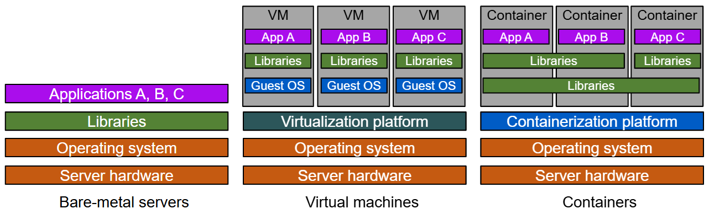

## 1. Introduction
### 1.1 Container
#### 1.1.1 What is a Container?
- In the <b>physical world</b>, container is a standardized unit of storage in the shipping industry. <u>Standardized containers provide a consistent, predictable unit of storage</u> that can be easily transferred to truck or rail transportation. By focusing on containers instead of individual pieces of cargo, we have improved efficiency,increased productivity, and reduced costs for consumers.This is a great example of using <u>abstraction</u> to increase agility.
- While in the <b>virtual world</b>, a container is <u>a standardized unit of software</u> designed to run quickly and reliably on any computing environment that is running the containerization platform.
- Containers are a form of virtualization that is implemented at the operating system level. ==Containers are lightweight, standalone packages that include everything needed to run an application=={!info}, such as code, runtime, system tools, system libraries, and settings.
- A single server can host <u>several containers that all share the underlying host system's OS Kernel</u>. These containers might be services that are part of a larger enterprise application, or they might be separate applications that are running in their isolated environment.

#### 1.1.2 How do Containers differ from other forms of virtualization?
::: timeline placement="between"
- Bare-metal servers
  placement=right

  <u>Technical maturity is often associated with increasec levels of abstraction.</u> 
  - workstyle: With bare metal servers the architectural layers, such as the infrastructure and application software layers are built. For example: you install an operating system on top of your server hardware, install any shared libraries on top of that operating system, and then install your applications that use those libraries. 
  - downside: 
    - it's massively inefficient: your hardware costs are the same whether you are running at 0% utilization or 100% utilization. 
    - keep the versions of your libraries <u>in sync with all your applications</u>: lf one application requires an updated version of a library that is incompatible with other applications running on that host, then you run into problems.

- Virtual machines
  type=important

  You can increase agility by <u>putting a **virtualization platform** over the operating system</u>. 
  - workstyles: Now you have isolated applications and their libraries with their own full operating system into avirtual machine (VM). This improves utilization. - downside:
    - the virtualization layer is "heavy": you may have four operating systemson the host instead of one.That means <u>more patching,more updates, significantly more space being taken upon the physical host.</u> 
    - significant redundancy: you've installed potentially the same OS four times, and potentially the same library three times.

- Containers
  type=success placement=right

  - workstyles: The container runtime shares the operating systems kernel, enabling you to create container images using file system layers. 
  - advantages:
    - lightweight, efficient, and fast: They can be spun up and spun down faster than virtual machines, allowing for better utilization of the underlying hardware.
    - share libraries: You can share libraries when needed, but you can also have library isolation for your applications. 
    - highly portable: Because containers isolate software from the other layers, their code runs identically across different environments: from development and staging, all the way to production.

:::

