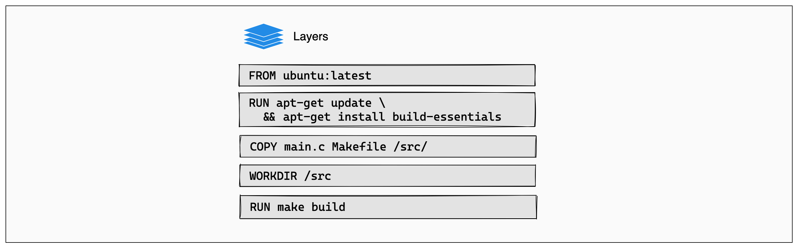
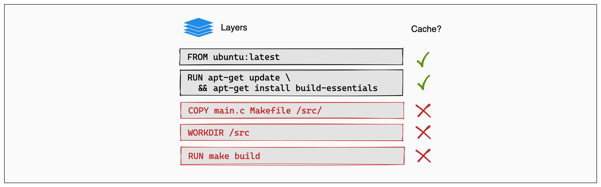

## 1. Introduction
### 1.1 What is a Container?
- In the <b>physical world</b>, container is a standardized unit of storage in the shipping industry. <u>Standardized containers provide a consistent, predictable unit of storage</u> that can be easily transferred to truck or rail transportation. By focusing on containers instead of individual pieces of cargo, we have improved efficiency,increased productivity, and reduced costs for consumers.This is a great example of using <u>abstraction</u> to increase agility.
- While in the <b>virtual world</b>, a container is <u>a standardized unit of software</u> designed to run quickly and reliably on any computing environment that is running the containerization platform.
- Containers are a form of virtualization that is implemented at the operating system level. ==Containers are lightweight, standalone packages that include everything needed to run an application=={!info}, such as code, runtime, system tools, system libraries, and settings.
- A single server can host <u>several containers that all share the underlying host system's OS Kernel</u>. These containers might be services that are part of a larger enterprise application, or they might be separate applications that are running in their isolated environment.

### 1.2 History of Virtualization
<u>Technical maturity is often associated with increasec levels of abstraction.</u> 

#### 1.2.1 Bare-metal servers
Bare metal refers to ==a physical computer=={.info}, specifically a server, that has one and only one operating system. <u>The distinction is important in modern computing because many, if not most, servers are virtual machines.</u> A physical server is typically a fairly large computer with powerful hardware built-in. 
Installing an operating system and running applications directly on that physical hardware, without virtualization, is referred to as running on “bare metal.”
- workstyle: With bare metal servers the architectural layers, such as the infrastructure and application software layers are built. For example: you install an operating system on top of your server hardware, install any shared libraries on top of that operating system, and then install your applications that use those libraries. 
- downside: 
    - it's massively inefficient: your hardware costs are the same whether you are running at 0% utilization or 100% utilization. 
    - keep the versions of your libraries <u>in sync with all your applications</u>: lf one application requires an updated version of a library that is incompatible with other applications running on that host, then you run into problems.

#### 1.2.2 Virtual machines
A virtual machine, commonly shortened to just VM, is no different than any other physical computer like a laptop, smart phone, or server. It has a CPU, memory, disks to store your files, and can connect to the internet if needed. While the parts that make up your computer (called hardware) are physical and tangible, ==VMs are often thought of as virtual computers or software-defined computers within physical servers, existing only as code.=={.info}
Virtual machines (VMs) are a way to run multiple applications on a single server. Each VM runs on top of a **hypervisor**, which is a piece of software that that can carve up the host resources into multiple isolated virtual hardware configuration which you can then treat as their own systems (each with an OS, binaries/libraries, and applications).
You can increase agility by <u>putting a **virtualization platform** over the operating system</u>. 
- workstyles: Now you have isolated applications and their libraries with their own full operating system into avirtual machine (VM). This improves utilization.
- downside:
    - the virtualization layer is "heavy": you may have four operating systemson the host instead of one.That means <u>more patching,more updates, significantly more space being taken upon the physical host.</u> 
    - significant redundancy: you've installed potentially the same OS four times, and potentially the same library three times.

#### 1.2.3 Containers
 Containers are a way to run multiple applications on a single server without the overhead of a hypervisor. Each container runs on top of a **container engine** (software that manages the lifecycle of containers), which oversees and isolates processes using the host operating system’s kernel features.
  - workstyles: The container runtime shares the operating systems kernel, enabling you to create container images using file system layers. 
  - advantages:
    - lightweight, efficient, and fast: They can be spun up and spun down faster than virtual machines, allowing for better utilization of the underlying hardware.
    - share libraries: You can share libraries when needed, but you can also have library isolation for your applications. 
    - highly portable: Because containers isolate software from the other layers, their code runs identically across different environments: from development and staging, all the way to production.

:::


And ==Docker=={.info} makes CONTAINER popular again.


### 1.3 What are the advantages of a microservice environment?
#### 1.3.1 Traditional vs microservice architecture
- Traditional architecture
Consider this example of atraditional architecture. All the processes for one of the applications are tightly coupled and run as a single service. 
    - This means that <u>if one process of the application experiences a spike in demand, the entire architecture must be scaled.</u>
    - Adding or improving features becomes more complex as the code base grows, which limits experimentation and makes it difficult to implement new ideas.
    - Monolithic architectures also add risk for application availability because many dependent and tightly coupled processes increase the impact of a single process failure. 
    - And you cansee where there is a lot of<u> redundancy of function across different applications.</u>
- Microservice architecture
Now consider the same three applications running ina microservice architecture: ==Each application is built as an independent component that runs as a service and communicates by using lightweight APl operations.=={.info}
    - Each service performs a single function that can support multiple applications. 
    - We also see <u>a migration away from dedicated servers to an abstracted hardware layer</u> where micro services can be intelligently placed based on needs, such as performance and resilience.


#### 1.3.2 Characteristics of microservices
- Decentralized,evolutionary design
    - Each container uses ==the language and technology that is best suited for the functioning of the service=={.info} instead of requiring users to use a specific language or a specific technology. 
    - Each component or system in the architecture is ==evolved separately=={.info} rather than updating the system in amonolithic style.
- Smart endpoints, dumb pipes

    There is no enterprise service bus(企业服务总线); data is not transformed when it's going between services. ==The service receiving the data should be smart enough to handle whatever it is sent.=={.info}
- Independent products, not projects

    Going against the traditional waterfall project model, think of a microservice as ==a separate product with its own inputs and outputs=={.info}. Containers help with this by enabling you to package all your dependencies and your libraries into a single immutable object.
- Designed for failure

    Everything fails all the time. Services are designed to be resilient, redundant, and to handle bad input, or if the service the microservice wants to communicate with is not there.
- Disposability可处理性

    We start fast, fail fast, and release any file handlers. Containers are added and removed, workloads change, and resources are temporary because they constantly change.
- Development and production parity对等

    ==Development, testing and production environments can be made consistent using containers.=={.info} 

To sum it all up,microservices and containers go well together. Containers are the underlying technology that powers modern microservices, and with microservice architectures, developers can take full advantage of containers.

### 1.4 Open Container Initiative (OCI)
The OCI is an industry collaboration that ==aims to create **open industry standards** for container formats and runtimes.=={.info} It was founded by companies like Docker, Google, VMware, Microsoft, Dell, IBM, and Oracle. 

The OCI's primary goal is to ensure the compatibility and interoperability of container environments through three defined technical specifications，which includes:

1. Image Specification: Defines the image's metadata and format, including a serializable file system.
2. Runtime Specification: Describes how to run a container using an image adhering to the Image Specification.
3. Distribution Specification: Outlines how images should be distributed, such as through registries, pushing, and pulling images.

Docker is a specific implementation of the OCI standard. When referring to Docker images or Docker container images, it means the Docker implementation of the OCI specification.


## 2. Underlying Technologies

### 2.1 Namespaces
Docker namespaces are a fundamental feature of Linux that ==Docker uses to create isolated environments for containers=={.info}. They provide a layer of isolation by <u>creating separate instances of global system resources, making each container believe it has its own unique set of resources.</u> 
Docker utilizes several types of namespaces, including PID (Process ID), NET (Network), MNT (Mount), UTS (Unix Timesharing System), IPC (InterProcess Communication), and USER namespaces and by leveraging these namespaces, Docker can create lightweight, portable, and secure containers that run consistently across different environments.

The best way to prevent privilege-escalation attacks from within a container is ==to configure your container's applications to run as unprivileged users.=={.info} For containers whose processes must run as the root user within the container, you can re-map this user to a less-privileged user on the Docker host. The mapped user is assigned a range of UIDs which function within the namespace as normal UIDs from 0 to 65536, but have no privileges on the host machine itself.

### 2.2 cgroups
cgroups or "control groups" are a Linux kernel feature that allows you to allocate and manage resources, such as CPU, memory, network bandwidth, and I/O, among groups of processes running on a system. It plays a crucial role in ==providing resource isolation and limiting the resources that a running container can use.=={.info} Docker utilizes cgroups to **enforce resource constraints on containers**, allowing them to have a consistent and predictable behavior. 

### 2.3 Union File systems
Union file systems, also known as UnionFS, play a crucial role in the overall functioning of Docker. It's a unique type of filesystem that ==creates a virtual, layered file structure by overlaying multiple directories.=={.info} Instead of modifying the original file system or merging directories, UnionFS enables the **simultaneous mounting of multiple directories on a single mount point while keeping their contents separate**. 
This feature is especially beneficial in the context of Docker, as it allows us to manage and optimize storage performance by minimizing duplication and reducing the container image size.


## 3. Docker Basics
### 3.1 Docker Components
There are ==3 key components=={.info} in the Docker ecosystem:

1. Dockerfile

    A text file containing instructions (commands) to build a Docker image.
    Each instruction in a Dockerfile creates <u>a read-only layer</u> in the image, making the container image an immutable object.
    If you change the Dockerfile and rebuild the image, ==only those layers that have changed are rebuilt.=={.info} This is part of what makes container images so lightweight, small, and fast, when compared to other virtualization technologies.

2. Docker Image

    A snapshot of a container, <u>created from a Dockerfile</u>. Images are stored in a registry, like Docker Hub, and can be pulled or pushed to the registry.
    An image is ==a read-only template=={.info} with instructions for creating a container. <u>A running container is an instance of an image.</u> 
    - You can create images from scratch
    - or you can use images that were created by others and published to a public or private registry. 
    An image is usually based on another image, with some customization.

3. Docker Container

    A running instance of a Docker image.


### 3.2 Docker Commands
Some essential Docker commands will be used frequently:
- ```bash
  docker pull <image>
    ```
    Download an image from a registry, like Docker Hub.

- ```bash
  docker build -t <image_name> <path>
    ```
    Build an image from a Dockerfile, where ```<path>``` is the directory containing the Dockerfile.

- ```bash
  docker image ls
    ```
    List all images available on your local machine.

- ```bash
  docker run -d -p <host_port>:<container_port> --name <container_name> <image>
    ```
    Run a container from an image, mapping host ports to container ports.

- ```bash
  docker container ls
    ```
    List all running containers.

- ```bash
  docker container stop <container>
    ```
    Stop a running container.

- ```bash
  docker container rm <container>
    ```
    Remove a stopped container.

- ```bash
  docker image rm <image>
    ```
    Remove an image from your local machine.


## 4. Data Persistence in Docker
When a container starts, it uses the files and configuration provided by the image. Each container is able to create, modify, and delete files and does so without affecting any other containers. When the container is deleted, these file changes are also deleted.

While this ephemeral nature of containers is great, ==it poses a challenge when you want to persist the data=={.info}. For example, if you restart a database container, you might not want to start with an empty database. So, how do you persist files?

### 4.1 Container Volumes
==Volumes are a storage mechanism that provide the ability to persist data beyond the lifecycle of an individual container.=={.note} Think of it like providing a shortcut or symlink from inside the container to outside the container. ==And it is created and managed by Docker.=={.note}That means When you create a volume, it's stored within a directory on the Docker host. 

#### 4.1.1 Mounting a volume over existing data
- If you mount a ```non-empty``` volume into a directory in the container in which files or directories exist, the pre-existing files are <u>obscured by the mount.</u> 

    This is similar to if you were to save files into /mnt on a Linux host, and then mounted a USB drive into /mnt. The contents of /mnt would be obscured by the contents of the USB drive until the USB drive was unmounted.

    With containers, there's no straightforward way of removing a mount to reveal the obscured files again. Your best option is to recreate the container without the mount.

- If you mount an ```empty``` volume into a directory in the container in which files or directories exist, these files or directories are <u>propagated (copied) into the volume by default.</u> Similarly, if you start a container and specify a volume which does not already exist, an empty volume is created for you. This is a good way to pre-populate data that another container needs.

- To prevent Docker from copying a container's pre-existing files into an empty volume, use the ```volume-nocopy``` option.

#### 4.1.2 Named and anonymous volumes
A volume may be named or anonymous. Anonymous volumes are given a random name that's guaranteed to be unique within a given Docker host. Just like named volumes, anonymous volumes persist even if you remove the container that uses them, except if you use the ```--rm``` flag when creating the container, in which case the anonymous volume associated with the container is destroyed.

If you create multiple containers consecutively that each use anonymous volumes, each container creates its own volume. Anonymous volumes aren't reused or shared between containers automatically. To share an anonymous volume between two or more containers, you must mount the anonymous volume using the random volume ID.

#### 4.1.3 Syntax
To mount a volume with the ```docker run ```command, you can use either the ```--mount``` or ```--volume``` flag.
```bash
$ docker run --mount type=volume,src=<volume-name>,dst=<mount-path>
$ docker run --volume <volume-name>:<mount-path>
```
In general, ==```--mount``` is preferred.=={.note} The main difference is that the ```--mount``` flag is more explicit and supports all the available options.

#### 4.1.4 Create and manage volumes
Unlike a bind mount, you can create and manage volumes <u>outside the scope of any container.</u>

- **Create** a volume: create a volume named ```log-data```.
    ```bash
    $ docker volume create log-data
    ```
- **List** volumes:
    ```bash
    $ docker volume ls

    local          my-vol
    ```
- **Inspect** a volume:
    ```bash
    $ docker volume inspect my-vol
    [
        {
            "Driver": "local",
            "Labels": {},
            "Mountpoint": "/var/lib/docker/volumes/my-vol/_data",
            "Name": "my-vol",
            "Options": {},
            "Scope": "local"
        }
    ]
    ```
- **Remove** a volume:
    ```bash
    docker volume rm my-vol
    ```

#### 4.1.5 Start a container with a volume
If you start a container with a volume that doesn't yet exist, Docker will <u>automatically create it</u> for you.

The following example mounts the volume ```myvol2``` into ```/app/``` in the container.

The following ```-v``` and ```--mount``` examples produce the same result.

::: code-tabs
@tab --mount
```bash
docker run -d \
  --name devtest \
  --mount source=myvol2,target=/app \
  nginx:latest
```

@tab -v
```bash
docker run -d \
  --name devtest \
  -v myvol2:/app \
  nginx:latest
```
:::

When the container runs, ==all files it writes into the ```/app``` folder will be saved in this volume,=={.note} outside of the container. If you delete the container and start a new container using the same volume, the files will still be there.

::: tip Sharing files using volumes
You can <u>attach the same volume to multiple containers to share files between containers.</u> This might be helpful in scenarios such as log aggregation, data pipelines, or other event-driven applications.
:::

### 4.2 Bind mounts
When you use a bind mount, a file or directory ==on the host machine=={.note} is mounted from the host into a container. 

By contrast, when you use a volume, a new directory is created <u>within Docker's storage directory on the host machine, and Docker manages that directory's contents.</u>

#### 4.2.1 Bind-mounting over existing data
If you bind mount file or directory into a directory in the container <u>in which files or directories exist</u>, the pre-existing files are <u>obscured by the mount.</u> 

This is similar to if you were to save files into ```/mnt``` on a Linux host, and then mounted a USB drive into ```/mnt```. The contents of ```/mnt``` would be obscured by the contents of the USB drive until the USB drive was unmounted.

With containers, there's no straightforward way of removing a mount to reveal the obscured files again. Your best option is to recreate the container without the mount.

#### 4.2.2 Considerations and constraints
- Bind mounts ==have write access=={.info} to files on the host by default.

    One side effect of using bind mounts is that you can change the host filesystem via processes running in a container, including creating, modifying, or deleting important system files or directories. This capability can have <u>security implications</u>. For example, it may affect non-Docker processes on the host system.
    
    You can use the readonly or ro option to prevent the container from writing to the mount.

- Bind mounts are created to the Docker daemon host, not the client.

    If you're using a remote Docker daemon, you can't create a bind mount to access files on the client machine in a container.

    For Docker Desktop, the daemon runs inside a Linux VM, not directly on the native host. Docker Desktop has built-in mechanisms that transparently handle bind mounts, allowing you to share native host filesystem paths with containers running in the virtual machine.

- Containers with bind mounts are ==strongly tied to the host=={.info}.

    Bind mounts rely on the host machine's filesystem <u>having a specific directory structure available</u>. This reliance means that containers with bind mounts <u>may fail if run on a different host without the same directory structure.</u>

#### 4.2.3 Syntax
To create a bind mount, you can use either the ```--mount``` or ```--volume``` flag.
```bash
$ docker run --mount type=bind,src=<host-path>,dst=<container-path>
$ docker run --volume <host-path>:<container-path>
```
In general, ==```--mount``` is preferred.=={.note} The main difference is that the ```--mount``` flag is more explicit and supports all the available options.

- If you use ```--volume``` to bind-mount a file or directory that <u>does not yet exist</u> on the Docker host, Docker <u>automatically creates</u> the directory on the host for you. It's always created as a directory.

- ```--mount``` ==does not automatically create a directory=={.note} if the specified mount path does not exist on the host. Instead, it produces an error.

#### 4.2.4 Start a container with a bind mount
Consider a case where you have a directory ```source``` and that when you build the source code, the artifacts are saved into another directory, ```source/target/```. You want the artifacts to be available to the container at ```/app/```, and you want the container to get access to a new build each time you build the source on your development host. 

Use the following command to bind-mount the ```target/``` directory into your container at ```/app/```. Run the command from <u>within the ```source directory```</u>. The ```$(pwd)``` sub-command <u>expands to the current working directory on Linux or macOS hosts.</u> If you're on Windows, see also [Path conversions on Windows](https://docs.docker.com/desktop/troubleshoot-and-support/troubleshoot/topics/).


The following ```-v``` and ```--mount``` examples produce the same result. You can't run them both unless you remove the ```devtest```container after running the first one.

::: code-tabs
@tab --mount
```bash
docker run -d \
  -it \
  --name devtest \
  --mount type=bind source="$(pwd)"/target,target=/app \
  nginx:latest
```

@tab -v
```bash
docker run -d \
  -it \
  --name devtest \
  -v "$(pwd)"/target:/app \
  nginx:latest
```
:::


### 4.3 Difference between volumes and bind mounts

#### 4.3.1 When to use bind mounts
Bind mounts are appropriate for the following types of use case:

- ==Sharing source code or build artifacts=={.note} between a development environment on the Docker host and a container.

- When you want to create or generate files in a container and <u>persist the files onto the host's filesystem</u>.

- Sharing configuration files <u>from the host machine to containers.</u> This is how Docker provides DNS resolution to containers by default, by mounting ```/etc/resolv.conf``` from the host machine into each container.

- Bind mounts are also available for builds: you can bind mount source code from the host into the build container to test, lint, or compile a project.

#### 4.3.2 When to use volumes
Volumes are a good choice for the following use cases:

- Volumes are <u>easier to back up or migrate</u> than bind mounts.
- You can manage volumes using Docker CLI commands or the Docker API.
- Volumes work on both Linux and Windows containers.
- Volumes can be more safely shared among multiple containers.
- New volumes can <u>have their content pre-populated by a container or build.</u>
- When your application <u>requires high-performance I/O.</u>

::: warning
Volumes are **not** a good choice if you need to access the files from the host, as the volume is completely managed by Docker. Use bind mounts if you need to access files or directories from both containers and the host.
:::


## 5. Using 3rd Party Container Images
### 5.1 Databases
Using a local containerized database offers flexibility and ease of setup, letting you mirror production environments closely without the overhead of traditional database installations. Docker simplifies this process, enabling you to deploy, manage, and scale databases in isolated containers with just a few commands.

The following wil use the MySQL image for examples, but the concepts can be applied to other database images.
#### 5.1.1 Run a local containerized database
Most popular database systems, including MySQL, PostgreSQL, and MongoDB, have a Docker Official Image available on Docker Hub. (Though I can't access the page)

To run a database container, you can use either the Docker Desktop GUI or CLI. (Just write down how to use CLI)

To run a container using the CLI, run the following command in a terminal:
```bash
$ docker run --name my-mysql -e MYSQL_ROOT_PASSWORD=my-secret-pw -e MYSQL_DATABASE=mydb -d mysql:latest
```
In this command:
- ```--name my-mysql``` assigns the name my-mysql to your container for easier reference.
- ```-e MYSQL_ROOT_PASSWORD=my-secret-pw``` sets the root password for MySQL to my-secret-pw. 
- ```-e MYSQL_DATABASE=mydb``` optionally creates a database named mydb. 
- ```-d``` runs the container in <u>detached mode, meaning it runs in the background</u>.
- ```mysql:latest``` specifies that you want to use the latest version of the MySQL image.

To verify that you container is running, run docker ps in a terminal

#### 5.1.2 Access the shell of a containerized database
When you have a database running inside a Docker container, you may need to <u>access its shell to manage the database, execute commands, or perform administrative tasks.</u> Docker provides a straightforward way to do this using the ```docker exec```command. Additionally, if you prefer a graphical interface, you can use Docker Desktop's GUI.

To access the terminal of a MySQL container **using the CLI**, you can use the following ```docker exec``` command.
```bash
$ docker exec -it my-mysql bash
```
In this command:
- ```docker exec``` tells Docker you want to **execute a command in a running container**.
- ```-it``` ensures that the terminal you're **accessing is interactive**, so you can type commands into it.
- ```my-mysql``` is the name of your MySQL container. If you named your container differently when you ran it, use that name instead.
- ```bash``` is <u>the command you want to run inside the container</u>. It opens up a bash shell that lets you interact with the container's file system and installed applications.

After executing this command, you will ==be given access to the bash shell inside your MySQL container, from which you can manage your MySQL server directly.=={.info} You can run ```exit``` to return to your terminal.

---
Once you've accessed the container's terminal, you can run <u>any tools</u> available in that container. The following example shows using mysql in the container to list the databases.
```sql
# mysql -u root -p
Enter password: my-secret-pw

mysql> SHOW DATABASES;

+--------------------+
| Database           |
+--------------------+
| information_schema |
| mydb               |
| mysql              |
| performance_schema |
| sys                |
+--------------------+
5 rows in set (0.00 sec)
```

#### 5.1.3 Connect to a containerized database from your host
Connecting to a containerized database from your host machine involves **mapping a port inside the container to a port on your host machine**. This process ensures that the database inside the container is accessible <u>via the host machine's network</u>. For MySQL, the default port is 3306. By exposing this port, you can use various database management tools or applications on your host machine to interact with your MySQL database.

Run the following command in a terminal:
```bash 
docker run -p 3307:3306 --name my-mysql -e MYSQL_ROOT_PASSWORD=my-secret-pw -e MYSQL_DATABASE=mydb -d mysql:latest
```
In this command, ```-p 3307:3306``` ==maps port 3307 on the host to port 3306 in the container.=={.note}

To verify the port is mapped, run the following command.
``` bash
docker ps
```
You should see output like the following:
``` bash
CONTAINER ID   IMAGE          COMMAND                  CREATED          STATUS          PORTS                               NAMES
6eb776cfd73c   mysql:latest   "docker-entrypoint.s…"   17 minutes ago   Up 17 minutes   33060/tcp, 0.0.0.0:3307->3306/tcp   my-mysql
```
At this point, <u>**any** application running on your host</u> can access the MySQL service in the container at ```localhost:3307```.

#### 5.1.4 Connect to a containerized database from another container
Connecting to a containerized database from another container is a common scenario in microservices architecture and during development processes. **Docker's networking** capabilities make it easy to establish this connection without having to expose the database to the host network. ==This is achieved by placing both the database container and the container that needs to access it on the same Docker network.=={.note}

As a result, **you should create a network first** and run containers on it. To achieve it:
1. Run the following command to create a Docker network named my-network.
    ```bash
    docker network create my-network
    ```
2. Run your database container and ==specify the network using the ```--network``` option=={.note}. This runs the container on the my-network network.
    ``` bash
    docker run --name my-mysql -e MYSQL_ROOT_PASSWORD=my-secret-pw -e MYSQL_DATABASE=mydb --network my-network -d mysql:latest
    ```
3. Run your other containers and specify the network using the ```--network option```. For this example, you'll run a phpMyAdmin container that can connect to your database.
    
    Run a phpMyAdmin container. Use the ```--network``` option to specify the network, the ```-p``` option to let you access the container from your host machine, and the ```-e``` option to specify a required environment variable for this image.
    ```bash
    docker run --name my-phpmyadmin -d --network my-network -p 8080:80 -e PMA_HOST=my-mysql phpmyadmin
    ```
4. Verify that the containers can communicate. For this example, you'll access phpMyAdmin and verify that it connects to the database.
- Open http://localhost:8080 to access your phpMyAdmin container.
- Log in using ```root``` as the username and ```my-secret-pw``` as the password. You should connect to the MySQL server and see your database listed.

At this point, **any application running on your ```my-network``` container network** can access the MySQL service in the container at ```my-mysql:3306```.

#### 5.1.5 Persist database data in a volume
Persisting database data in a Docker volume is necessary for ensuring that your data survives container restarts and removals. A Docker volume lets you store database files outside the container's writable layer, making it possible to upgrade the container, switch bases, and share data without losing it. Here’s how you can attach a volume to your database container using either the Docker CLI or the Docker Desktop GUI.

To run your database container **with a volume attached**, include the ```-v``` option with your ```docker run``` command, specifying a volume name and the path where the database stores its data inside the container. If the volume doesn't exist, Docker automatically creates it for you.

To run a database container with a volume attached, and then verify that the data persists:
1. Run the container and attach the volume.
    ```bash
    docker run --name my-mysql -e MYSQL_ROOT_PASSWORD=my-secret-pw -e MYSQL_DATABASE=mydb -v my-db-volume:/var/lib/mysql -d mysql:latest
    ```
    This command mounts the volume named ```my-db-volume``` to the ```/var/lib/mysql``` directory in the container.
2. Create some data in the database. Use the ```docker exec``` command to run ```mysql``` inside the container and create a table.
    ```bash
    docker exec my-mysql mysql -u root -p my-secret-pw -e "CREATE TABLE IF NOT EXISTS mydb.mytable (column_name VARCHAR(255)); INSERT INTO mydb.mytable (column_name) VALUES ('value');"
    ```
    This command uses the ```mysql``` tool in the container to create a table named ```mytable``` with a column named ```column_name```, and finally inserts a value of ```value```.
3. Stop and remove the container. Without a volume, the table you created would be lost when removing the container.
    ```bash
    docker remove --force my-mysql
    ```
4. Start a new container with the volume attached. This time, ==you don't need to specify any environment variables as the configuration is saved in the volume=={.note}.
    ```bash
    docker run --name my-mysql -v my-db-volume:/var/lib/mysql -d mysql:latest
    ```
5. Verify that the table you created still exists. Use the ```docker exec``` command again to run ```mysql``` inside the container.
    ```bash 
    docker exec my-mysql mysql -u root -p my-secret-pw -e "SELECT * FROM mydb.mytable;"
    ```
    This command uses the ```mysql``` tool in the container to select all the records from the ```mytable``` table.
    
    You should see output like the following.
    ```bash 
    column_name
    value
    ```
At this point, any MySQL container that mounts the ```my-db-volume``` will be able to access and save persisted data.

#### 5.1.6 Build a customized database image
Customizing your database image lets you **include additional configuration, scripts, or tools alongside the base database server**. This is particularly useful for creating a Docker image that matches your specific development or production environment needs. The following example outlines how to build and run a custom MySQL image that includes a table initialization script.

To build and run your custom image:
1. ==Create a Dockerfile=={.note}.
- Create a file named ```Dockerfile``` in your project directory. For this example, you can create the ```Dockerfile``` in an empty directory of your choice. <u>This file will define how to build your custom MySQL image.</u>
- Add the following content to the Dockerfile.
    ```dockerfile
    # syntax=docker/dockerfile:1

    # Use the base image mysql:latest
    FROM mysql:latest

    # Set environment variables
    ENV MYSQL_DATABASE mydb

    # Copy custom scripts or configuration files from your host to the container
    COPY ./scripts/ /docker-entrypoint-initdb.d/
    ```
    In this Dockerfile, you've set the environment variable for the MySQL database name. You can also use the ```COPY``` instruction to add custom configuration files or scripts into the container. In this example, ==files from your host's ```./scripts/``` directory are copied into the container's ```/docker-entrypoint-initdb.d/``` directory=={.note}. In this directory, ```.sh```, ```.sql```, and ```.sql.gz``` scripts are executed when the container is started for the first time.
- Create a script file to initialize a table in the database. <u>In the directory where your ```Dockerfile``` is located, create a subdirectory named ```scripts```,</u> and then create a file named ```create_table.sql``` with the following content.
    ```sql
    CREATE TABLE IF NOT EXISTS mydb.myothertable (
    column_name VARCHAR(255)
    );

    INSERT INTO mydb.myothertable (column_name) VALUES ('other_value');
    ```
    You should now have the following directory structure.
    ```
    ├── your-project-directory/
    │ ├── scripts/
    │ │ └── create_table.sql
    │ └── Dockerfile
    ```
2. ==Build your image=={.note}.
- In a terminal, change directory to the directory where your ```Dockerfile``` is located.
- Run the following command to build the image.
    ```bash
    docker build -t my-custom-mysql .
    ```
    In this command, ==```-t my-custom-mysql``` tags (names) your new image as ```my-custom-mysql```=={.note}. The period (.) at the end of the command ==specifies the current directory as the context for the build=={.note}, where **Docker looks for the Dockerfile and any other files needed for the build**.
3. Run your image. This time, <u>specify your image's name</u> instead of ```mysql:latest```. Also, you no longer need to specify the ```MYSQL_DATABASE``` environment variable as it's now defined by your Dockerfile.
    ```bash
    docker run --name my-mysql -e MYSQL_ROOT_PASSWORD=my-secret-pw -d my-custom-mysql
    ```
4. Verify that your container is running with the following command.
    ```bash
    docker ps
    ```
5. Verify that your initialization script was ran. Run the following command in a terminal to show the contents of the myothertable table.
    ```bash
    docker exec my-mysql mysql -u root -p my-secret-pw -e "SELECT * FROM mydb.myothertable;"
    ```
    You should see output like the following.
    ```bash
    column_name
    other_value
    ```
Any container ran using your ```my-custom-mysql``` image will have the table initialized when first started.

#### 5.1.7 Use Docker Compose to run a database
Docker Compose is a tool for defining and running multi-container Docker applications. With a single command, you can configure all your application's services (like databases, web apps, etc.) and manage them. In this example, you'll create a Compose file and use it to run a MySQL database container and a phpMyAdmin container.

To run your containers with Docker Compose:
1. Create a **Docker Compose file**.
- Create a file named ```compose.yaml``` in your project directory. This file will define the services, networks, and volumes.
- Add the following content to the ```compose.yaml``` file.
    ```yaml
    services:
    db:
        image: mysql:latest
        environment:
        MYSQL_ROOT_PASSWORD: my-secret-pw
        MYSQL_DATABASE: mydb
        ports:
        - 3307:3306
        volumes:
        - my-db-volume:/var/lib/mysql

    phpmyadmin:
        image: phpmyadmin/phpmyadmin:latest
        environment:
        PMA_HOST: db
        PMA_PORT: 3306
        MYSQL_ROOT_PASSWORD: my-secret-pw
        ports:
        - 8080:80
        depends_on:
        - db

    volumes:
    my-db-volume:
    ```
    For the database service:
    - ```db``` is the name of the service.
    - ```image: mysql:latest``` specifies that the service uses the latest MySQL image from Docker Hub.
    - ```environment``` lists the environment variables used by MySQL to initialize the database, such as the root password and the database name.
    - ```ports``` maps port 3307 on the host to port 3306 in the container, allowing you to connect to the database from your host machine.
    - ```volumes``` mounts ```my-db-volume``` to ```/var/lib/mysql``` inside the container to persist database data.
    
    In addition to the database service, there is a phpMyAdmin service. <u>By default Compose sets up a single network for your app. Each container for a service joins the default network and is both reachable by other containers on that network, and discoverable by the service's name. </u>Therefore, in the ```PMA_HOST``` environment variable, you can specify the service name, ```db```, in order to connect to the database service. 
2. Run Docker Compose.
- Open a terminal and change directory to the directory where your ```compose.yaml``` file is located.
- Run Docker Compose using the following command.
    ```bash
    docker compose up
    ```
    You can now access phpMyAdmin at http://localhost:8080 and connect to your database using ```root``` as the username and ```my-secret-pw``` as the password.
- To stop the containers, press ```ctrl+c``` in the terminal.

Now, with Docker Compose you can <u>start your database and app, mount volumes, configure networking, and more,</u> all with a **single** command.

### 5.2 Interactive Test Environments
#### 5.2.1 Source
You can launch a dev environment from a:
- Git repository
- Branch or tag of a Git repository
- Sub-folder of a Git repository
- Local folder

This does not conflict with any of the local files or local tooling set up on your host. 

#### 5.2.2 Launch a dev environment from a Git repository

To launch a dev environment:

1. From the **Dev Environments** tab in Docker Dashboard, select **Create**. The **Create a Dev Environment** dialog displays.
2. Select **Get Started**. 
3. Optional: Provide a name for you dev environment.
4. Select **Existing Git repo** as the source and then paste your Git repository link into the field provided: https://github.com/dockersamples/single-dev-env
5. Choose your IDE. You can choose either:
    - **Visual Studio Code**. The Git repository is cloned into a Volume and attaches to your containers. This allows you to develop directly inside of them using Visual Studio Code.
    - **Other**. The Git repository is cloned into your chosen local directory and attaches to your containers as a bind mount. This shares the directory from your computer to the container, and allows you to develop using any local editor or IDE.
6. Select **Continue**.

To launch the application, run the command `make run` in your terminal. This opens an http server on port 8080. Open [http://localhost:8080](http://localhost:8080) in your browser to see the running application.

> Tip
>
> To use the `make` command in Windows, try `Makefile Tool` in VS Code.


### 5.3 Command Line Utilities
About some command line references.
- `Docker Images ls`: List images, most of the options allow users to look into details like digest, image ID, tag, repository, etc. Refer to [Docker image ls](https://docs.docker.com/engine/reference/commandline/images/) for more information.
- `Docker Run`: Create and run a new container, pulling the image if needed and starting the container. There are lots of options here, and can't list all out. Refer to [Docker run](https://docs.docker.com/reference/cli/docker/container/run/).
- `Docker Image Pull`: Download an image from a registry, and options in this command allow users to choose which image should be pulled, using repository/tag/digest and so on. Refer to [Docker image pull](https://docs.docker.com/engine/reference/commandline/pull/).


## 6. Building Container Images
### 6.1 Dockerfiles
Docker can build images automatically by reading the instructions from a Dockerfile. A Dockerfile is a text document that contains all the commands a user could call on the command line to assemble an image. 

#### 6.1.1 Commands Overview
The Dockerfile supports the following instructions. And here I would not list all the usages regarding every command, since it's pretty too long. Refer to [Dockerfile Reference](https://docs.docker.com/reference/dockerfile/#overview) to view details:

| Instruction                            | Description                                                 |
| :------------------------------------- | :---------------------------------------------------------- |
| [`ADD`](#add)                          | Add local or remote files and directories.                  |
| [`ARG`](#arg)                          | Use build-time variables.                                   |
| [`CMD`](#cmd)                          | Specify default commands.                                   |
| [`COPY`](#copy)                        | Copy files and directories.                                 |
| [`ENTRYPOINT`](#entrypoint)            | Specify default executable.                                 |
| [`ENV`](#env)                          | Set environment variables.                                  |
| [`EXPOSE`](#expose)                    | Describe which ports your application is listening on.      |
| [`FROM`](#from)                        | Create a new build stage from a base image.                 |
| [`HEALTHCHECK`](#healthcheck)          | Check a container's health on startup.                      |
| [`LABEL`](#label)                      | Add metadata to an image.                                   |
| [`MAINTAINER`](#maintainer-deprecated) | Specify the author of an image.                             |
| [`ONBUILD`](#onbuild)                  | Specify instructions for when the image is used in a build. |
| [`RUN`](#run)                          | Execute build commands.                                     |
| [`SHELL`](#shell)                      | Set the default shell of an image.                          |
| [`STOPSIGNAL`](#stopsignal)            | Specify the system call signal for exiting a container.     |
| [`USER`](#user)                        | Set user and group ID.                                      |
| [`VOLUME`](#volume)                    | Create volume mounts.                                       |
| [`WORKDIR`](#workdir)                  | Change working directory.                                   |

#### 6.1.2 Format
Here is the format of the Dockerfile:
```dockerfile
# Comment
INSTRUCTION arguments
```
The instruction is **not case-sensitive**. However, convention is for them to be **UPPERCASE** to distinguish them from arguments more easily.

Docker runs instructions in a Dockerfile <u>in order</u>. A Dockerfile **must begin with a `FROM` instruction**. This may be after parser
directives, comments, and globally scoped ARGs. The `FROM` instruction specifies the [base image](https://docs.docker.com/glossary/#base-image) from which you are building. 

For comments, buildKit treats <u>lines that begin with `#` as a comment</u>, unless the line is a valid parser directive. A `#` marker anywhere else in a line is treated as an argument. This allows statements like:

```dockerfile
# Comment
RUN echo 'we are running some # of cool things'
```

Comment lines are **removed** before the Dockerfile instructions are executed. The comment in the following example is removed before the shell executes the `echo` command.

```dockerfile
RUN echo hello \
# comment
world
```

The following examples is equivalent.

```dockerfile
RUN echo hello \
world
```

Comments don't support line continuation characters.

> [!NOTE]
> **Note on whitespace**
>
> For backward compatibility, leading whitespace before comments (`#`) and
> instructions (such as `RUN`) are ignored, but discouraged. Leading whitespace
> is not preserved in these cases, and the following examples are therefore
> equivalent:
>
> ```dockerfile
>         # this is a comment-line
>     RUN echo hello
> RUN echo world
> ```
>
> ```dockerfile
> # this is a comment-line
> RUN echo hello
> RUN echo world
> ```
>
> Whitespace in instruction arguments, however, isn't ignored.
> The following example prints `    hello    world`
> with leading whitespace as specified:
>
> ```dockerfile
> RUN echo "\
>      hello\
>      world"
> ```

#### 6.1.3 Parser directives
Parser directives are optional, and affect the way in which subsequent lines in a Dockerfile are handled. Parser directives don't add layers to the build, and don't show up as build steps. Parser directives are written as a special type of comment in the form `# directive=value`. **A single directive may only be used once.**

The following parser directives are supported:

- `syntax`
- `escape`
- `check` (since Dockerfile v1.8.0)

**All parser directives must be at the top of a Dockerfile.**


##### 6.1.3.1 syntax
Use the `syntax` parser directive to <u>declare the Dockerfile syntax version to use for the build</u>. If unspecified, BuildKit uses a bundled version of the Dockerfile frontend. 

Most users will want to set this parser directive to `docker/dockerfile:1`, which causes BuildKit to pull the ==latest stable version of the Dockerfile syntax=={.info} before the build.

```dockerfile
# syntax=docker/dockerfile:1
```

For more information about how the parser directive works, see
[Custom Dockerfile syntax](https://docs.docker.com/build/buildkit/dockerfile-frontend/).

##### 6.1.3.2 escape

```dockerfile
# escape=\
```

Or

```dockerfile
# escape=`
```

The `escape` directive sets the character used to escape characters in a Dockerfile. If not specified, the default escape character is `\`.

The escape character is used both to escape characters in a line, and to escape a newline. This allows a Dockerfile instruction to
span multiple lines. Note that regardless of whether the `escape` parser directive is included in a Dockerfile, escaping is not performed in a `RUN` command, except at the end of a line.

Setting the escape character to `` ` `` is especially useful on
`Windows`, where `\` is the directory path separator. `` ` `` is consistent with Windows PowerShell.

##### 6.1.3.3 check
```dockerfile
# check=skip=<checks|all>
# check=error=<boolean>
```

The `check` directive is used to configure how build checks are evaluated. By default, all checks are run, and failures are treated as
warnings.

You can disable specific checks using `#check=skip=<check-name>`. To specify multiple checks to skip, separate them with a comma:
```dockerfile
# check=skip=JSONArgsRecommended,StageNameCasing
```
To disable all checks, use `#check=skip=all`.

#### 6.1.2 Building best practices
##### 6.1.2.1 Use **multi-stage builds**

Multi-stage builds let you reduce the size of your final image, by creating a cleaner separation between the building of your image and the final output. Split your Dockerfile instructions into distinct stages to make sure that the resulting output only contains the files that are needed to run the application.

Using multiple stages can also let you build more efficiently by executing build steps in parallel.

##### 6.1.2.2 Create reusable stages
If you have multiple images with a lot in common, consider **creating a reusable stage that includes the shared components**, and basing your unique stages on that. Docker only needs to build the common stage once. This means that your derivative images use memory
on the Docker host more efficiently and load more quickly.

It's also easier to maintain a common base stage ("Don't repeat yourself"), than it is to have multiple different stages doing similar things.

##### 6.1.2.3 Choose the right base image
The first step towards achieving a secure image is to choose the right base image. When choosing an image, ensure it's built from a trusted source and keep it small.

- [Docker Official Images](https://hub.docker.com/search?image_filter=official) are a curated collection that have clear documentation, promote best practices, and are regularly updated. They provide a trusted starting point for many applications.
- [Verified Publisher](https://hub.docker.com/search?image_filter=store) images are high-quality images published and maintained by the organizations partnering with Docker, with Docker verifying the authenticity of the content in their repositories.
- [Docker-Sponsored Open Source](https://hub.docker.com/search?image_filter=open_source) are published and maintained by open source projects sponsored by Docker through an open source program.

You should also consider using two types of base image: one for building and unit testing, and another (typically slimmer) image for production. In the later stages of development, your image may not require build tools such as compilers, build systems, and debugging tools. A small image with minimal dependencies can considerably lower the attack surface.

##### 6.1.2.4 Rebuild your images often
Docker images are immutable. Building an image is taking a snapshot of that image at that moment. That includes any base images, libraries, or other software you use in your build. <u>To keep your images up-to-date and secure, make sure to rebuild your image often, with updated dependencies.</u>

To ensure that you're getting the latest versions of dependencies in your build, you can use the `--no-cache` option to avoid cache hits.
```console
$ docker build --no-cache -t my-image:my-tag .
```

The following Dockerfile uses the `24.04` tag of the `ubuntu` image. Over time, that tag may resolve to a different underlying version of the `ubuntu` image, as the publisher rebuilds the image with new security patches and updated libraries. Using the `--no-cache`, you can avoid cache hits and ensure a fresh download of base images and dependencies.

```dockerfile
# syntax=docker/dockerfile:1
FROM ubuntu:24.04
RUN apt-get -y update && apt-get install -y --no-install-recommends python3
```

##### 6.1.2.5 Exclude with .dockerignore
To exclude files not relevant to the build, without restructuring your source repository, use a `.dockerignore` file. This file supports exclusion patterns similar to `.gitignore` files.

For example, to exclude all files with the `.md` extension:
```plaintext
*.md
```
For information on creating one, see
[Dockerignore file](/manuals/build/concepts/context.md#dockerignore-files).

##### 6.1.2.6 Create ephemeral containers
The image defined by your Dockerfile should generate containers that are as ephemeral as possible. Ephemeral means that the container can be stopped and destroyed, then rebuilt and replaced with an absolute minimum set up and configuration.

Refer to [Processes](https://12factor.net/processes) under _The Twelve-factor App_ methodology to get a feel for the motivations of running containers in such a stateless fashion.

##### 6.1.2.7 Don't install unnecessary packages

Avoid installing extra or unnecessary packages just because they might be nice to have. For example, you don’t need to include a text editor in a database image.

When you avoid installing extra or unnecessary packages, your images have reduced complexity, reduced dependencies, reduced file sizes, and reduced build times.

##### 6.1.2.8 **Decouple** applications
Each container should have only one concern. Decoupling applications into multiple containers makes it easier to scale horizontally and reuse containers.

For instance, a web application stack might consist of three separate
containers, each with its own unique image, to manage the web application, database, and an in-memory cache in a decoupled manner.

Use your best judgment to keep containers as clean and modular as possible. If containers depend on each other, you can use [Docker container networks](/manuals/engine/network/_index.md)
to ensure that these containers can communicate.

##### 6.1.2.9 Sort multi-line arguments
Whenever possible, sort multi-line arguments **alphanumerically** to make maintenance easier. This helps to avoid duplication of packages and make the list much easier to update. This also makes PRs a lot easier to read and review. Adding a space before a backslash (`\`) helps as well.

Here’s an example from the [buildpack-deps image](https://github.com/docker-library/buildpack-deps):

```dockerfile
RUN apt-get update && apt-get install -y --no-install-recommends \
  bzr \
  cvs \
  git \
  mercurial \
  subversion \
  && rm -rf /var/lib/apt/lists/*
```

##### 6.1.2.10 Leverage build cache
When building an image, Docker steps through the instructions in your
Dockerfile, executing each in the order specified. <u>For each instruction, Docker checks whether it can reuse the instruction from the build cache.</u>

For more information about the Docker build cache and how to optimize your builds, see [Docker build cache](/manuals/build/cache/_index.md).

##### 6.1.2.11 Pin base image versions
Image tags are mutable, meaning a publisher can update a tag to point to a new image. This is useful because it lets publishers update tags to point to newer versions of an image. And as an image consumer, it means you automatically get the new version when you re-build your image.

For example, if you specify `FROM alpine:3.21` in your Dockerfile, `3.21`
resolves to the latest patch version for `3.21`.

```dockerfile
# syntax=docker/dockerfile:1
FROM alpine:3.21
```

At one point in time, the `3.21` tag might point to version 3.21.1 of the image. If you rebuild the image 3 months later, <u>the same tag might point to a different version, such as 3.19.4.</u> This publishing workflow is best practice, and most publishers use this tagging strategy, but it isn't enforced.

The downside with this is that <u>you're not guaranteed to get the same for every build.</u> This could result in breaking changes, and it means you also don't have an audit trail of the exact image versions that you're using.

To fully secure your supply chain integrity, you can ==pin the image version to a specific digest.=={tip} By pinning your images to a digest, you're guaranteed to always use the same image version, even if a publisher replaces the tag with a new image. 

For example, the following Dockerfile pins the Alpine image to the
same tag as earlier, `3.21`, but this time with a digest reference as well.
```dockerfile
# syntax=docker/dockerfile:1
FROM alpine:3.21@sha256:a8560b36e8b8210634f77d9f7f9efd7ffa463e380b75e2e74aff4511df3ef88c
```
With this Dockerfile, even if the publisher updates the `3.21` tag, your builds would still use the pinned image version:
`a8560b36e8b8210634f77d9f7f9efd7ffa463e380b75e2e74aff4511df3ef88c`.

While this helps you avoid unexpected changes, it's also more tedious to have to look up and include the image digest for base image versions manually each time you want to update it. And you're opting out of automated security fixes, which is likely something you want to get.

##### 6.1.2.12 Build and test your images in CI
When you check in a change to source control or create a pull request, use [GitHub Actions](../ci/github-actions/_index.md) or another CI/CD pipeline to automatically build and tag a Docker image and test it.

#### 6.1.3 Dockerfile Examples
It **must** be a useful tool for me.

[Dockerfile Examples](https://github.com/dockersamples)

### 6.2 Efficient Layer Caching
When you build the same Docker image multiple times, knowing how to optimize the build cache is a great tool for making sure the builds run fast.

So, **how does the build cache work**?

The following example shows a small Dockerfile for a program written in C.

```dockerfile
# syntax=docker/dockerfile:1
FROM ubuntu:latest

RUN apt-get update && apt-get install -y build-essentials
COPY main.c Makefile /src/
WORKDIR /src/
RUN make build
```

==Each instruction in this Dockerfile translates to a layer=={.info} in your final image. You can think of image layers as a *stack*, with each layer adding more content on top of the layers that came before it:

Whenever a layer changes, that layer will need to be re-built. For example, suppose you make a change to your program in the `main.c` file. After this change, the `COPY` command will have to run again in order for those changes to appear in the image. In other words, Docker will invalidate the cache for this
layer.

If a layer changes, ==all other layers that come after it are also affected=={.tip}. When the layer with the `COPY` command gets invalidated, all layers that follow will need to run again, too:


And that's the Docker build cache in a nutshell. Once a layer changes, then <u>all downstream layers need to be rebuilt as well</u>. Even if they wouldn't build anything differently, they still need to re-run.

### 6.3 Image Size and Security
#### 6.3.1 Multi-stage builds
Multi-stage builds are useful to anyone who has struggled to optimize Dockerfiles while keeping them easy to read and maintain.

##### 6.3.1.1 Use multi-stage builds
With multi-stage builds, you use **multiple `FROM` statements** in your Dockerfile. Each `FROM` instruction can use a different base, and ==each of them begins a new stage of the build=={.tip}. You can selectively copy artifacts from one stage to
another, leaving behind everything you don't want in the final image.

The following Dockerfile has two separate stages: one for building a binary,and <u>another where the binary gets copied from the first stage into the next stage</u>.
```dockerfile
# syntax=docker/dockerfile:1
FROM golang:{}
WORKDIR /src
COPY <<EOF ./main.go
package main

import "fmt"

func main() {
  fmt.Println("hello, world")
}
EOF
RUN go build -o /bin/hello ./main.go

FROM scratch
COPY --from=0 /bin/hello /bin/hello
CMD ["/bin/hello"]
```

You only need the **single** Dockerfile. No need for a separate build script. Just run `docker build`.

```console
$ docker build -t hello .
```

The end result is a tiny production image with nothing but the binary inside.None of the build tools required to build the application are included in the resulting image.

How does it work? The second `FROM` instruction starts a new build stage with
the `scratch` image as its base. **The `COPY --from=0` line copies just the built artifact from the previous stage into this new stage.** The Go SDK and any intermediate artifacts are left behind, and not saved in the final image.

##### 6.3.1.2 Name your build stages

By default, the stages aren't named, and you refer to them by their integer
number, starting with 0 for the first `FROM` instruction. However, you can
name your stages, by adding an `AS <NAME>` to the `FROM` instruction. This
example improves the previous one by naming the stages and using the name in
the `COPY` instruction. This means that even if the instructions in your
Dockerfile are re-ordered later, the `COPY` doesn't break.

```dockerfile
# syntax=docker/dockerfile:1
FROM golang:{} AS build
WORKDIR /src
COPY <<EOF /src/main.go
package main

import "fmt"

func main() {
  fmt.Println("hello, world")
}
EOF
RUN go build -o /bin/hello ./main.go

FROM scratch
COPY --from=build /bin/hello /bin/hello
CMD ["/bin/hello"]
```

##### 6.3.1.3 Stop at a specific build stage

When you build your image, you don't necessarily need to build the entire Dockerfile including every stage. You can **specify a target build stage**. The following command assumes you are using the previous `Dockerfile` but <u>stops at the stage named `build`</u>:
```console
$ docker build --target build -t hello .
```
A few scenarios where this might be useful are:
- Debugging a specific build stage
- Using a `debug` stage with all debugging symbols or tools enabled, and a
  lean `production` stage
- Using a `testing` stage in which your app gets populated with test data, but
  building for production using a different stage which uses real data

##### 6.3.1.4 Use an external image as a stage
When using multi-stage builds, ==you aren't limited to copying from stages you created earlier in your Dockerfile.=={.tip} You can use the `COPY --from` instruction to **copy from a separate image**, either using the **local image name, a tag available locally or on a Docker registry, or a tag ID**. The Docker client pulls the image if necessary and copies the artifact from there. The syntax is:

```dockerfile
COPY --from=nginx:latest /etc/nginx/nginx.conf /nginx.conf
```

##### 6.3.1.5 Use a previous stage as a new stage

You can pick up where a previous stage left off by referring to it when using the `FROM` directive. For example:

```dockerfile
# syntax=docker/dockerfile:1

FROM alpine:latest AS builder
RUN apk --no-cache add build-base

FROM builder AS build1
COPY source1.cpp source.cpp
RUN g++ -o /binary source.cpp

FROM builder AS build2
COPY source2.cpp source.cpp
RUN g++ -o /binary source.cpp
```

##### 6.3.1.6 Differences between legacy builder and BuildKit
The **legacy** Docker Engine builder processes **all stages of a Dockerfile leading up to the selected `--target`.** It will build a stage even if the selected target <u>doesn't depend on that stage</u>.

BuildKit <u>only builds the stages that the target stage depends on</u>.

For example, given the following Dockerfile:
```dockerfile
# syntax=docker/dockerfile:1
FROM ubuntu AS base
RUN echo "base"

FROM base AS stage1
RUN echo "stage1"

FROM base AS stage2
RUN echo "stage2"
```
With BuildKit enabled, building the `stage2` target in this Dockerfile means <u>only `base` and `stage2` are processed. There is no dependency on `stage1`, so it's skipped</u>.

```console
$ DOCKER_BUILDKIT=1 docker build --no-cache -f Dockerfile --target stage2 .
[+] Building 0.4s (7/7) FINISHED                                                                    
 => [internal] load build definition from Dockerfile                                            0.0s
 => => transferring dockerfile: 36B                                                             0.0s
 => [internal] load .dockerignore                                                               0.0s
 => => transferring context: 2B                                                                 0.0s
 => [internal] load metadata for docker.io/library/ubuntu:latest                                0.0s
 => CACHED [base 1/2] FROM docker.io/library/ubuntu                                             0.0s
 => [base 2/2] RUN echo "base"                                                                  0.1s
 => [stage2 1/1] RUN echo "stage2"                                                              0.2s
 => exporting to image                                                                          0.0s
 => => exporting layers                                                                         0.0s
 => => writing image sha256:f55003b607cef37614f607f0728e6fd4d113a4bf7ef12210da338c716f2cfd15    0.0s
```

On the other hand, building the same target without BuildKit results in <u>all stages being processed</u>:

```console
$ DOCKER_BUILDKIT=0 docker build --no-cache -f Dockerfile --target stage2 .
Sending build context to Docker daemon  219.1kB
Step 1/6 : FROM ubuntu AS base
 ---> a7870fd478f4
Step 2/6 : RUN echo "base"
 ---> Running in e850d0e42eca
base
Removing intermediate container e850d0e42eca
 ---> d9f69f23cac8
Step 3/6 : FROM base AS stage1
 ---> d9f69f23cac8
Step 4/6 : RUN echo "stage1"
 ---> Running in 758ba6c1a9a3
stage1
Removing intermediate container 758ba6c1a9a3
 ---> 396baa55b8c3
Step 5/6 : FROM base AS stage2
 ---> d9f69f23cac8
Step 6/6 : RUN echo "stage2"
 ---> Running in bbc025b93175
stage2
Removing intermediate container bbc025b93175
 ---> 09fc3770a9c4
Successfully built 09fc3770a9c4
```

The legacy builder <u>processes `stage1`, even if `stage2` doesn't depend on it</u>.


#### 6.3.2 Security
For security thing, refer to link below:
[Explore top posts about Security](https://app.daily.dev/tags/security?ref=roadmapsh)


## 7. Container Registries
A Container Registry is a centralized storage and distribution system for Docker container images. It allows developers to easily share and deploy applications in the form of these images. Container registries play a crucial role in the deployment of containerized applications, as they provide a fast, reliable, and secure way to distribute container images across various production environments.

### 7.1 DockerHub
Docker Hub is a cloud-based registry service that serves as the primary public repository for Docker container images. It allows users to store, share, and distribute Docker images, offering both free public repositories and paid private ones and integrates seamlessly with Docker CLI, enabling easy pushing and pulling of images. It features **official images maintained by software vendors**, automated builds linked to source code repositories, and webhooks for triggering actions based on repository events.

#### 7.1.1 DockerHub
It is a useful tool, but I don't have access to it, so I just put its link here: [DockerHub](https://hub.docker.com/) 

#### 7.1.2 DockerHub Repositories
A Docker Hub repository is a collection of container images, enabling you to store, manage, and share Docker images publicly or privately. Each repository serves as a dedicated space where you can store images associated with a particular application, microservice, or project. **Content in repositories is
organized by tags**, which represent different versions of the same application, allowing users to pull the right version when needed.

Refer to [this link](https://docs.docker.com/docker-hub/repos/) to learn how to create/manage/archive/delete a repository in detail.

#### 7.1.3 DockerHub Webhooks
You can use webhooks to cause an action in another service in response to a push event in the repository. Webhooks are POST requests sent to a URL you define in Docker Hub.

Refer to [this link](https://docs.docker.com/docker-hub/repos/manage/webhooks/) to learn how to create or view a webhook in detail.

### 7.2 DockerHub Alternatives
Container images can be stored in many different registries, not just Dockerhub. Most major cloud platforms now provide container registries such as =="Artifact Registry" on Google Cloud Platform, Elastic Container Registry on AWS and Azure Container Registry on Microsoft Azure. GitHub also provides it's own registry which is useful when container builds are included in your GitHub Actions workflow.=={.tip}

List relative link here for these 4 registries mentioned above:
- [Artifact Registry on Google Cloud Platform](https://cloud.google.com/artifact-registry)
- [Elastic Container Registry on AWS](https://aws.amazon.com/ecr/)
- [Azure Container Registry on Microsoft Azure](https://azure.microsoft.com/en-in/products/container-registry)
- [GitHub Container Registry on GitHub](https://docs.github.com/en/packages/guides/about-github-container-registry)


### 7.3 Image Tagging Best Practices
Docker image tagging best practices center on **creating clear, consistent, and informative labels**. To ensure efficient image management and improve collaboration across your organization, try practices like:
- Adopt **semantic versioning** for releases
- Avoid the ambiguous "latest" tag in production
- Include relevant metadata like build dates or Git commit hashes
- Implement a strategy distinguishing between environments 
- Use descriptive tags for variants
- Automate tagging in CI/CD pipelines 
- Regularly clean up old tags 
- Document your conventions to maintain clarity and facilitate team-wide adoption. 

#### 7.3.1 Build, tag, and publish an image
In this guide, you will learn the following:

- **Building** images - the process of building an image based on a `Dockerfile`
- **Tagging** images - the process of <u>giving an image a name, which also determines where the image can be distributed</u>
- **Publishing** images - the process to distribute or share the newly created image using a container registry

##### 7.3.1.1 Building images
Most often, images are built using a Dockerfile. The most basic `docker build` command might look like the following:

```bash
docker build .
```

The final `.` in the command provides the path or URL to the [build context](https://docs.docker.com/build/concepts/context/#what-is-a-build-context). At this location, the builder will find the `Dockerfile` and other referenced files.

When you run a build, the builder pulls the base image, if needed, and then runs the instructions specified in the Dockerfile.

With the previous command, the image will <u>have no name</u>, but the output will <u>provide the ID of the image</u>. As an example, the previous command might produce the following output:

```console
$ docker build .
[+] Building 3.5s (11/11) FINISHED                                              docker:desktop-linux
 => [internal] load build definition from Dockerfile                                            0.0s
 => => transferring dockerfile: 308B                                                            0.0s
 => [internal] load metadata for docker.io/library/python:3.12                                  0.0s
 => [internal] load .dockerignore                                                               0.0s
 => => transferring context: 2B                                                                 0.0s
 => [1/6] FROM docker.io/library/python:3.12                                                    0.0s
 => [internal] load build context                                                               0.0s
 => => transferring context: 123B                                                               0.0s
 => [2/6] WORKDIR /usr/local/app                                                                0.0s
 => [3/6] RUN useradd app                                                                       0.1s
 => [4/6] COPY ./requirements.txt ./requirements.txt                                            0.0s
 => [5/6] RUN pip install --no-cache-dir --upgrade -r requirements.txt                          3.2s
 => [6/6] COPY ./app ./app                                                                      0.0s
 => exporting to image                                                                          0.1s
 => => exporting layers                                                                         0.1s
 => => writing image sha256:9924dfd9350407b3df01d1a0e1033b1e543523ce7d5d5e2c83a724480ebe8f00    0.0s
```

With the previous output, you could start a container by using the referenced image:
```console
docker run sha256:9924dfd9350407b3df01d1a0e1033b1e543523ce7d5d5e2c83a724480ebe8f00
```

That name certainly <u>isn't memorable</u>, which is where tagging becomes useful.


##### 7.3.1.2 Tagging images
Tagging images is the method to provide an image with a memorable name. However, there is a **structure** to the name of an image. A full image name has the following structure:

```text
[HOST[:PORT_NUMBER]/]PATH[:TAG]
```

- `HOST`: The ==optional registry hostname=={.tip} where the image is located. If no host is specified, Docker's public registry at **`docker.io` is used by default**.
- `PORT_NUMBER`: ==The registry port number if a hostname is provided=={.tip}
- `PATH`: The path of the image, consisting of slash-separated components. **For Docker Hub, the format follows `[NAMESPACE/]REPOSITORY`**, where namespace is either a user's or organization's name. **If no namespace is specified, `library` is used,** which is the namespace for Docker Official Images.
- `TAG`: ==A custom, human-readable identifier=={.tip} that's typically used to identify different versions or variants of an image. **If no tag is specified, `latest` is used by default.**

Some examples of image names include:

- `nginx`, equivalent to `docker.io/library/nginx:latest`: this pulls an image from the `docker.io` registry, the `library` namespace, the `nginx` image repository, and the `latest` tag.
- `docker/welcome-to-docker`, equivalent to `docker.io/docker/welcome-to-docker:latest`: this pulls an image from the `docker.io` registry, the `docker` namespace, the `welcome-to-docker` image repository, and the `latest` tag
- `ghcr.io/dockersamples/example-voting-app-vote:pr-311`: this pulls an image from the GitHub Container Registry, the `dockersamples` namespace, the `example-voting-app-vote` image repository, and the `pr-311` tag

To tag an image during a build, add the `-t` or `--tag` flag:

```console
docker build -t my-username/my-image .
```

If you've already built an image, you can add another tag to the image by using the [`docker image tag`](https://docs.docker.com/engine/reference/commandline/image_tag/) command:

```console
docker image tag my-username/my-image another-username/another-image:v1
```

##### 7.3.1.3 Publishing images
Once you have an image built and tagged, you're ready to push it to a registry. To do so, use the [`docker push`](https://docs.docker.com/engine/reference/commandline/image_push/) command:
```console
docker push my-username/my-image
```
Within a few seconds, all of the layers for your image will be pushed to the registry.

#### 7.3.2 Docker Image Tagging Strategy

Managing tags for Docker images according to software releases is crucial for version control and ensuring that the correct image is deployed. Here are some ways to manage tags effectively:

1. [**Semantic Versioning**](https://semver.org/): Use semantic versioning (SemVer) for your software releases. This approach follows a ==three-part versioning scheme: MAJOR.MINOR.PATCH.=={tip} Tag your Docker images with the corresponding SemVer tag. For example, if your software release is version 1.2.3, tag the Docker image as “1.2.3”.

2. **Git Tags**: If you use Git for version control, consider creating Git tags for each software release. These tags can be directly used as Docker image tags. For instance, if you have a Git tag “v1.2.3” for a release, use the same tag as the Docker image tag.

3. **Branch Names**: If you follow a branching strategy for software development, you can use branch names to manage tags. For example, if you have a branch named “release/1.2.3” for a specific release, tag the corresponding Docker image as “1.2.3”.

4. **Date-Based Tags**: Another approach is to use date-based tags for Docker images. For each software release, append the release date to the tag. For example, if the release date is June 30, 2023, tag the Docker image as “1.2.3–20230630”. This provides a clear indication of when the image was built.

5. **Latest Tag**: Additionally, consider using a “latest” tag for the most recent stable release of your software. This allows you to easily refer to the latest version without specifying the exact version number. For instance, tag the Docker image of the latest stable release as “latest”.

6. **Git Commit Hash**: Instead of relying solely on version numbers or dates, you can use the Git commit hash to uniquely identify a specific software release. Tag your Docker images with the corresponding commit hash, which provides a high level of traceability. For example, tag the Docker image with “1.2.3-sha1abcde”.

Remember to choose a tagging strategy that aligns with your team’s workflow and requirements. Consistency and clarity in tag naming conventions are essential to avoid confusion and ensure smooth version control of Docker images.


## 8. Running Containers
### 8.1 Docker Run
The `docker run` command <u>creates and starts a new container</u> from a specified image. It combines `docker create` and `docker start` operations, offering [<u>a range of options</u>](https://docs.docker.com/engine/reference/commandline/run/) to customize the container's runtime environment. Users can set environment variables, map ports and volumes, define network connections, and specify resource limits. The command supports detached mode for background execution, interactive mode for shell access, and the ability to override the default command defined in the image. Common flags include `-d` for detached mode, `-p` for port mapping, `-v` for volume mounting, and `--name` for assigning a custom container name. Understanding `docker run` is fundamental to effectively deploying and managing Docker containers.

### 8.2 Docker Compose
Docker Compose is a tool for defining and running **multi-container** applications. It is the key to unlocking a streamlined and efficient development and deployment experience.

Compose simplifies the control of your entire application stack, making it easy to manage ==services, networks, and volumes=={.info} in a single YAML configuration file. Then, with a single command, you create and start all the services from your configuration file.

Compose works in all environments; production, staging, development, testing, as well as CI workflows. It also has commands for managing the whole lifecycle of your application:
- Start, stop, and rebuild services
- View the status of running services
- Stream the log output of running services
- Run a one-off command on a service

#### 8.2.1 How Compose works
With Docker Compose you use a YAML configuration file, known as the **Compose file**, to configure your application’s services, and then you create and start all the services from your configuration with the **Compose CLI**. 

The Compose file, or `compose.yaml` file, follows the rules provided by the [Compose Specification](https://docs.docker.com/reference/compose-file/) in how to define multi-container applications. This is the Docker Compose implementation of the formal Compose Specification. 

##### 8.2.1.1 The Compose file

The default path for a Compose file is `compose.yaml` (preferred) or `compose.yml` that is placed in the working directory.

Compose also supports `docker-compose.yaml` and `docker-compose.yml` for backwards compatibility of earlier versions.

If both files exist, Compose prefers the canonical `compose.yaml`.

You can use [fragments](https://docs.docker.com/reference/compose-file/fragments/) and [extensions](https://docs.docker.com/reference/compose-file/extension/) to keep your Compose file efficient and easy to maintain.

==Multiple=={.info} Compose files can be [merged](https://docs.docker.com/reference/compose-file/merge/) together to define the application model. The combination of YAML files is implemented by appending or overriding YAML elements based on the Compose file order you set. 
Simple attributes and maps get overridden by the **highest order** Compose file, lists get merged by appending. Relative
paths are resolved based on the **first** Compose file's parent folder, whenever complimentary files being merged are hosted in other folders. As some Compose file elements can both be expressed as single strings or complex objects, merges apply to the expanded form. For more information, see [Working with multiple Compose files](https://docs.docker.com/compose/how-tos/multiple-compose-files/).

If you want to ==reuse=={.info} other Compose files, or factor out parts of your application model into separate Compose files, you can also use [`include`](https://docs.docker.com/reference/compose-file/include/). This is useful if your Compose application is dependent on another application which is managed by a different team, or needs to be shared with others.

##### 8.2.1.2 CLI

The Docker CLI lets you interact with your Docker Compose applications through the `docker compose` command, and its subcommands. Using the CLI, you can manage the lifecycle of your multi-container applications defined in the `compose.yaml` file. The CLI commands enable you to start, stop, and configure your applications effortlessly.

To **start** all the services defined in your `compose.yaml` file:

```console
$ docker compose up
```

To **stop and remove** the running services:

```console
$ docker compose down 
```

If you want to **monitor the output** of your running containers and debug issues, you can view the logs with: 

```console
$ docker compose logs
```

To **list all the services** along with their current status:

```console
$ docker compose ps
```

For a full list of all the Compose CLI commands, see the [reference documentation](https://docs.docker.com/reference/cli/docker/compose/).

##### 8.2.1.3 Illustrative example

The following example illustrates the Compose concepts outlined above. The example is *non-normative*.

Consider an application split into a *frontend web application* and a *backend service*.

The frontend is configured at runtime with an HTTP configuration file managed by infrastructure, providing an external domain name, and an HTTPS server certificate injected by the platform's secured secret store.

The backend stores data in a persistent volume.

Both services communicate with each other on an isolated back-tier network, while the frontend is also connected to a front-tier network and exposes port 443 for external usage.


The example application is composed of the following parts:

- 2 services, backed by Docker images: `webapp` and `database`
- 1 secret (HTTPS certificate), injected into the frontend
- 1 configuration (HTTP), injected into the frontend
- 1 persistent volume, attached to the backend
- 2 networks

```yml
services:
  frontend:
    image: example/webapp
    ports:
      - "443:8043"
    networks:
      - front-tier
      - back-tier
    configs:
      - httpd-config
    secrets:
      - server-certificate

  backend:
    image: example/database
    volumes:
      - db-data:/etc/data
    networks:
      - back-tier

volumes:
  db-data:
    driver: flocker
    driver_opts:
      size: "10GiB"

configs:
  httpd-config:
    external: true

secrets:
  server-certificate:
    external: true

networks:
  # The presence of these objects is sufficient to define them
  front-tier: {}
  back-tier: {}
```

The `docker compose up` command starts the `frontend` and `backend` services, creates the necessary networks and volumes, and injects the configuration and secret into the frontend service.

`docker compose ps` provides a snapshot of the current state of your services, making it easy to see which containers are running, their status, and the ports they are using:

```text
$ docker compose ps

NAME                IMAGE                COMMAND                  SERVICE             CREATED             STATUS              PORTS
example-frontend-1  example/webapp       "nginx -g 'daemon of…"   frontend            2 minutes ago       Up 2 minutes        0.0.0.0:443->8043/tcp
example-backend-1   example/database     "docker-entrypoint.s…"   backend             2 minutes ago       Up 2 minutes
```
#### 8.2.2 Other references
Refer to [here](https://docs.docker.com/compose/) to get more infomation about:
- Why use Compose?
- Install Compose
- View the release notes
- Explore the [Compose file reference](https://docs.docker.com/reference/compose-file/): with this reference, you can find information on defining: 
    - version
    - services
    - networks
    - volumes
    - configs
    - secrets

#### 8.2.3 Curated Docker Compose Samples
[These](https://github.com/docker/awesome-compose?tab=readme-ov-file) samples provide a starting point for how to integrate different services using a Compose file and to manage their deployment with Docker Compose.
Useful in local development environments such as project setups, tinkering with software stacks, etc. These samples must **not** be deployed in production environments.


## 9. Container Security
### 9.1 Runtime Security
Runtime security in Docker focuses on ==ensuring the safety and integrity of containers during their execution=={.tip}, safeguarding against vulnerabilities and malicious activities that could arise while the containerized application is running. This involves monitoring container behavior for anomalies, implementing access controls to limit permissions, and employing tools to detect and respond to suspicious activity in real time. Effective runtime security also ensures that only verified images are deployed and continuously audits the system to maintain compliance, thereby providing a robust defense layer to prevent exploits and maintain the desired security posture throughout the container lifecycle.

There are four major areas to consider when reviewing Docker security:

- The <u>intrinsic security</u> of the kernel and its support for **namespaces** and **cgroups**
- The attack surface of the **Docker daemon** itself
- Loopholes in the **container configuration profile**, either by default, or when customized by users.
- The "hardening" security features of the **kernel** and how they interact with containers.

#### 9.1.1 Kernel namespaces
When you start a container with `docker run`, behind the scenes <u>Docker creates a set of namespaces and control groups for the container</u>.

Namespaces provide the ==first and most straightforward form of **isolation**=={.tip}. Processes running within a container cannot see, and even less affect, processes running in another container, or in the host system.

Each container also ==gets its own network stack=={.tip}, meaning that a container doesn't get privileged access to the sockets or interfaces of another container. Of course, if the host system is setup accordingly, containers can interact with each other through their respective network interfaces — just like they can interact with external hosts. When you specify public ports for your containers or use links then IP traffic is allowed between containers. They can ping each other, send/receive UDP packets, and establish TCP connections, but that can be restricted if necessary. From a network architecture point of view, all containers on a given Docker host are sitting on bridge interfaces. This means that they are just like physical machines connected through a common Ethernet switch; no more, no less.

How mature is the code providing kernel namespaces and private networking? Kernel namespaces were introduced between kernel version
2.6.15 and 2.6.26.
This means that since July 2008 (date of the 2.6.26 release), namespace code has been exercised and scrutinized on a large number of production systems. 

#### 9.1.2 Control groups
Control Groups are another key component of Linux containers. They implement **resource accounting and limiting**. ==They provide many useful metrics, but they also help ensure that each container gets its fair share of memory, CPU, disk I/O; and, more importantly, that a single container cannot bring the system down by exhausting one of those resources.=={.tip}

So while they do not play a role in preventing one container from accessing or affecting the data and processes of another container, they
are essential to fend off some denial-of-service attacks. They are particularly important on multi-tenant platforms, like public and private PaaS, to guarantee a consistent uptime (and performance) even when some applications start to misbehave.

Control Groups have been around for a while as well: the code was started in 2006, and initially merged in kernel 2.6.24.

#### 9.1.3 Docker daemon attack surface

Running containers (and applications) with Docker implies running the
Docker daemon. <u>This daemon requires `root` privileges unless you opt-in
to Rootless mode</u>, and you should therefore be aware of some important details.

First of all, only **trusted users** should be allowed to control your Docker daemon. This is a direct consequence of some powerful Docker features. Specifically, Docker allows you to share a directory between the Docker host and a guest container; and it allows you to do so without limiting the access rights of the container. This means that you can start a container where the `/host` directory is the `/` directory on your host; and the container can alter your host filesystem without any restriction. This is similar to how virtualization systems allow filesystem resource sharing. Nothing prevents you from sharing your root filesystem (or even your root block device) with a virtual machine.

This has a strong security implication: for example, if you instrument Docker from a web server to provision containers through an API, you should be even more careful than usual with parameter checking, to make sure that a malicious user cannot pass crafted parameters causing Docker to create arbitrary containers.

For this reason, the REST API endpoint (used by the Docker CLI to
communicate with the Docker daemon) changed in Docker 0.5.2, and now
uses a Unix socket instead of a TCP socket bound on 127.0.0.1 (the
latter being prone to cross-site request forgery attacks if you happen to run Docker directly on your local machine, outside of a VM). You can then
use traditional Unix permission checks to limit access to the control
socket.

The daemon is also potentially **vulnerable to other inputs**, such as image loading from either disk with `docker load`, or from the network with `docker pull`. As of Docker 1.3.2, images are now extracted in a chrooted subprocess on Linux/Unix platforms, being the first-step in a wider effort toward privilege separation. As of Docker 1.10.0, all images are stored and accessed by the cryptographic checksums of their contents, limiting the possibility of an attacker causing a collision with an existing image.

Finally, if you run Docker on a server, it is recommended to run exclusively Docker on the server, and move all other services within containers controlled by Docker. Of course, it is fine to keep your favorite admin tools (probably at least an SSH server), as well as existing monitoring/supervision processes, such as NRPE and collectd.

#### 9.1.4 Linux kernel capabilities
By default, Docker starts containers with **a restricted set of capabilities**. What does that mean?

Capabilities turn the binary "root/non-root" dichotomy into a fine-grained access control system. Processes (like web servers) that <u>just need to bind on a port below 1024 do not need to run as root: they can just be granted the `net_bind_service` capability instead</u>. And there are many other capabilities, for almost all the specific areas where root privileges are usually needed. This means a lot for container security.

Typical servers run several processes as `root`, including the SSH daemon,
`cron` daemon, logging daemons, kernel modules, network configuration tools, and more. <u>A container is different, because almost all of those tasks are handled by the infrastructure around the container</u>:

 - **SSH access** are typically managed by a single server running on
   the Docker host
 - `cron`, when necessary, should run as a <u>user process</u>, dedicated and tailored for the app that needs its scheduling service, rather than as a platform-wide facility
 - **Log management** is also typically handed to Docker, or to
   third-party services like Loggly or Splunk
 - **Hardware management** is irrelevant, meaning that you never need to
   run `udevd` or equivalent daemons within containers
 - **Network management** happens outside of the containers, enforcing
   separation of concerns as much as possible, meaning that a container
   should never need to perform `ifconfig`, `route`, or ip commands (except when a container is specifically engineered to behave like a router or firewall, of course)

This means that ==in most cases, containers do not need "real" root
privileges at all*=={.tip} And therefore, containers can run with a reduced capability set; meaning that =="root" within a container has much less privileges than the real "root"=={.tip}. For instance, it is possible to:
 - Deny all "mount" operations
 - Deny access to raw sockets (to prevent packet spoofing)
 - Deny access to some filesystem operations, like creating new device
   nodes, changing the owner of files, or altering attributes (including
   the immutable flag)
 - Deny module loading

This means that ==even if an intruder manages to escalate to root within a
container, it is much harder to do serious damage, or to escalate to the host.=={.tip}

This doesn't affect regular web apps, but reduces the vectors of attack by
malicious users considerably. By default Docker drops all capabilities except those needed, <u>an allowlist instead of a denylist approach</u>. You can see a full list of available capabilities in Linux manpages.

One primary **risk** with running Docker containers is that the default set of capabilities and mounts given to a container may provide **incomplete isolation**, either independently, or when used in combination with kernel vulnerabilities.

Docker supports the addition and removal of capabilities, allowing use of a non-default profile. This may make Docker more secure through capability removal, or less secure through the addition of capabilities.
The best practice for users would be to ==remove all capabilities except
those explicitly required for their processes=={.tip}.

#### 9.1.5 Docker Content Trust signature verification
Docker Engine can be configured to **only run signed images**. The Docker Content Trust signature verification feature is built directly into the `dockerd` binary. This is configured in the Dockerd configuration file. 

To enable this feature, trustpinning can be configured in `daemon.json`, whereby only repositories signed with a user-specified root key can be pulled and run.
  
This feature provides more insight to administrators than previously available with the CLI for enforcing and performing image signature verification. 

#### 9.1.6 Other kernel security features

Capabilities are just one of the many security features provided by
modern Linux kernels. It is also possible to ==leverage existing, well-known systems like TOMOYO, AppArmor, SELinux, GRSEC, etc. with
Docker=={.tip}.

While Docker currently only enables capabilities, <u>it doesn't interfere
with the other systems</u>. This means that there are many different ways to harden a Docker host. Here are a few examples.

 - You can run a kernel with GRSEC and PAX. This adds many safety
   checks, both at compile-time and run-time; it also defeats many
   exploits, thanks to techniques like address randomization. It doesn't
   require Docker-specific configuration, since those security features
   apply system-wide, independent of containers.
 - If your distribution comes with security model templates for
   Docker containers, you can use them out of the box. For instance, we
   ship a template that works with AppArmor and Red Hat comes with SELinux
   policies for Docker. These templates provide an extra safety net (even
   though it overlaps greatly with capabilities).
 - You can define your own policies using your favorite access control
   mechanism.

Just as you can use third-party tools to augment Docker containers, including special network topologies or shared filesystems, tools exist to harden Docker containers without the need to modify Docker itself.

#### 9.1.7 Conclusions

Docker containers are, by default, quite secure; especially if you
run your processes as non-privileged users inside the container.

You can add an extra layer of safety by enabling AppArmor, SELinux,
GRSEC, or another appropriate hardening system.

### 9.2 Image Security ———— Content trust in Docker
Image security is a crucial aspect of deploying Docker containers in your environment. ==Ensuring the images you use are secure, up to date, and free of vulnerabilities=={.tip} is essential. In this section, we will review best practices and tools for securing and managing your Docker images. When pulling images from public repositories, always use trusted, official images as a starting point for your containerized applications. Official images are vetted by Docker and are regularly updated with security fixes. You can find these images on the Docker Hub or other trusted registries.

When transferring data among networked systems, trust is a central concern. In particular, when communicating over an untrusted medium such as the internet, it is critical to ensure the integrity and the publisher of all the data a system operates on. You use Docker Engine to push and pull images (data) to a public or private registry. ==Content trust gives you the ability to verify both the integrity and the publisher of all the data received from a registry over any channel=={.tip}.

#### 9.2.1 About Docker Content Trust (DCT)
Docker Content Trust (DCT) provides the ability to ==use digital signatures for data sent to and received from remote Docker registries=={.tip}. These signatures allow client-side or runtime verification of the integrity and publisher of specific image tags.

Through DCT, image publishers can sign their images, and image consumers can ensure that the images they pull are signed. Publishers could be individuals or organizations manually signing their content, or automated software supply chains signing content as part of their release process.

#### 9.2.2 Image tags and DCT
An individual image record has the following identifier:

```text
[REGISTRY_HOST[:REGISTRY_PORT]/]REPOSITORY[:TAG]
```

A particular image `REPOSITORY` can have multiple tags. For example, `latest` and `3.1.2` are both tags on the `mongo` image. An image publisher can build an image and tag combination many times changing the image with each build.

**DCT is associated with the `TAG` portion of an image**. Each image repository has a set of keys that image publishers use to sign an image tag. Image publishers have discretion on which tags they sign.

An image repository can contain an image with one tag that is signed and another tag that is not. For example, consider the Mongo image repository. The `latest` tag could be unsigned while the `3.1.6` tag could be signed. <u>It is the responsibility of the image publisher to decide if an image tag is signed or not</u>.

Publishers can choose to sign a specific tag or not. As a result, <u>the content of an unsigned tag and that of a signed tag with the same name may not match</u>. For example, a publisher can push a tagged image `someimage:latest` and sign it. Later, the same publisher can push an unsigned `someimage:latest` image. <u>This second push replaces the last unsigned tag `latest` but does not affect the signed `latest` version.</u> The ability to choose which tags they can sign, allows publishers to iterate over the unsigned version of an image before officially signing it.

==Image consumers can enable DCT to ensure that images they use were signed=={.info}. If a consumer **enables** DCT, they can only pull, run, or build with **trusted** images. Enabling DCT is a bit like applying a "filter" to your registry. Consumers "see" only signed image tags and the less desirable, unsigned image tags are "invisible" to them.

To the consumer who has **not enabled** DCT, nothing about how they work with Docker images changes. Every image is visible regardless of whether it is signed or not.

#### 9.2.3 Docker Content Trust Keys
==Trust for an image tag is managed through the use of signing **keys**=={.info}. A key set is created when an operation using DCT is first invoked. A key set consists of the following classes of keys:

- An offline key that is the root of DCT for an image tag
- Repository or tagging keys that sign tags
- Server-managed keys such as the timestamp key, which provides freshness security guarantees for your repository

> [!WARNING]
>
>The root key once lost is not recoverable. If you lose any other key, send an email to Docker Hub Support. This loss also requires manual intervention from every consumer that used a signed tag from this repository prior to the loss.

You should back up the root key somewhere safe. Given that it is only required to create new repositories, it is a good idea to store it offline in hardware.

#### 9.2.4 Signing images with Docker Content Trust

Within the Docker CLI we can sign and push a container image with the `$ docker trust` command syntax. This is built on top of the Notary feature set. For more information, see the Notary GitHub repository.

A prerequisite for signing an image is a Docker Registry with a Notary server attached (Such as the Docker Hub ). Instructions for standing up a self-hosted environment can be found here.

To sign a Docker Image you will need **a delegation key pair**. These keys can be generated locally using `$ docker trust key generate` or generated by a certificate authority.

First we will add the delegation private key to the local Docker trust repository. (By default this is stored in `~/.docker/trust/`). If you are generating delegation keys with `$ docker trust key generate`, the private key is automatically added to the local trust store. If you are importing a separate
key, you will need to use the `$ docker trust key load` command.

```console
$ docker trust key generate jeff
Generating key for jeff...
Enter passphrase for new jeff key with ID 9deed25:
Repeat passphrase for new jeff key with ID 9deed25:
Successfully generated and loaded private key. Corresponding public key available: /home/ubuntu/Documents/mytrustdir/jeff.pub
```

Or if you have an existing key:

```console
$ docker trust key load key.pem --name jeff
Loading key from "key.pem"...
Enter passphrase for new jeff key with ID 8ae710e:
Repeat passphrase for new jeff key with ID 8ae710e:
Successfully imported key from key.pem
```

Next we will need to add the delegation public key to the Notary server; this is specific to a particular image repository in Notary known as a Global Unique Name (GUN). If this is the first time you are adding a delegation to that
repository, this command will also initiate the repository, using a local Notary canonical root key. To understand more about initiating a repository, and the role of delegations, head to delegations for content trust.

```console
$ docker trust signer add --key cert.pem jeff registry.example.com/admin/demo
Adding signer "jeff" to registry.example.com/admin/demo...
Enter passphrase for new repository key with ID 10b5e94:
```

Finally, we will use the delegation private key to sign a particular tag and push it up to the registry.

```console
$ docker trust sign registry.example.com/admin/demo:1
Signing and pushing trust data for local image registry.example.com/admin/demo:1, may overwrite remote trust data
The push refers to repository [registry.example.com/admin/demo]
7bff100f35cb: Pushed
1: digest: sha256:3d2e482b82608d153a374df3357c0291589a61cc194ec4a9ca2381073a17f58e size: 528
Signing and pushing trust metadata
Enter passphrase for signer key with ID 8ae710e:
Successfully signed registry.example.com/admin/demo:1
```

Alternatively, once the keys have been imported an image can be pushed with the `$ docker push` command, by exporting the DCT environmental variable.

```console
$ export DOCKER_CONTENT_TRUST=1

$ docker push registry.example.com/admin/demo:1
The push refers to repository [registry.example.com/admin/demo:1]
7bff100f35cb: Pushed
1: digest: sha256:3d2e482b82608d153a374df3357c0291589a61cc194ec4a9ca2381073a17f58e size: 528
Signing and pushing trust metadata
Enter passphrase for signer key with ID 8ae710e:
Successfully signed registry.example.com/admin/demo:1
```

Remote trust data for a tag or a repository can be viewed by the
`$ docker trust inspect` command:

```console
$ docker trust inspect --pretty registry.example.com/admin/demo:1

Signatures for registry.example.com/admin/demo:1

SIGNED TAG          DIGEST                                                             SIGNERS
1                   3d2e482b82608d153a374df3357c0291589a61cc194ec4a9ca2381073a17f58e   jeff

List of signers and their keys for registry.example.com/admin/demo:1

SIGNER              KEYS
jeff                8ae710e3ba82

Administrative keys for registry.example.com/admin/demo:1

  Repository Key:	10b5e94c916a0977471cc08fa56c1a5679819b2005ba6a257aa78ce76d3a1e27
  Root Key:	84ca6e4416416d78c4597e754f38517bea95ab427e5f95871f90d460573071fc
```

Remote Trust data for a tag can be removed by the `$ docker trust revoke` command:

```console
$ docker trust revoke registry.example.com/admin/demo:1
Enter passphrase for signer key with ID 8ae710e:
Successfully deleted signature for registry.example.com/admin/demo:1
```

#### 9.2.5 Client enforcement with Docker Content Trust

Content trust is disabled by default in the Docker Client. <u>To enable it, set the `DOCKER_CONTENT_TRUST` environment variable to `1`.</u> This prevents users from working with tagged images unless they contain a signature.

When DCT is enabled in the Docker client, `docker` CLI commands that operate on tagged images must either have content signatures or explicit content hashes.
The commands that operate with DCT are:

* `push`
* `build`
* `create`
* `pull`
* `run`

For example, with DCT enabled a `docker pull someimage:latest` only succeeds if `someimage:latest` **is signed**. However, an operation with an explicit content hash always succeeds as long as the hash exists:

```console
$ docker pull registry.example.com/user/image:1
Error: remote trust data does not exist for registry.example.com/user/image: registry.example.com does not have trust data for registry.example.com/user/image

$ docker pull registry.example.com/user/image@sha256:d149ab53f8718e987c3a3024bb8aa0e2caadf6c0328f1d9d850b2a2a67f2819a
sha256:ee7491c9c31db1ffb7673d91e9fac5d6354a89d0e97408567e09df069a1687c1: Pulling from user/image
ff3a5c916c92: Pull complete
a59a168caba3: Pull complete
Digest: sha256:ee7491c9c31db1ffb7673d91e9fac5d6354a89d0e97408567e09df069a1687c1
Status: Downloaded newer image for registry.example.com/user/image@sha256:ee7491c9c31db1ffb7673d91e9fac5d6354a89d0e97408567e09df069a1687c1
```

## 10. Docker CLI
### 10.1 Containers
Refer to [here](https://docs.docker.com/reference/cli/docker/) to view base commands for docker.

### 10.2 Images
Refer to [here](https://docs.docker.com/reference/cli/docker/image/) to learn how to manage images.

### 10.3 Volumes
- [Introduction of Volume](https://docs.docker.com/engine/storage/volumes/)
- [Related commands of Volume](https://docs.docker.com/reference/cli/docker/volume/)

### 10.4 Networks

#### 10.4.1 Networking overview
Container networking refers to ==the ability for containers to connect to and communicate with each other, or to non-Docker workloads.=={.info}

Containers have networking enabled by default, and they can make outgoing connections. <u>A container has no information about what kind of network it's attached to, or whether their peers are also Docker workloads or not.</u> A container only sees a network interface with an IP address, a gateway, a routing table, DNS services, and other networking details. That is, unless the container uses the `none` network driver.

This section describes networking from the point of view of the container, and the concepts around container networking. It doesn't describe OS-specific details about how Docker networks work. For information about how Docker manipulates `iptables` rules on Linux, see [Packet filtering and firewalls](https://docs.docker.com/engine/network/packet-filtering-firewalls/).

##### 10.4.1.1 User-defined networks
You can create custom, user-defined networks, and connect multiple containers to the same network. Once connected to a user-defined network, containers can communicate with each other <u>using container IP addresses or container names</u>.

The following example creates a network using the `bridge` network driver and running a container in the created network:

```console
$ docker network create -d bridge my-net
$ docker run --network=my-net -itd --name=container3 busybox
```

##### 10.4.1.2 Drivers
The following network drivers are available by default, and provide core networking functionality:

| Driver    | Description                                                              |
| :-------- | :----------------------------------------------------------------------- |
| `bridge`  | The **default** network driver.                                              |
| `host`    | **Remove network isolation** between the container and the Docker host.      |
| `none`    | **Completely isolate** a container from the host and other containers.       |
| `overlay` | Overlay networks connect **multiple Docker daemons** together.               |
| `ipvlan`  | IPvlan networks provide full control over **both IPv4 and IPv6 addressing**. |
| `macvlan` | Assign a **MAC** address to a container.                                     |

For more information about the different drivers, see [Network drivers overview](https://docs.docker.com/engine/network/drivers/).

##### 10.4.1.3 Connecting to multiple networks
**A container can be connected to multiple networks.**
For example, a frontend container may be connected to <u>a bridge network with external access</u>, and <u>a [`--internal`](https://docs.docker.com/reference/cli/docker/network/create/#internal) network to communicate with containers running backend services that do not need external network access</u>.

**A container may also be connected to different types of network**. For example, an `ipvlan` network to provide internet access, and a `bridge` network for access to local services.

When sending packets, <u>if the destination is an address in a directly connected network, packets are sent to that **network**. Otherwise, packets are sent to a default **gateway** for routing to their destination.</u> In the example above, the `ipvlan` network's gateway must be the default gateway.

The default gateway is selected by Docker, and may change whenever a container's network connections change. To make Docker choose a specific default gateway when creating the container or connecting a new network, set a gateway priority. See option `gw-priority` for the `docker run` and `docker network connect` commands.

The default `gw-priority` is `0` and the gateway in the network with the highest priority is the default gateway. So, when a network should always be the default gateway, it is enough to set its `gw-priority` to `1`.

```console
$ docker run --network name=gwnet,gw-priority=1 --network anet1 --name myctr myimage
$ docker network connect anet2 myctr
```

##### 10.4.1.4 Container networks

In addition to user-defined networks, **you can attach a container to another container's networking stack directly**, using the `--network container:<name|id>` flag format.

The following flags aren't supported for containers using the `container:` networking mode:

- `--add-host`
- `--hostname`
- `--dns`
- `--dns-search`
- `--dns-option`
- `--mac-address`
- `--publish`
- `--publish-all`
- `--expose`

The following example runs a Redis container, with Redis binding to `localhost`, then running the `redis-cli` command and connecting to the Redis server over the `localhost` interface.

```console
$ docker run -d --name redis example/redis --bind 127.0.0.1
$ docker run --rm -it --network container:redis example/redis-cli -h 127.0.0.1
```

##### 10.4.1.5 Published ports

By default, when you create or run a container using `docker create` or `docker run`, containers on bridge networks <u>don't expose any ports to the outside world</u>.
Use the `--publish` or `-p` flag to make a port available to services outside the bridge network.
This creates a firewall rule in the host, mapping a container port to a port on the Docker host to the outside world.
Here are some examples:

| Flag value                      | Description                                                                                                                                             |
| ------------------------------- | ------------------------------------------------------------------------------------------------------------------------------------------------------- |
| `-p 8080:80`                    | Map port `8080` on the Docker host to TCP port `80` in the container.                                                                                   |
| `-p 192.168.1.100:8080:80`      | Map port `8080` on the Docker host IP `192.168.1.100` to TCP port `80` in the container.                                                                |
| `-p 8080:80/udp`                | Map port `8080` on the Docker host to UDP port `80` in the container.                                                                                   |
| `-p 8080:80/tcp -p 8080:80/udp` | Map TCP port `8080` on the Docker host to TCP port `80` in the container, and map UDP port `8080` on the Docker host to UDP port `80` in the container. |

> [!IMPORTANT]
>
> Publishing container ports is insecure by default. Meaning, when you publish
> a container's ports it becomes available not only to the Docker host, but to
> the outside world as well.
>
> If you include the localhost IP address (`127.0.0.1`, or `::1`) with the
> publish flag, only the Docker host and its containers can access the
> published container port.
>
> ```console
> $ docker run -p 127.0.0.1:8080:80 -p '[::1]:8080:80' nginx
> ```
>
> > [!WARNING]
> >
> > In releases older than 28.0.0, hosts within the same L2 segment (for example,
> > hosts connected to the same network switch) can reach ports published to localhost.
> > For more information, see
> > [moby/moby#45610](https://github.com/moby/moby/issues/45610)

==If you want to make a container accessible to other containers, it isn't necessary to publish the container's ports.=={.info} You can enable inter-container communication by connecting the containers to the same network, usually a [bridge network](https://docs.docker.com/engine/network/drivers/bridge/).

Ports on the <u>host's IPv6 addresses</u> will map to the <u>container's IPv4 address</u> if no host IP is given in a port mapping, the bridge network is IPv4-only, and `--userland-proxy=true` (default).

##### 10.4.1.6 IP address and hostname

When creating a network, **IPv4 address allocation is enabled by default**, it can be disabled using `--ipv4=false`. IPv6 address allocation can be enabled using `--ipv6`.

```console
$ docker network create --ipv6 --ipv4=false v6net
```

By default, the container gets an IP address for every Docker network it attaches to. A container receives an IP address out of the IP subnet of the network. The Docker daemon performs dynamic subnetting and IP address allocation for containers.
Each network also has a default subnet mask and gateway.

You can connect a running container to multiple networks,
either by passing the `--network` flag multiple times when creating the container, or using the `docker network connect` command for already running containers.
In both cases, you can use the `--ip` or `--ip6` flags to specify the container's IP address on that particular network.

In the same way, **a container's hostname defaults to be the container's ID in Docker**. You can override the hostname using `--hostname`. When connecting to an existing network using `docker network connect`, you can use the `--alias` flag to specify an additional network alias for the container on that network.

##### 10.4.1.7 DNS services

Containers use **the same DNS servers as the host** by default, but you can override this with `--dns`.

By default, containers inherit the DNS settings as defined in the `/etc/resolv.conf` configuration file. Containers that attach to the default `bridge` network receive a copy of this file. ==Containers that attach to a custom network use **Docker's embedded DNS server**=={.tip}.The embedded DNS server forwards external DNS lookups to the DNS servers configured on the host.

You can configure DNS resolution on a per-container basis, using flags for the `docker run` or `docker create` command used to start the container.
The following table describes the available `docker run` flags related to DNS
configuration.

| Flag           | Description                                                                                                                                                                                                                                           |
| -------------- |-------------------------------------------------------------------------------------------------------------------------------------------------------------------------------------------------------------------------------------------------------|
| `--dns`        | The IP address of a DNS server. To specify multiple DNS servers, use multiple `--dns` flags. DNS requests will be forwarded from the container's network namespace so, for example, `--dns=127.0.0.1` refers to the container's own loopback address. |
| `--dns-search` | A DNS search domain to search non-fully qualified hostnames. To specify multiple DNS search prefixes, use multiple `--dns-search` flags.                                                                                                              |
| `--dns-opt`    | A key-value pair representing a DNS option and its value. See your operating system's documentation for `resolv.conf` for valid options.                                                                                                              |
| `--hostname`   | The hostname a container uses for itself. Defaults to the container's ID if not specified.                                                                                                                                                           
##### 10.4.1.8 Custom hosts

Your container will have lines in `/etc/hosts` which define the hostname of the container itself, as well as `localhost` and a few other common things. Custom hosts, defined in `/etc/hosts` on the host machine, aren't inherited by containers. To pass additional hosts into a container, refer to [add entries to
container hosts file]([/reference/cli/docker/container/run.md#add-host](https://docs.docker.com/reference/cli/docker/container/run/#add-host)) in the `docker run` reference documentation.

##### 10.4.1.9 Proxy server

If your container needs to use a proxy server, see
[Use a proxy server](https://docs.docker.com/engine/daemon/proxy/).

#### 10.4.2 Network CLI
Refer to [here](https://docs.docker.com/reference/cli/docker/network/) to view details about managing docker network.

## 11. Developer Experience
So far, we have focused primarily on getting our container images ready for deploying to production, and haven't focused on the **developer experience**.

**Key DevX Features**:
1. **Easy/simple to set up**: Using <u>docker compose</u>, we can define the entire environment with a single yaml file. To get started, team members can issue a single command `make compose-up-build` or `make compose-up-build-debug` depending if they want to run the debugger or not.

2. **Ability to iterate without rebuilding the container image**: In order to avoid having to rebuild the container image with every single change, we can use a ==bind mount to mount the code from our host into the container filesystem=={.tip}. For example:

    ```dockerfile
    - type: bind
    source: ../05-example-web-application/api-node/
    target: /usr/src/app/
    ```

3. **Automatic reloading of the application**:
    - <u>React Client</u>: We are using <u>Vite</u> for the react client which handles this handles this automatically
    - <u>Node API</u>: We added <u>nodemon</u> as a development dependency and specify the Docker CMD to use it
    - <u>Golang API</u>: We added a utility called <u>[air](https://github.com/cosmtrek/air) </u>within <u>Dockerfile.dev</u> which watches for changes and rebuild the app automatically.

4. **Use a debugger**:
    - <u>React Client</u>: For a react app, you can use the <u>browser developer tools + extensions</u> to debug. I did include <u>react-query-devtools</u> to help debug react query specific things. It is also viewed from within the browser.
    - <u>Node API</u>: To enable debugging for a NodeJS application we can run the app with the `--inspect` flag. The debug session can then be accessed via a websocket on port *9229*. The additional considerations in this case are to specify that <u>the debugger listen for requests from 0.0.0.0 (any) and to publish port *9229* from the container to localhost</u>.
    - Golang API: To enable remote debugging for a golang application I installed a tool called <u>[delve](https://github.com/go-delve/delve)</u> within <u>./api-golang/Dockerfile.dev</u>. We then override the command used to run the container to use this tool (see: `docker-compose-debug.yml`)

5. **Executing tests**: We also need the ability to execute our test suites within containers. Again, we can create a custom `docker-compose-test.yml` overlay which modifies the container commands to execute our tests. To build the api images and execute their tests, you can execute `make run-tests` which will use the `test` compose file along with the `dev` compose file to do so.

6. **Continuous integration pipeline for production images**
7. **Ephemeral environment for each pull request**

### 11.1 Hot Reloading
Even with layer caching, we don't want to have to rebuild our container image with every code change. Instead, we want the state of our application in the container to reflect changes immediately. We can achieve this through **a combination of bind mounts and hot reloading utilities**!

The full `docker-compose.yml` file can be found [here](https://github.com/sidpalas/devops-directive-docker-course/blob/main/11-development-workflow/docker-compose-dev.yml).

#### 11.1.1 React Frontend
**Vite** is already designed to handle hot reloading, so all we need to do is **bind mount our source code directory into the container at runtime**.

```dockerfile
volumes:
  - type: bind
    source: ../05-example-web-application/client-react/
    target: /usr/src/app/
  - type: volume
    target: /usr/src/app/node_modules
```
Here we can see the source code location is mounted to the path we specified as *WORKDIR* in the `Dockerfile`.

We also add a second volume with **NO** source mounted to the location of the `node_modules` directory, just in case we have installed the node modules locally. This <u>takes precedence over the bind mount and prevents those unwanted files from being mounted in</u>.

#### 11.1.2 Node API
We will be using **nodemon** to watch for changes and restart the node server.

First, install it as a development dependency:

```console
npm install --save-dev nodemon
```

Then, refactor the Dockerfile to have a separate **dev** stage which includes development dependencies:

```dockerfile
FROM node:19.6-bullseye-slim AS base
WORKDIR /usr/src/app
COPY package*.json ./

#------------------------------------------------
# Separate dev stage with nodemon and different CMD
FROM base as dev
RUN --mount=type=cache,target=/usr/src/app/.npm \
  npm set cache /usr/src/app/.npm && \
  npm install
COPY . .
# "npm run dev" corresponds to "nodemon src/index.js"
CMD ["npm", "run", "dev"]
#------------------------------------------------

FROM base as production
ENV NODE_ENV production
RUN --mount=type=cache,target=/usr/src/app/.npm \
  npm set cache /usr/src/app/.npm && \
  npm ci --only=production
USER node
COPY --chown=node:node ./src/ .
EXPOSE 3000
CMD [ "node", "index.js" ]
```

We then can specify the **dev** as the target for our `docker compose build` configuration and add the bind mount to our compose file:
```dockerfile
build:
  context: ../05-example-web-application/api-node/
  dockerfile: ../../06-building-container-images/api-node/Dockerfile.9
  target: dev
volumes:
  - type: bind
    source: ../05-example-web-application/api-node/
    target: /usr/src/app/
  - type: volume
    target: /usr/src/app/node_modules
```
And our Node API will have hot reloading!

#### 11.1.3 Golang API
Since golang is a compiled language, for hot reloading, <u>we actually need to recompile with each code change</u>. We will be using **https://github.com/cosmtrek/air** for this.

There is no concept of dev vs. production dependencies within the `go.mod` file, so we can update our Dockerfile to create a separate dev stage and install Air there:
```dockerfile
FROM golang:1.19-bullseye AS build-base
WORKDIR /app
COPY go.mod go.sum ./
RUN --mount=type=cache,target=/go/pkg/mod \
  --mount=type=cache,target=/root/.cache/go-build \
  go mod download

#------------------------------------------------
FROM build-base AS dev
# Install air for hot reload & delve for debugging
RUN go install github.com/cosmtrek/air@latest && \
  go install github.com/go-delve/delve/cmd/dlv@latest
COPY . .
CMD ["air", "-c", ".air.toml"]
#------------------------------------------------

FROM build-base AS build-production
RUN useradd -u 1001 nonroot
COPY . .
RUN go build \
  -ldflags="-linkmode external -extldflags -static" \
  -tags netgo \
  -o api-golang

FROM scratch
ENV GIN_MODE=release
WORKDIR /
COPY --from=build-production /etc/passwd /etc/passwd
COPY --from=build-production /app/healthcheck/healthcheck healthcheck
COPY --from=build-production /app/api-golang api-golang
USER nonroot
EXPOSE 8080
CMD ["/api-golang"]
```

With this updated, we can <u>modify the docker compose to target the dev stage and bind mount the source code</u>:
```dockerfile
build:
  context: ../05-example-web-application/api-golang/
  dockerfile: ../../06-building-container-images/api-golang/Dockerfile.8
  target: dev
volumes:
  - type: bind
    source: ../05-example-web-application/api-golang/
    target: /app/
```

### 11.2 Debuggers in Docker
In order to make developing with containers competitive with developing locally, we need the ability to run and attach to debuggers inside the container.

#### 11.2.1 Aside: Multiple Docker Compose Files
Docker compose has a nice feature that **allows you to specify multiple docker compose files at runtime**. This way you can <u>define a base configuration and a much smaller overlay with customizations</u>.

For example, lets say we had `docker-compose-a.yml`:
```dockerfile
services:
  my-service:
    image: foobar
```

and `docker-compose-b.yml`:
```dockerfile
services:
  my-service:
    command: ["echo", "new command!"]
```

we can then issue the following `docker compose `command to run `my-service` with the updated command:
```docker
docker compose -f docker-compose-a.yml -f docker-compose-b.yml run my-service
```

#### 11.2.2 Debuggers
As much as we all love sprinkling `console.log()` and `print()` statements, we need to be able to use real debuggers that enable us to set breakpoints, examine the runtime state of our code, etc...

##### 11.2.2.1 Node API
NodeJS has a <u>built in debugger</u> we can activate using the `--inspect` flag. We can set up an NPM script to utilize this:
```npm
"debug-docker": "nodemon --inspect=0.0.0.0:9229 ./src/index.js",
```

By default, `inspect` would only accept connections from localhost, but in this case we want to accept connections from outside of the container which is why we specify `0.0.0.0` (any host).

Now we can craft a compose overlay `docker-compose-debug.yml` to use this npm script and publish port 9229.
```dockerfile
services:
  api-node:
    command:
      - "npm"
      - "run"
      - "debug-docker"
    ports:
      - "3000:3000"
      # inspect debug port
      - "9229:9229"
```
With this configuration we can connect to the debugger listening on port 9229.

##### 11.2.2.2 Golang API
In the previous lesson we added the following to our Dockerfile to install [delve](https://github.com/go-delve/delve), a golang debugger.
```dockerfile
RUN go install github.com/go-delve/delve/cmd/dlv@latest
```

Combining this with a compose overlay:

```dockerfile
services:
  api-golang:
    command:
      - "dlv"
      - "debug"
      - "/app/main.go"
      - "--listen=:4000"
      - "--headless=true"
      - "--log=true"
      - "--log-output=debugger,debuglineerr,gdbwire,lldbout,rpc"
      - "--accept-multiclient"
      - "--continue"
      - "--api-version=2"
    ports:
      - "8080:8080"
      # delve debug port
      - "4000:4000"
```
We can run our remote debugger and connect to it on port 4000.

##### 11.2.2.3 Running in debug mode
To use the updated configurations, run `docker compose up` with the *dev* and *debug* configurations together:
```docker
docker-compose -f docker-compose-dev.yml -f docker-compose-debug.yml up --build
```
As discussed earlier, this command will interleave the configuration from both the `docker-compose-dev.yml` and `docker-compose-debug.yml `files.

### 11.3 Tests
We want to run tests in an environment as similar as possible to production, so it only makes sense to do so inside of our containers!

#### 11.3.1 Test compose file
We will take advantage of the ability to **specify multiple docker compose yaml files** (as described in the previous section) to create a custom test configuration.

All we need to do is ==include commands to override the defaults=={.tip} that execute our test suite(s):

```dockerfile
services:
  api-node:
    command:
      - "npm"
      - "run"
      - "test"
  api-golang:
    command:
      - "go"
      - "test"
      - "-v"
      - "./..."
```

#### 11.3.2 Executing tests
To execute the tests we can then run the following docker compose commands:

```console
docker-compose -f docker-compose-dev.yml -f docker-compose-test.yml run --rm api-node
docker-compose -f docker-compose-dev.yml -f docker-compose-test.yml run --rm api-golang
```

These commands will **overlay the test configuration on the development configuration**, run the tests for each service, and remove the containers after the tests are executed.

### 11.4 Continuous Integration (CI)
Continuous integration is the idea of **executing some actions (for example build, test, etc...) automatically** as you push code to your version control system.

For containers, there are a number of things we may want to do:

1. Build the container images
2. Execute tests
3. Scan container images for vulnerabilities
4. Tag images with useful metadata
5. Push to a container registry

#### 11.4.1 **GitHub Actions**
GitHub Actions is a continuous integration pipeline system built into GitHub.

You add configuration files to **.github/workflows** within the repo and GitHub will automatically execute them based on the conditions you set!

GitHub actions has a [public marketplace](https://github.com/marketplace?type=actions) where people can publish open source actions that help make the process of writing your pipelines easier and faster. We will use a number of these actions as we build out a workflow for our repo.

#### 11.4.2 Execution conditions
Common events used to trigger workflows include:

- <u>Push events to one or more branches</u> (e.g. with each update to the **main** branch)
- Creation of tags (e.g. tag that matches **v*** pattern indicating **a release**)
- Pull request creation/modification (usually to execute tests)

In this case we want to run our workflow on push events to the **github-action** branch and on any **v*** tags. To specify this we use the following yaml:
```yaml
on:
  push:
    branches:
      - "github-action"
    tags:
      - "v*"
```

#### 11.4.3 Build, Tag, and Push
We can then specify one or more jobs. To keep things simple for the course I included a single job that will <u>build one of our container images, tag it, push it to Dockerhub, and scan it for vulnerabilities</u>.

The job is given a name and a specific machine type to run on.
```yaml
jobs:
  build-tag-push:
    runs-on: ubuntu-latest
    steps:
      - ...
```

We then proceed through the following steps:

1. Check out the code

    A standard action which checks out the code from the repo at the relevant commit.

    ```yaml
    - name: Checkout
      uses: actions/checkout@v3
    ```
2. Generate image tags

    Uses an action <u>from Docker</u> to generate useful tags based on information about the triggering event, the commit sha, and the current timestamp.
    ```yaml
    - name: Docker meta
      id: meta
      uses: docker/metadata-action@v4
      with:
          images: |
            sidpalas/devops-directive-docker-course-api-node
          tags: |
            type=raw,value=latest
            type=ref,event=branch
            type=ref,event=pr
            type=semver,pattern={{version}}
            type=semver,pattern={{major}}.{{minor}}
            type=raw,value={{date 'YYYYMMDD'}}-{{sha}}
    ```

3. Login to DockerHub
    
    Uses an action <u>from Docker + secrets</u> stored in the repo to authenticate to Dockerhub.
    ```yaml
    - name: Login to Docker Hub
      uses: docker/login-action@v2
      with:
        username: ${{ secrets.DOCKERHUB_USERNAME }}
        password: ${{ secrets.DOCKERHUB_TOKEN }}
    ```

4. Build and push image

    Use an action <u>from Docker along with the output of the tag generation step</u> to build and push the container image.
    ```yaml
    - name: Build and push
      uses: docker/build-push-action@v4
      with:
        file: ./06-building-container-images/api-node/Dockerfile.8
        context: ./05-example-web-application/api-node/
        push: true
        tags: ${{ steps.meta.outputs.tags }}
    ```
5. Scan image for vulnerabilities

    Use an action <u>from Trivy</u> to run their security scanner against the built image and fail if any **CRITICAL** level vulnerabilities are found.
    ```yaml
    - name: Run Trivy vulnerability scanner
      uses: aquasecurity/trivy-action@master
      with:
        image-ref: "sidpalas/devops-directive-docker-course-api-node:latest"
        format: "table"
        exit-code: "1"
        ignore-unfixed: true
        vuln-type: "os,library"
        severity: "CRITICAL"
    ```

#### 11.4.4 Additional Resources
For more examples and advanced use cases of **GitHub Actions and Docker CI/CD**, check out Brett Fisher's [Docker CI/CD Automation repository](https://github.com/BretFisher/docker-ci-automation).

You can also watch his [talk](https://www.youtube.com/watch?v=aZzV6X7XhyI) on the subject for a full walkthrough.


## 12. Deploying Containers
Deploying containers is a crucial step in using Docker and containerization to manage applications more efficiently, easily scale, and ensure consistent performance across environments. This topic will give you an overview of how to deploy Docker containers to create and run your applications.
### 12.1 Nomad
Refer to [here](https://www.nomadproject.io/docs) to view details.
### 12.2 Docker Swarm
Docker Swarm is Docker’s native container orchestration tool that allows users to deploy, manage, and scale containers across a cluster of Docker hosts. By transforming a group of Docker nodes into a single, unified cluster, Swarm provides high availability, load balancing, and automated container scheduling using simple declarative commands. With features like service discovery, rolling updates, and integrated security through TLS encryption, Docker Swarm offers an approachable alternative to more complex orchestrators like Kubernetes. Its tight integration with the Docker CLI and ease of setup make it a suitable choice for small to medium-sized deployments where simplicity and straightforward management are priorities.

Refer to [here](https://docs.docker.com/engine/swarm/) to view details.
### 12.3 Kubernetes
Kubernetes is an open-source container orchestration platform designed to automate the deployment, scaling, and management of containerized applications. It provides a robust framework for handling complex container workloads by organizing containers into logical units called pods, managing service discovery, load balancing, and scaling through declarative configurations. Kubernetes enables teams to deploy containers across clusters of machines, ensuring high availability and fault tolerance through self-healing capabilities like automatic restarts, replacements, and rollback mechanisms. With its extensive ecosystem and flexibility, Kubernetes has become the de facto standard for running large-scale, distributed applications, simplifying operations and improving the reliability of containerized workloads.

Refer to [here](https://kubernetes.io/) to view details.
### 12.4 PaaS Options
Platform-as-a-Service (PaaS) options for deploying containers provide a simplified and managed environment where developers can build, deploy, and scale containerized applications without worrying about the underlying infrastructure. Popular PaaS offerings include Google Cloud Run, Azure App Service, AWS Elastic Beanstalk, and Heroku, which abstract away container orchestration complexities while offering automated scaling, easy integration with CI/CD pipelines, and monitoring capabilities. These platforms support rapid development and deployment by allowing teams to focus on application logic rather than server management, providing a seamless way to run containers in production with minimal operational overhead.

- [Azure Container Instances](https://azure.microsoft.com/en-us/services/container-instances/)
- [Google Cloud Run](https://cloud.google.com/run)
- [IBM Cloud Code Engine](https://www.ibm.com/cloud/code-engine)
- [Amazon Elastic Container Service](https://aws.amazon.com/ecs/)
