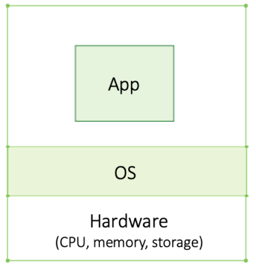
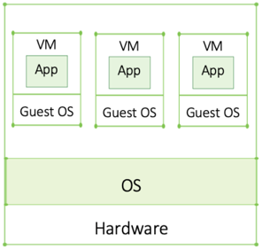
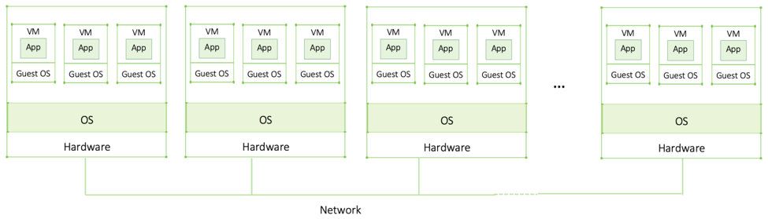
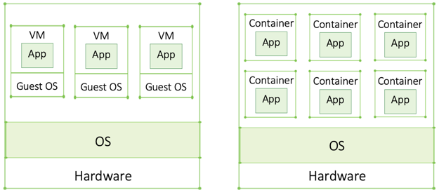
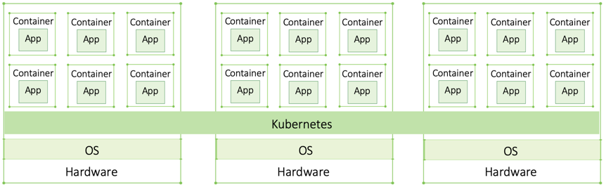

## 1. Introduction
### 1.1 Kubernetes overview
Kubernetes is a portable, extensible, open source platform for **managing containerized workloads and services**, that facilitates both declarative configuration and automation. It has a large, rapidly growing ecosystem. Kubernetes services, support, and tools are widely available.

The name Kubernetes originates from Greek, meaning helmsman or pilot. K8s as an abbreviation results from counting the eight letters between the "K" and the "s". Google open-sourced the Kubernetes project in 2014. Kubernetes combines over 15 years of Google's experience running production workloads at scale with best-of-breed ideas and practices from the community.

Kubernetes can run on bare metal servers, virtual machines, public cloud providers, private clouds, and hybrid cloud environments. One of Kubernetes’s key advantages is **it works on many different kinds of infrastructure**.

### 1.2 Why use Kubernetes?

#### 1.2.1 Why you need Kubernetes
Containers are a good way to bundle and run your applications. <u>In a production environment, you need to manage the containers that run the applications and ensure that there is no downtime.</u> For example, if a container goes down, another container needs to start. Wouldn't it be easier if this behavior was handled by a system?

That's how Kubernetes comes to the rescue! **Kubernetes provides you with a framework to run distributed systems resiliently. It takes care of scaling and failover for your application, provides deployment patterns, and more.** For example: Kubernetes can easily manage a canary deployment for your system.

#### 1.2.2 How Kubernetes Came to Be ———— Virtualization Evolution
I’ll start with a single computer, move to virtual machines, and then briefly discuss distributed applications.

We've already know what a **bare metal machine** and a **virtual machine** looks like:

##### 1.2.2.1 Large Enterprise Applications and Distributed Systems
**Enterprise applications can be huge** and often require way more compute capacity than a single machine can handle. Parallel computing, running multiple programs at the same time, may also be required. In order to achieve that, **multiple machines are connected through a network forming a distributed application/system**. The two main characteristics of a distributed system are (1) a collection of autonomous virtual or physical machines (2) that appears as one single coherent system to the end-user (which can be a person or an application).

**A group of machines that works together forms a cluster**; each machine is referred to as a node. For a cluster to realize a common goal, nodes must communicate or “exchange messages.” Over the network, data is exchanged, commands given or accepted, status updates provided, etc.

The key concept here is that a cluster or distributed system becomes one big powerful machine even though the nodes may not necessarily be located in the same physical location.

Unless we are dealing with monolithic applications (typically older applications that were built as one single entity), these large distributed applications are **modular and broken down into several components that are placed into VMs**. This eases updates, fixes, and rollouts. It also means that if one component crashes, the entire system isn’t necessarily down.

Containers are the <u>next step</u> in the virtualization evolution, and it has been discussed before, so just jump.

##### 1.2.2.2 Microservices
**Microservices are applications broken down into even smaller components. Each microcomponent is called a service — hence microservices**. More components mean more VMs or containers are needed. The fact that containers require a lot less resources made microservices feasible for many organizations which is why we are hearing so much about them now.

Placed into a container, each microservice is isolated from one another. Why is this beneficial? Well, the smaller an independent component, the easier to build, test, deploy, debug, and fix. Clearly, it’s much easier to find a bug in a few lines of code than hundreds of them. Since they are isolated, it’s also easier to roll back should a new feature or update prove problematic. But how micro should a microservice be to be considered as such? One way of defining it is code that can be built, tested, and deployed within a week.

##### 1.2.2.3 Container Orchestrators
If a legacy app with hundreds of VMs migrates to containers, it may now be composed of thousands of containers. **As you can imagine, managing them all manually is just impossible. This is where container orchestration tools, like Kubernetes, come in.** The orchestrator ensures the right number of containers are up and running and, if necessary, intervenes to fix it. It automates a lot of otherwise very cumbersome manual work which would make it impossible to scale. **A container orchestrator spans across the entire cluster and abstracts away the underlying resources**(hardware across the cluster such as CPU, memory, and storage).

While there are a few container orchestrators on the market (Docker Swarm is a well-known example), Kubernetes won the container war and in 2018 all major cloud providers adopted it.

#### 1.2.3 What Kubernetes can do
Kubernetes provides you with:

- **Service discovery and load balancing** Kubernetes can expose a container using the DNS name or using their own IP address. ==If traffic to a container is high, Kubernetes is able to load balance and distribute the network traffic=={.info} so that the deployment is stable.
- **Storage orchestration** Kubernetes allows you to ==automatically mount a storage system of your choice, such as local storages, public cloud providers, and more.=={.info}
- **Automated rollouts and rollbacks** You can describe the ==desired state=={.info} for your deployed containers using Kubernetes, and it can change the actual state to the desired state at a controlled rate. For example, you can automate Kubernetes to create new containers for your deployment, remove existing containers and adopt all their resources to the new container.
- **Automatic bin packing** You provide Kubernetes with a cluster of nodes that it can use to run containerized tasks. ==You tell Kubernetes how much CPU and memory (RAM) each container needs. Kubernetes can fit containers onto your nodes to make the best use of your resources.=={.info}
- **Self-healing** Kubernetes ==restarts containers that fail, replaces containers, kills containers=={.info} that don't respond to your user-defined health check, and doesn't advertise them to clients until they are ready to serve.
- **Secret and configuration management** Kubernetes lets you ==store and manage sensitive information=={.info}, such as passwords, OAuth tokens, and SSH keys. You can deploy and update secrets and application configuration without rebuilding your container images, and without exposing secrets in your stack configuration.
- **Batch execution** In addition to services, Kubernetes can manage your batch and CI workloads, replacing containers that fail, if desired.
- **Horizontal scaling** Scale your application up and down with a simple command, with a UI, or automatically based on CPU usage.
- **IPv4/IPv6 dual-stack** Allocation of IPv4 and IPv6 addresses to Pods and Services
- **Designed for extensibility** Add features to your Kubernetes cluster without changing upstream source code.

### 1.3 Key Concepts and Terminologies
#### 1.3.1 Cluster Architecture: The architectural concepts behind Kubernetes.
A Kubernetes cluster consists of **a control plane plus a set of worker machines, called nodes**, that run containerized applications. Every cluster needs at least one worker node in order to run Pods.

The worker node(s) host the **Pods** that are the components of the application workload. The control plane manages the worker nodes and the Pods in the cluster. In production environments, the control plane usually runs across multiple computers and a cluster usually runs multiple nodes, providing fault-tolerance and high availability.

Refer to [here](https://kubernetes.io/docs/concepts/architecture/) to learn more about cluster architecture.

#### 1.3.2 Workloads
**A workload is an application running on Kubernetes**. Whether your workload is a single component or several that work together, on Kubernetes you run it inside **a set of pods**. In Kubernetes, **a Pod represents a set of running containers on your cluster**.

Kubernetes pods have a defined lifecycle. For example, once a pod is running in your cluster then a critical fault on the node where that pod is running means that all the pods on that node fail. Kubernetes treats that level of failure as final: you would need to create a new Pod to recover, even if the node later becomes healthy.

However, to make life considerably easier, you don't need to manage each Pod directly. Instead, you can use *workload resources* that manage a set of pods on your behalf. These resources **configure controllers** that make sure the right number of the right kind of pod are running, to match the state you specified.

Refer to [here](https://kubernetes.io/docs/concepts/workloads/) to learn more about several built-in workload resources in Kubernetes.

#### 1.3.3 Services, Load Balancing, and Networking
Refer to [here](https://kubernetes.io/docs/concepts/services-networking/) to learn more.

#### 1.3.4 Storage 
Ways to provide both long-term and temporary storage to Pods in your cluster.
Refer to [here](https://kubernetes.io/docs/concepts/storage/) to view different types of storage that Kubernetes support.

#### 1.3.5 Configuration
Resources that Kubernetes provides for configuring Pods.
Refer to [here](https://kubernetes.io/docs/concepts/configuration/) to view different types of storage that Kubernetes support.

#### 1.3.6 Cluster Administration
Lower-level detail relevant to creating or administering a Kubernetes cluster.
The cluster administration overview is for anyone creating or administering a Kubernetes cluster. It assumes some familiarity with core Kubernetes concepts.
Refer to [here](https://kubernetes.io/docs/concepts/cluster-administration/) to view different types of storage that Kubernetes support.

### 1.4 Kubernetes Alternatives
While there are other container orchestration tools available, such as Docker Swarm, Mesos, and Nomad, there are some key differences between Kubernetes and these other tools.

- Comparing **Apache Mesos** with Kubernetes:
    - There are some reasons to choose Mesos, rather than Kubernetes, those are:
        - Mesos has existed longer than Kubernetes and is thus somewhat more mature. 
        - Mesos can also be easier to set up than Kubernetes -- provided that it supports your networking and storage requirements based on its native features. 
        - Mesos' ability to run non-containerized apps natively is also an advantage, especially for organizations looking to deploy a range of application types.
    - But Kubernetes is still a better choice if:
        - Looking to benefit from the hundreds of open source add-ons and integrations provided by the Kubernetes community. 
        - Finding engineers with the right expertise to support your clusters.
    - Refer to [here](https://www.techtarget.com/searchitoperations/tip/Compare-container-orchestrators-Apache-Mesos-vs-Kubernetes) to view details.

- Comparing **Swarm** with Kubernetes:
    - Swarm is obviously simpler in many ways: application defining, networking, security, scaling applications
    - Kubernetes has a stronger ecosystem, there are many more applications and components that are built for Kubernetes than for Swarm, and Kubernetes can work with any container runtime that complies with the Container Runtime Interface, where Swarm uses only the Docker Engine runtime.
    - Refer to [here](https://thenewstack.io/docker-swarm-a-user-friendly-alternative-to-kubernetes/) to view details.

