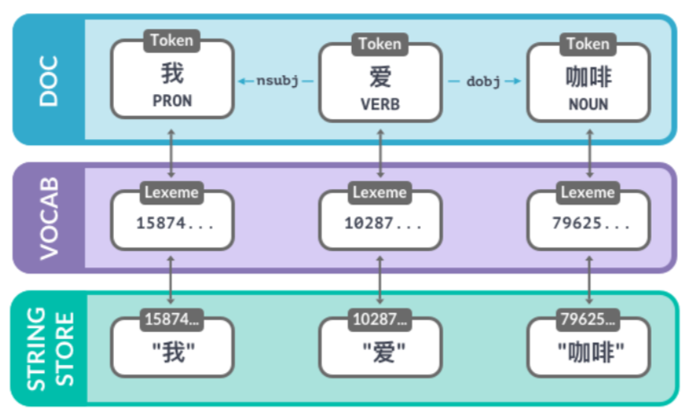
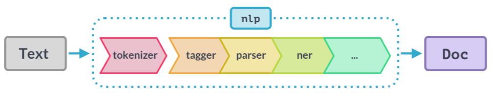
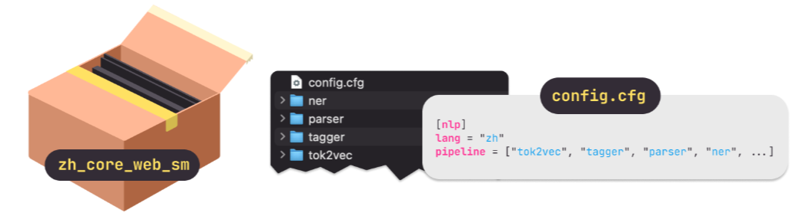
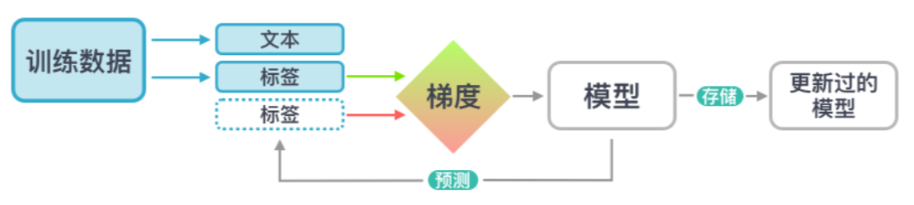
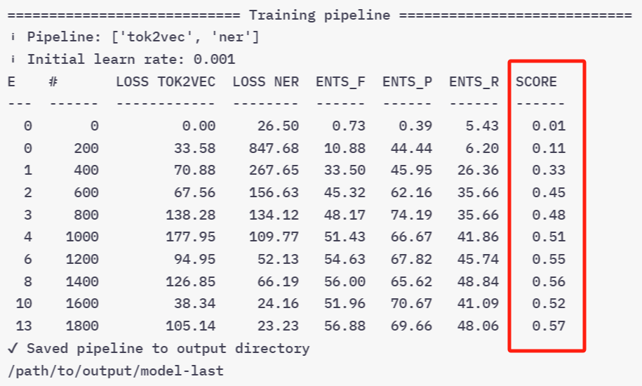

## 1. Basis
### 1.1 What is it?
#### 1.1.1 spaCy
spaCy的核心就是**包含了自然语言处理流程的对象**。通常把这个变量叫做nlp。

```python
# 导入spaCy
import spacy

# 创建一个空白的中文nlp对象；可以像一个函数一样使用nlp对象来分析文本。
# 这个nlp对象包含了流程中的所有不同组件。
nlp = spacy.blank("zh")
```

#### 1.1.2 Doc对象
当我们用nlp对象来处理文本时，**spaCy会创建一个叫做Doc的对象**，这是"document"的缩写。 Doc可以让我们**用结构化的方式来读取文本相关的信息，并且不会有信息丢失**。
eg: 
```python
# 使用nlp对象处理一段文本并生成doc实例
doc = nlp("这是一个句子。")

# doc来就像一个正常的Python序列，可以遍历doc实例中的词符
for token in doc:
    print(token.text)
```

#### 1.1.3 Token对象
Token实例代表了**一个文本中的词符**，比如一个词或者一个标点符号。

要读取某一个位置的词符，我们可以直接**使用doc的索引**。

Token实例同时提供了**不同的属性**可以让我们读取词符的**其它信息**。 比如.text属性可以返回词符的原始文本。
```python
doc = nlp("这是一个句子。")

# 使用Doc索引读取单个词符
token = doc[1]

# 使用.text属性读取词符的文本
print(token.text)
```
::: details OUTPUT
一个
:::

#### 1.1.4 Span对象
一个Span实例是**文本包含了一个或更多的词符的一段截取**。 它仅仅是Doc的一个**视图**而**不包含实际的数据本身**。

要**创建一个span，我们可以使用Python截取的语法**。举个例子，1:3会创建一个从索引1开始 一直到索引3之前（不包括索引3）的词符截取。
```python
doc = nlp("这是一个句子。")

# 截取Doc的一部分就成为了Span实例
span = doc[1:3]

# 使用.text属性获取span的文本
print(span.text)
```
::: details OUTPUT
一个句子
:::

#### 1.1.5 词汇的属性
```python
doc = nlp("这个肉夹馍花了￥5。")

print("Index:   ", [token.i for token in doc])
print("Text:    ", [token.text for token in doc])

print("is_alpha:", [token.is_alpha for token in doc])
print("is_punct:", [token.is_punct for token in doc])
print("like_num:", [token.like_num for token in doc])
```

::: details OUTPUT
Index:    [0, 1, 2, 3, 4, 5, 6]  
Text:     ['这个', '肉夹馍', '花', '了', '￥', '5', '。']  
is_alpha: [True, True, True, True, False, False, False]  
is_punct: [False, False, False, False, False, False, True]  
like_num: [False, False, False, False, False, True, False]  
:::

- **i**是原始文本中的**词符索引值**。
- **text**返回词符的**文本**。
- **is_alpha，is_punct和like_num**都会*返回一个布尔值*，**检测词符是否有字母表字符组成、 是否是标点符号或者是否代表了一个数字**；举个例子，一个包含了1和0的词符"10"， 或者一个包含了T,E,N三个字母的词组"ten"。
- 这些属性也被叫做词汇属性：他们仅仅代表了*词典中元素的特性，而与词符所在的语义情境无关。*
---
### 1.2 训练流程
#### 1.2.1 流程的定义
很多非常有趣的分析是**基于语境**的： 比如一个词是否是动词，或者文本的一段跨度是否是人名。

在spaCy中，已经有很多由大量标注过的文本例子训练而成的流程。

流程组件中所包含的**统计模型**让spaCy可以通过语境来做抽取。抽取结果通常包括：
- 词性标注
- 依存关系
- 命名实体

流程可以输入更多的标注数据来优化结果，常见的应用是用特定数据优化用户需要的特定场景。

#### 1.2.2 流程包
可以用spacy download命令下载训练好的流程包，如"zh_core_web_sm"这个流程包就是一个小的中文模型，它有所有核心功能，是从网上的文本训练而来。：
```bash
python -m spacy download zh_core_web_sm
```
下载好流程包后，通过spacy.load方法，通过包名读取一个流程包并返回一个nlp实例。
```python 
import spacy

nlp = spacy.load("zh_core_web_sm")
```
一个训练好的流程/模型，包含如下信息：
- 二进制权重：用这些权重可以做出模型预测实现信息抽取
- 词汇表
- 元信息
- 配置文件

#### 1.2.3 词性标注
对处理后的文本得到的词符，可以通过 ==.pos_=={.info}属性读取其词性标注的结果。
```python
import spacy

# 读取小版本的中文流程
nlp = spacy.load("zh_core_web_sm")

# 处理文本
doc = nlp("我吃了个肉夹馍")

# 遍历词符
for token in doc: # [!code word:pos_]
    # Print the text and the predicted part-of-speech tag
    print(token.text, token.pos_)
```
::: details OUTPUT
我 PRON  
吃 VERB  
了 PART  
个 NUM  
肉夹馍 NOUN  
:::

#### 1.2.4 依存关系解析
依存关系，即词与词之间的关系。比如一个词是某一个句子或者物体的主语。

==.dep_=={.info}属性返回预测的<u>依存关系标注</u>。

==.head=={.info}属性返回<u>句法头词符</u>。你可以认为这是词在句子中所依附的母词符。

```python
for token in doc: # [!code word:dep_]
    print(token.text, token.pos_, token.dep_, token.head.text)
```
::: details OUTPUT
我 PRON nsubj 吃  
吃 VERB ROOT 吃  
了 PART aux:asp 吃  
个 NUM nummod 肉夹馍  
肉夹馍 NOUN dobj 吃  
:::

#### 1.2.5 命名实体识别
通过 ==doc.ents=={.info}，返回一个<u>Span实例</u>的遍历器；可以通过 ==.label_=={.info}属性读取模型预测出的所有命名实体以及**实体标注**。
```python
# 处理文本
doc = nlp("微软准备用十亿美金买下这家英国的创业公司。")

# 遍历识别出的实体
for ent in doc.ents:# [!code word:label_]
    # 打印实体文本及其标注
    print(ent.text, ent.label_)
```
::: details OUTPUT
微软 ORG  
十亿美金 MONEY  
英国 GPE  
:::
___
### 1.3 基于规则的匹配抽取matcher
#### 1.3.1 与正则表达式的差别
1. 作用对象不同：
    正则表达式作用在字符串上，而matcher是在Doc和Token
2. 搜索对象不同：
    正则表达式搜索目标字符串，而matcher不仅可以搜索文本，还**可以搜索其它的词法属性**。
    甚至可以直接调用模型的预测结果来写规则。
3. 举个例子，我们可以寻找那些是动词而不是名词的"duck"词汇（"duck"名词意思是鸭子，而动词是闪避的意思）

#### 1.3.2 匹配的模板
匹配的模板是一些 ==list=={.info}，list的每一个元素是一个==dict=={.info}。 每个dict代表一个词符，键值是==词符属性名=={.info}，映射到==对应的目标值上面=={.info}。

模板示例：
1. 匹配词符的完全一致的文字
```python
# 找两个文本为"iPhone"和"X"的词符
# [!code word:TEXT]
[{"TEXT": "iPhone"}, {"TEXT": "X"}]
```
2. 匹配词汇属性
```python
# 找两个小写形式为"iphone"和"x"的词符
# [!code word:LOWER]
[{"LOWER": "iphone"}, {"LOWER": "x"}]
```
3. 匹配任意的词符属性
```python
# 找一个词根为"buy"且后面为名词的词符
# 词根是词的基础形式，所以这个模板会匹配到诸如"buying milk"或者"bought flowers"这样的短语
# [!code word:LEMMA]
[{"LEMMA": "buy"}, {"POS": "NOUN"}]
```

#### 1.3.3 使用示例
:::: steps
1. 从spacy.matcher中导入matcher  
    ```python
    from spacy.matcher import Matcher
    ```
2. 读取一个流程创建nlp实例  
3. 用流程分享出的vocab初始化matcher  
    ```python
    matcher = Matcher(nlp.vocab)
    ```
4. 通过matcher.add方法**给matcher加入模板**  
第一个参数是唯一的ID用来识别匹配的是哪一个模板，第二个参数是一个模板的列表  
5. 处理目标文本，并在得到的doc实例中调用matcher进行匹配
    ```python 
    doc = nlp("...")
    matches = matcher(doc)
    ```
6. 此时会返回一个**每个元素是一个元组(tuple)的列表**：每个元组由**三个值**构成：匹配到的模板名的ID，匹配到的跨度的起始和终止索引。  
::::

###### 1.3.3.1 匹配词符的完全一致的文字
```python
import spacy

# 导入Matcher
# [!code word:import Matcher]
from spacy.matcher import Matcher

# 读取一个流程，创建nlp实例
nlp = spacy.load("zh_core_web_sm")

# 用模型分享出的vocab初始化matcher
matcher = Matcher(nlp.vocab) # [!code highlight]

# 给matcher加入模板
# 以匹配词符的完全一致的文字为例
pattern = [{"TEXT": "iPhone"}, {"TEXT": "X"}]
matcher.add("IPHONE_PATTERN", [pattern])

# 处理文本
doc = nlp("即将上市的iPhone X发布日期被泄露了")

# 在doc上面调用matcher
# [!code word:matcher]
matches = matcher(doc) 

# 遍历所有的匹配结果
for match_id, start, end in matches:
    # 获取匹配的跨度
    matched_span = doc[start:end]
    print(matched_span.text)
```
::: details OUTPUT
iPhone X
:::

###### 1.3.3.2 匹配词汇属性
```python
import spacy

# 导入Matcher
# [!code word:import Matcher]
from spacy.matcher import Matcher

# 读取一个流程，创建nlp实例
nlp = spacy.load("zh_core_web_sm")

# 用模型分享出的vocab初始化matcher
matcher = Matcher(nlp.vocab) # [!code highlight]

# 给matcher加入模板
# 匹配词汇属性：一个只含有数字的词符；三个匹配到"国际", "足联"和"世界杯"的词符；以及一个标点符号词符。
pattern = [ # [!code focus:7]
    {"IS_DIGIT": True},
    {"LOWER": "国际"},
    {"LOWER": "足联"},
    {"LOWER": "世界杯"},
    {"IS_PUNCT": True}
] 
matcher.add("IPHONE_PATTERN", [pattern])

# 处理文本
doc = nlp("2018国际足联世界杯：法国队赢了！")# [!code focus]

# 在doc上面调用matcher
# [!code word:matcher]
matches = matcher(doc) 

# 遍历所有的匹配结果
for match_id, start, end in matches:
    # 获取匹配的跨度
    matched_span = doc[start:end]
    print(matched_span.text)
```
::: details OUTPUT
2018国际足联世界杯：
:::

或：
```python
import spacy

# 导入Matcher
# [!code word:import Matcher]
from spacy.matcher import Matcher

# 读取一个流程，创建nlp实例
nlp = spacy.load("zh_core_web_sm")

# 用模型分享出的vocab初始化matcher
matcher = Matcher(nlp.vocab) # [!code highlight]

# 给matcher加入模板
# 匹配词汇属性：一个动词，其中词根是"喜欢"，后面跟着一个名词。
pattern = [# [!code focus:4]
    {"LEMMA": "喜欢", "POS": "VERB"},
    {"POS": "NOUN"}
]
matcher.add("IPHONE_PATTERN", [pattern])

# 处理文本
doc = nlp("我喜欢狗但我更喜欢猫。")# [!code focus]

# 在doc上面调用matcher
# [!code word:matcher]
matches = matcher(doc) 

# 遍历所有的匹配结果
for match_id, start, end in matches:
    # 获取匹配的跨度
    matched_span = doc[start:end]
    print(matched_span.text)
```
::: details OUTPUT
喜欢狗  
喜欢猫
:::

##### 1.3.3.3 使用运算符和量词
使用运算符和量词来定义**一个词符应该被匹配几次**。 我们可以在目标词符后用"OP"这个关键词来添加它们。
|  序号   |  例子   | 说明  |
|  :----:  |  :----:  | :----:  |
| 1 | "!" | 否定: 0次匹配 |
| 2 | "?" | 可选: 0次或1次匹配 |
| 3 | "+" | 1次或更多次匹配 |
| 4 | "*" | 0次或更多次匹配 |
```python
# 这个模板会匹配到一个词根为"买"的词符，一个可选的数词和一个名词。
pattern = [
    {"LEMMA": "买"},
    {"POS": "NUM", "OP": "?"},  # 可选: 匹配0次或者1次
    {"POS": "NOUN"}
]
```
```python
doc = nlp("我买个肉夹馍。我还要买凉皮。")
```
::: details OUTPUT
买个肉夹馍  
买凉皮
:::

## 2. 使用spaCy进行大规模数据分析
### 2.1 数据结构 (1): Vocab, Lexemes和StringStore
#### 2.1.1 Vocab & StringStore：词汇表，字符串库
1. Vocab：一个词汇表，存储spaCy中多个文档共享的数据。除词汇外，还包括了标注和实体的标注方案。
2. StringStore：
- 为了节省内存，spaCy将所有字符串编码为**哈希值**。
- 字符串在存储时，spaCy使用哈希方程为其生成一个ID，通过nlp.vocab.strings将ID和对应的字符串一起存储到StringStore中，且只存储一次。
- StringStore是一个**双向**的查询表。你可以查找一个字符串获得其哈希值，也可以查找一个哈希值获得其字符串值。 spaCy内部的信息交流都是通过哈希ID进行的。
    ```python
    nlp.vocab.strings.add("咖啡")
    coffee_hash = nlp.vocab.strings["咖啡"]
    coffee_string = nlp.vocab.strings[coffee_hash]
    ```
- 但哈希ID不能逆求解。如果一个词不在词汇表里，那我们也没法办拿到它的字符串。 这也是为什么我们每次都要把共享词汇表传进来。
    ```python
    # 如果该字符串从未出现过则会报错
    string = nlp.vocab.strings[7962530705879205333]
    ```
3. 实际应用中，使用nlp方法对文本进行处理后，可以在 ==nlp.vocab.strings=={.info}中查找字符串和哈希值；Doc也可以暴露出词汇表和字符串
```python
doc = nlp("我爱喝咖啡。")
print("hash value:", nlp.vocab.strings["咖啡"])
# [!code word:doc]
# or: print("hash value:", doc.vocab.strings["咖啡"]) 
print("string value:", nlp.vocab.strings[7962530705879205333])
```
::: details OUTPUT
hash value: 7962530705879205333  
string value: 咖啡
:::
#### 2.1.2 Lexemes: 词汇表中的元素
**Lexeme（语素）** 是词汇表中和语境**无关**的元素。当我们在词汇表中查询一个字符串或者一个哈希ID就会获得一个lexeme。
得到一个lexeme后，它同样具有一些和词符类似的属性，它们代表着**一个词的和语境无关的信息**，比如文本本身，或者是这个词是否包含了英文字母。
Lexeme中**没有**词性标注、依存关系或者实体标签这些和语境关联的信息。
```python
doc = nlp("我爱喝咖啡。")
lexeme = nlp.vocab["咖啡"]

# 打印词汇的属性
# lexeme.orth：哈希值
print(lexeme.text, lexeme.orth, lexeme.is_alpha)
```
::: details OUTPUT
咖啡 7962530705879205333 True
:::

#### 2.1.3 三者关系
Doc包含了<u>语境中的词汇</u>，在这个例子里面就是指"I"、"love"、"coffee"这三个词符 以及它们的词性标注和依存关系。
每个词符对应一个<u>语素lexeme</u>，里面保存着词汇的<u>哈希ID</u>。 要拿到这个词的文本表示，spaCy要在<u>字符串库</u>里面查找它的哈希值。

___
### 2.2 数据结构(2)：Doc、Span和Token
#### 2.2.1 Doc文档实例
Doc是spaCy的核心数据结构之一。 当我们用nlp实例来处理文本时Doc就会被自动创建，那么如何**手动初始化这个类**呢？
:::: steps
1. 创建一个nlp实例
2. 从spacy.tokens中**导入Doc类**
3. 创建两个list，分别用于表示加入Doc的词汇，和其对应位置后空格。空格列表的元素为布尔值。
4. 通过下列三个参数初始化Doc类：
    - ==共享的词汇表nlp.vocab=={.caution}
    - 词汇
    - 空格
::::
```python
# 创建一个nlp实例
import spacy
nlp = spacy.blank("en")

# 导入Doc类
from spacy.tokens import Doc

# 用来创建doc的词汇和空格
words = ["Hello", "world", "!"]
spaces = [True, False, False]

# 手动创建一个doc
doc = Doc(nlp.vocab, words=words, spaces=spaces)
```
#### 2.2.2 Span跨度实例
一个Span是doc的**一段包含了一个或更多的词符的截取**。 
如何创建Span实例？
:::: steps
1. （通过手动或其他方式）获得一个doc实例
2. 通过下列4个参数初始化Span类：
    - 对应的doc
    - span的初始索引
    - span的终止索引（不包含在这个span里面）
    - 标签，可选参数
::::

创建一个span实例后，由于==doc.ents=={.info}是可写的，可以通过一个span列表覆盖doc.ents，来手动添加一些实体。

::: warning
Doc和Span是非常强大的类，可以存储词语和句子的参考资料和关系。
- **不到最后就不要把结果转换成字符串**：如果你的应用需要输出字符串，确保到了最后才转换doc实例。 如果太早转换的话你就会丢失所有词符之间的关系。
- **尽可能使用词符属性**，比如用token.i来表示词符的索引
:::
___
### 2.3 词向量和语义相似度
#### 2.3.1 如何比较相似度
- spaCy能够对==文档doc、跨度span或者单个的词符token=={.info}中的其中两个实例进行相似度判断。
- 通过Doc、Token和Span实例的 ==.similarity()=={.info}方法
- 其中，参数为另一个实例，返回值为一个0到1之间的浮点数，这个浮点数代表了两个实例之间的相似度。
::: warning
要计算相似度，我们必须需要一个**比较大的**含有词向量的spaCy流程
- 可以用中等的英文流程：en_core_web_md（名字后面是"md"）
- 可以用大的英文流程：en_core_web_lg （名字后面是"lg"）
- 不可以用小流程：en_core_web_sm 
::: 

举个栗子：
```python
# 读取一个有词向量的较大流程
nlp = spacy.load("en_core_web_md")

# 1. 比较两个文档doc
doc1 = nlp("I like fast food")
doc2 = nlp("I like pizza")

# [!code word:doc1.similarity(doc2)]
print(doc1.similarity(doc2))

# 2. 比较两个词符token
doc = nlp("I like pizza and pasta")
token1 = doc[2]
token2 = doc[4]

# [!code word:token1.similarity(token2)]
print(token1.similarity(token2))

# 3. 比较一篇文章doc和一个词符token
doc = nlp("I like pizza")
token = nlp("soap")[0]

# [!code word:doc.similarity(token)]
print(doc.similarity(token))

# 4. 比较一个跨度span和一篇文档doc
span = nlp("I like pizza and pasta")[2:5]
doc = nlp("McDonalds sells burgers")

# [!code word:span.similarity(doc)]
print(span.similarity(doc))

```
::: details OUTPUT
1. 模型给出了一个相对高的相似度分数：0.8627204117787385  
2. 相似度分数也相对较高：0.7369546  
3. 模型认为这两个实例差别比较大：0.32531983166759537  
4. 模型认为这两个是比较相似的：0.619909235817623
:::

#### 2.3.2 判断机制
- 相似度是通过**词向量**计算的
- 词向量是**一个词汇的多维度的语义表示**。
- 词向量是用诸如Word2Vec的算法在大规模语料上面生成的。当然，词向量可以是spaCy流程的一部分。
- 默认spaCy会返回两个向量的**余弦相似度**，但有需要时我们也可以替换为其它计算相似度的方法。
- 一个包含了多个词符的实例，比如Doc和Span，默认的向量值的计算方法是**其中所有词符向量的平均值**。
- 因此，短语的向量表示要优于长篇文档，因为后者含有很多不相关的词
- 通过==token.vector=={.info}获取向量
    ```python
    # 导入一个含有词向量的较大的流程
    nlp = spacy.load("en_core_web_md")

    doc = nlp("I have a banana")
    # 通过token.vector属性获取向量
    print(doc[3].vector) # 对于"banana"，将获得一个300维的向量
    ```
    ::: details OUTPUT
    [2.02280000e-01,  -7.66180009e-02,   3.70319992e-01,
    3.28450017e-02,  -4.19569999e-01,   7.20689967e-02,
    -3.74760002e-01,   5.74599989e-02,  -1.24009997e-02,
    5.29489994e-01,  -5.23800015e-01,  -1.97710007e-01,
    -3.41470003e-01,   5.33169985e-01,  -2.53309999e-02,
    1.73800007e-01,   1.67720005e-01,   8.39839995e-01,
    5.51070012e-02,   1.05470002e-01,   3.78719985e-01,
    2.42750004e-01,   1.47449998e-02,   5.59509993e-01,
    1.25210002e-01,  -6.75960004e-01,   3.58420014e-01,
    -4.00279984e-02,   9.59490016e-02,  -5.06900012e-01,
    -8.53179991e-02,   1.79800004e-01,   3.38669986e-01,
    ...
    :::

#### 2.3.3 相似度使用注意
- 判断相似度对很多种不同的应用都很有帮助。比如基于用户的阅读历史来推荐相似的文章。 相似度还可以帮助标记重复内容，比如在线平台里面的帖子。
- 然而我们要明确知道并**没有一个绝对客观的定义来判断什么是相似的，什么不是**
- 这要决定于实际场景和所支持的应用是要做什么。
- 我们看一个例子：
    - spaCy默认的词向量会对"I like cats"和"I hate cats"这两句给出<u>非常高的相似度分数</u>(0.95)。这是有道理的，因为两个文本都在讲关于猫的看法。
    - 但在另一个应用场景里，你可能希望这两句话是*非常不同*的，因为它们的看法是完全相反的。
---
### 2.4 流程和规则的结合
我们应该学会如何**将统计模型的预测结果与规则系统结合使用**，因为这是自然语言处理工具箱里面最强大的方法之一。
#### 2.4.1 统计模型和规则系统的区别
|   |  统计模型   | 规则系统  |
|  :----:  |  :----:  | :----:  |
| 应用场景 | 	需要根据例子来*泛化*的应用 | *有限个*例子组成的字典 |
| 真实范例 | 产品名、人名、主语宾语关系 [+model] | 世界上的国家、城市、药品名、狗的种类 |
| spaCy功能 | 实体识别器、依存句法识别器、词性标注器 | 分词器, Matcher, PhraseMatcher|

[+model]:
    通过已有的人名例子，判断一段文本中的几个词符是否是人名

#### 2.4.2 高效短语匹配：PhraseMatcher
短语匹配器phrase matcher是另一个在数据中查找词语序列的非常有用的工具，短语匹配器也是在文本中做关键词查询，但不同于仅仅寻找字符串，短语匹配器可以**直接读取语义中的词符**。  
与Matcher相比，其特点如下：
- 将Doc实例作为模板
- 比Matcher更快更高效
- 适用于大规模词表的匹配

```python
# 和matcher一样从spacy.matcher中导入
from spacy.matcher import PhraseMatcher

matcher = PhraseMatcher(nlp.vocab)

# 传进一个Doc实例而不是字典列表作为模板
pattern = nlp("Golden Retriever") # [!code highlight]
matcher.add("DOG", [pattern]) # [!code highlight]
doc = nlp("I have a Golden Retriever")

# 遍历匹配结果
for match_id, start, end in matcher(doc):
    # 获取匹配到的span
    span = doc[start:end]
    print("Matched span:", span.text)
```
::: details OUTPUT
Matched span: Golden Retriever
:::

## 3. 处理流程
### 3.1 流程组件
#### 3.1.1 调用nlp时会发生什么？
- 首先，应用**分词器**将一段文本的字符串变成一个Doc实例
- 然后，**一系列的流程组件**会依次作用在这个doc上面。如下图所示，下图中这些组件依次是：
    - 词性标注器tagger
    - 依存关系标注器parser
    - 实体识别器entity recognizer
- 最后返回被处理过的doc，我们就可以在这个上面开展后续工作了。  


#### 3.1.2 一些经典的原生的流程组件

| 名字        | 描述           | 创建结果  |
| :-------------: |:-------------:| :-----:|
| tagger | 词性标注器 | Token.tag, Token.pos |
| parser | 依存关系标注器 | Token.dep, Token.head, Doc.sents, Doc.noun_chunks[+parser] |
| ner | 命名实体识别器 | Doc.ents, Token.ent_iob, Token.ent_type |
| textcat | 文本分类器 | Doc.cats[+textcat] |

[+parser]:
    检测句子和基础的名词短语（名词块）
[+textcat]:
    适用于整个文本的类别
::: info
因为文本的类别往往是特定的，所以**默认文本分类器不包含在任何一个训练好的流程里面**。但我们可以用它来训练自己的系统。
:::

#### 3.1.3 流程查看
1. 通过配置文件
    - 当我们读进一个spaCy的流程包时，其中将包含一些文件和一个==config.cfg=={.info}
    - 这个配置文件定义了**语种**，**流程**也被依次定义在模型中，用于告诉spaCy应该如何初始化和配置哪些组件
    - 原生的组件如果要做预测也要需要二进制数据。这些数据都保存在流程包中，当我们读取流程的时候这些数据就被读取到组件中。
    
2. 通过方法
- 使用==nlp.pipe_names=={.info}属性，读取当前nlp实例中流程组件的**名字**。
    ```python
    print(nlp.pipe_names)
    ```
    ::: details OUTPUT
    ['tok2vec', 'tagger', 'parser', 'ner', 'attribute_ruler', 'lemmatizer']
    :::
- 使用==nlp.pipeline=={.info}属性来读取一个**组件名与组件函数[+pipeline_func]构成的元组**的列表。
    ```python
    print(nlp.pipeline)
    ```
    ::: details OUTPUT
    [('tok2vec', <spacy.pipeline.Tok2Vec>),  
    ('tagger', <spacy.pipeline.Tagger>),  
    ('parser', <spacy.pipeline.DependencyParser>),  
    ('ner', <spacy.pipeline.EntityRecognizer>),  
    ('attribute_ruler', <spacy.pipeline.AttributeRuler>),  
    ('lemmatizer', <spacy.pipeline.Lemmatizer>)]
    :::

[+pipeline_func]: 
    组件函数，就是那些作用在doc上面处理文本并设置属性的函数，比如词性标注器或者命名实体识别器。
---
### 3.2 定制化流程组件
定制化流程组件让我们可以在spaCy的流程中加入我们自己的函数。当我们在一段文本上调用nlp时，这些函数就会被调用来完成，比如修改doc为其增加更多数据的任务。
#### 3.2.1 定制化组件的应用场景
- 定制化组件允许我们在一段文字上调用nlp时，使得一个自定义函数被自动执行
- 为文档document和词符token添加**定制化的元数据**
- **更新原生属性**，比如命名实体识别的结果doc.ents
#### 3.2.2 如何定制化
- In reality，一个流程组件就是一个函数或者callable，**它读取一个doc，并对其进行修改和返回，** 作为下一个流程组件的输入。
因此，我们想要定制化一个流程组件，就是写一个函数。  
- 当我们完成一个组件，如何让spaCy找到我们的定制组件并调用？我们需要用 **@Language.component装饰器来装饰这个组件**，只需要将其放在函数定义的前一行即可，从而完成这个组件的注册。
- 最后，一旦组件被注册后，我们就可以用**nlp.add_pipe**来将其加入到流程中。这个方法需要至少一个参数：**组件名**。
```python
from spacy.language import Language
@Language.component("custom_component") # [!code highlight]
def custom_component_function(doc):
    # 对doc做一些处理
    return doc # [!code highlight]

nlp.add_pipe("custom_component")
```
::: info
对于nlp.add_pipe方法的参数，说明如下：
| 参数        | 说明           | 例子  |
| :------------- |:-------------| :-----|
| last | 如果为True则加在最后面；默认 | nlp.add_pipe("component", last=True) |
| first | 如果为True则加在最前面，紧跟在分词器之后 | nlp.add_pipe("component", first=True) |
| before | 加在指定组件之前	 | nlp.add_pipe("component", before="ner") |
| after | 加在指定组件[+assignment_component]之后 | nlp.add_pipe("component", after="tagger") |

[+assignment_component]:
    新组件位置之前或者之后的那个组件**必须存在**，不然spaCy就会报错。
:::

#### 3.2.3 举例
```python
# 创建nlp实例
nlp = spacy.load("zh_core_web_sm")

# 定义一个定制化组件
# 用@Language.component装饰器将其注册，起名为"custom_component".
@Language.component("custom_component")
def custom_component_function(doc):
    # 打印doc的长度
    print("Doc length:", len(doc))
    # 返回doc
    return doc # [!code warning]

# 把组件添加到流程的最前面
nlp.add_pipe("custom_component", first=True)

# 打印流程的组件名
print("Pipeline:", nlp.pipe_names)

# 处理一段文本
doc = nlp("这是一个句子。")
```
::: details OUTPUT
Pipeline: ['custom_component', 'tok2vec', 'tagger', 'parser', 'ner', 'attribute_ruler', 'lemmatizer']   # 可以看到定制化组件现在出现在起始位置。这意味着我们处理一个doc 的时候这个组件会先被调用

Doc length: 4
:::

---
### 3.3 扩展属性
定制化属性，允许我们添加任何的元数据到doc、token和span中，从而更具有定制性。这些元数据可以一次性添加，也可以动态被计算出来。
- 定制化属性通过 ==._=={.info}（点加下划线）属性来读取。这样我们可以很清楚看到这些属性是被用户添加的，而不是spaCy的内建属性，如token.text。
    ```python
    # [!code word:._.]
    doc._.title = "My document"
    token._.is_color = True
    span._.has_color = False
    ```
- **使用set_extension方法在全局的Doc、Token或Span上注册**：属性需要注册在从spacy.tokens导入的全局Doc、Token和Span类上。我们用set_extension方法将一个定制化属性注册到Doc、Token和Span上。
    - set_extension方法的第一个参数是<u>属性名字</u>。在这个例子中这些定制化参数有<u>默认值，也可以被覆盖重写</u>。
    ```python
    # 导入全局类
    from spacy.tokens import Doc, Token, Span

    # 在Doc、Token和Span上设置扩展属性
    # [!code word:set_extension]
    Doc.set_extension("title", default=None)
    Token.set_extension("is_color", default=False)
    Span.set_extension("has_color", default=False)
    ```
有三种扩展类别：
- 特性（Attribute）扩展
- 属性（Property）扩展
- 方法（Method）扩展

#### 3.3.1 特性（Attribute）扩展
特性扩展：设置一个**可被覆盖的默认值。**
```python
from spacy.tokens import Token

# 为Token设置一个有默认值的is_color特性，默认值是False
Token.set_extension("is_color", default=False)

doc = nlp("天空是蓝色的。")

# 覆盖默认扩展特性的值
doc[2]._.is_color = True
```

#### 3.3.2 属性（Property）扩展
属性扩展的工作方式和Python中的属性（property）一样，它们可以定义一个 ==取值器（getter）=={.info} 和一个 ==可选的赋值器（setter）=={.info}。  
取值器只有**当我们提取属性值的时候才会被调用**。因此，我们可以<u>动态</u>计算属性值，甚至可以考虑到其它定制化属性的值。
- 取值函数有一个参数：**其对应的实例**。
- 通过**getter关键字参数**来提供这个函数，从而完成注册扩展。
- 对于Span而言，==如果我们想给其设置一个拓展属性，大部分时间我们应该用一个带取值函数的属性拓展=={.info}。否则为了设置所有的span值我们需要手动更新*每一个可能出现的span*。

```python
from spacy.tokens import Token

# --------- 1. For token -----------------
# 定义取值器函数
# 取值器的参数应为其对应的实例，在本例中就是Token本身。
def get_is_color(token):
    colors = ["红色", "黄色", "蓝色"]
    return token.text in colors

# 为词符设置有取值器的扩展
Token.set_extension("is_color", getter=get_is_color)

doc = nlp("天空是蓝色的。")
# [!code word:._.is_color]
print(doc[2]._.is_color, "-", doc[2].text)

# --------- 2. For span -----------------
# 定义取值器函数
# 取值器的参数应为其对应的实例，在本例中是span。
def get_has_color(span):
    colors = ["红色", "黄色", "蓝色"]
    return any(token.text in colors for token in span)

# 为Span设置一个带有取值器getter的扩展
Span.set_extension("has_color", getter=get_has_color)

doc = nlp("天空是蓝色的")
# [!code word:._.has_color]
print(doc[1:4]._.has_color, "-", doc[1:4].text)
print(doc[0:2]._.has_color, "-", doc[0:2].text)
```
::: details OUTPUT
True - 蓝色  
True - 是蓝色的  
False - 天空是
:::

#### 3.3.3 方法（Method）扩展
方法扩展使扩展属性变为一个可调用的方法。  
我们可以向方法扩展中传入一个或多个参数，然后基于比如某一个特定 的参数或者设定，<u>动态计算属性值</u>。
还可以和前面的定制化组件结合起来。

```python
from spacy.tokens import Doc

# 定义含有参数的方法
# 本例中，方法函数检查doc中是否含有一个给定文本的词符
# 方法的第一个参数永远是实例本身，在本例中是doc。
# 其它所有的函数参数都是这个方法扩展的参数，在这里这个参数就是token_text。
def has_token(doc, token_text):
    in_doc = token_text in [token.text for token in doc]
    return in_doc

# 在doc上设置方法扩展
Doc.set_extension("has_token", method=has_token)

doc = nlp("天空是蓝色的。")
# [!code word:._.has_token()]
print(doc._.has_token("蓝色"), "- 蓝色")
print(doc._.has_token("云朵"), "- 云朵")
```
::: details OUTPUT
True - 蓝色  
False - 云朵
:::

---
### 3.4 规模化和性能
考虑如何让spaCy流程可以运作得尽可能快速，并且能够高效处理大规模语料。
#### 3.4.1 处理大规模语料
当我们需要对很多段文本进行处理并创建一系列的Doc实例时，考虑使用**nlp.pipe方法**，可以极大地加速这一过程。
- <u>将大规模语料存储在list里</u>，并传入nlp.pipe方法中
- nlp.pipe方法会使用<u>流模式</u>来处理文本生成Doc实例
- 这种方法大大快过在每段文本上调用nlp，原因是它对目标文本集进行了打包。
- nlp.pipe是一个**产生Doc实例的生成器**，因此如果想要获得**doc的列表**，记住要**对其调用list方法。**
```python 
# bad method
docs = [nlp(text) for text in LOTS_OF_TEXTS] # [!code --]
# good method
# [!code word:list]
docs = list(nlp.pipe(LOTS_OF_TEXTS)) # [!code ++]
```
- nlp.pipe支持传入形式为(text, context)的**文本/语境元组**，我们只需要设置**as_tuples为True。**
- 该方法会生成一系列(doc, context)的**文档/语境元组**。
- 当我们要把doc关联到一些元数据时这种方法就很有用，比如我们想要添加文本对应的ID，或是一个页码。
- 或者可以把语境元数据加入到doc的定制化属性中
```python
from spacy.tokens import Doc

Doc.set_extension("id", default=None)
Doc.set_extension("page_number", default=None)

data = [
    ("这是一段文本", {"id": 1, "page_number": 15}),
    ("以及另一段文本", {"id": 2, "page_number": 16}),
]

for doc, context in nlp.pipe(data, as_tuples=True):
    print(doc.text, context["page_number"])
    doc._.id = context["id"]
    doc._.page_number = context["page_number"]
```
::: details OUTPUT
这是一段文本 15
以及另一段文本 16
:::
#### 3.4.2 只用部分组件
有时候我们已经读入了一个模型来做一些其它的处理，但是对某一个特定的文本我们**只需要运行分词器**。此时，我们**没有必要跑完整个流程**，因为这会比较慢，我们还会拿到很多我们并不需要的模型预测结果。
1. 如果我们只想用分词器
如果我们只是需要一个分词过的Doc实例，我们可以用**nlp.make_doc方法**读入一段文本并返回一个doc。  
这也是spaCy后台所做的事情：流程组件在被调用之前，nlp.make_doc会先把文本变成一个doc。
    ```python
    doc = nlp.make_doc("Hello world!")
    ```
2. 关闭流程组件
spaCy允许我们通过**nlp.select_pipes方法**==暂时=={.info}关闭一些流程组件。
    - nlp.select_pipes方法需要一个关键词参数：enable或者disable，可以定义一个包含了需要关闭的一个或多个流程组件的名字的列表。 
    - 比如我们只想要用实体识别器来处理文档，我们就可以暂时关闭词性标注器tagger和依存关系标注器parser。
    - **通过with代码块使用这个方法**。
    - 在with代码块里面，spaCy只会跑未被关闭的剩余组件。
    - 在with代码块之后，**那些被关闭的流程组件会被自动重新启用**。
    ```python 
    # 关闭词性标注器tagger和依存关系标注器parser
    with nlp.select_pipes(disable=["tagger", "parser"]): # [!code highlight]
        # 处理文本并打印实体结果
        doc = nlp(text)
        print(doc.ents)
    ```

## 4. 训练神经网络模型
考虑如何更新spaCy的统计模型使其能够为特定的使用场景做出定制化。
### 4.1 训练和更新模型
#### 4.1.1 模型的训练流程
spaCy的训练流程如下：
:::: steps
1. **初始化**模型权重，使之变为随机值
2. spaCy调用nlp.update方法**预测**几个例子，看看当前权重的表现
3. **比较**预测结果和真实标注的标签
4. **计算**如何调整权重来改善预测结果
5. **微调**模型权重
6. 重复步骤 2。  

::::

在训练过程中，我们通常要**多次遍历**数据进行训练，直到模型不再变得更好。

#### 4.1.2 生成训练语料：以训练实体识别器为例
以实体识别器的训练为例，首先明白其工作原理：实体识别器读入一个文档，预测其中的短语及其**语境中**的标签。$\rightarrow$ 
- 这意味着训练数据需要有==文本、包含的实体以及实体的标签=={.info}。
- 且训练例子需要**带有语境**。
- 每一个词符只能是某一个实体的一部分。

目标是：教会模型==在相似语境中识别出新的实体=={.info}，就算这些实体并没有在训练数据中出现过。
```python
import spacy
nlp = spacy.blank("zh")

# 创建一个含有实体span的Doc
# 我们的目标识别对象
doc1 = nlp("iPhone X就要来了")
doc1.ents = [Span(doc1, 0, 8, label="GADGET")]

# 创建另一个没有实体span的Doc
# 让模型知道哪些词 并不是 实体也是非常重要的。
# 这种情况下，span标注的列表会是空的。
doc2 = nlp("我急需一部新手机，给点建议吧！")

docs = [doc1, doc2]  # 以此类推...
```
准备好训练语料后，**将其分成训练数据和测试数据**。
- 训练数据：用来==更新=={.info}模型
- 开发数据：用来==测试=={.info}模型
```python
# 通常，对数据随机排序
random.shuffle(docs)

#这里只是简单的50/50对半分
train_docs = docs[:len(docs) // 2]
dev_docs = docs[len(docs) // 2:]
```
一般来说，将训练和测试数据保存为**硬盘上的文件**，这样我们就可以读入到spaCy的训练流程中。  
==DocBin=={.info}是用来有效存储和序列化Doc对象的容器。我们可以用一个**Doc对象的列表**来初始化它，然后调用to_disk方法将其存储为一个二进制文件。这些文件我们一般使用 ==.spacy作为后缀=={.info}。
```python
# 创建和保存一系列的训练文档
train_docbin = DocBin(docs=train_docs)
train_docbin.to_disk("./train.spacy")
# 创建和保存一系列的测试文档
dev_docbin = DocBin(docs=dev_docs)
dev_docbin.to_disk("./dev.spacy")
```
---
### 4.2 配置和进行训练
#### 4.2.1 配置文件config.cfg
配置文件在spaCy中的作用：
- 定义了如何初始化nlp对象
- 包含了关于流程组件和模型实现的所有设定
- 配置了训练过程和超参数
- 使我们的训练过程可复现

给一个节选：
```ini
[nlp]
lang = "zh"
pipeline = ["tok2vec", "ner"]
batch_size = 1000
[nlp.tokenizer]
@tokenizers = "spacy.zh.ChineseTokenizer"
segmenter = "char"
[components]
[components.ner]
factory = "ner"
[components.ner.model]
@architectures = "spacy.TransitionBasedParser.v2"
hidden_width = 64
# 以此类推
```
如何**生成**它？不需要手写配置文件！
- spaCy可以自动生成一个默认的配置文件
- 文档中有可交互的[快速上手](https://spacy.io/usage/training#quickstart)插件
- 使用spaCy内建的init config命令
    ```bash
    $ python -m spacy init config ./config.cfg --lang zh --pipeline ner
    ```
    命令说明：
    - init config: 要运行的命令
    - config.cfg: 生成的配置文档的输出路径
    - --lang: 流程的语言类，比如中文是zh
    - --pipeline: 用逗号分隔的流程组件名称

#### 4.2.2 启动训练
要训练一个流程，我们需要：
- config.cfg
- 训练与测试数据

通过spacy train命令进行训练：
```bash
$ python -m spacy train ./config.cfg --output ./output --paths.train train.spacy --paths.dev dev.spacy
```
命令说明：
- train: 要运行的命令
- config.cfg: 配置文档的路径
- --output: 保存训练流程的输出路径
- --paths.train: 覆盖训练数据的路径
- --paths.dev: 覆盖测试数据的路径

一个训练过程中和结束时我们会看到的屏幕输出的例子:

要留意最后一列的合成分数。这反映了我们的模型在测试数据中预测正确的准确度。
训练过程会一直进行直到模型没有进一步的改进空间了，这时程序就会自动退出。

#### 4.2.3 训练结束后
训练后的输出是一个正常的可读取的spaCy流程，就像其它spaCy提供的训练好的流程一样，比如zh_core_web_sm。并会**将两个流程存储在输出路径中**：
- **model-last**: 最后训练出的流程
- **model-best**: 表现最好的训练流程

此时，我们可以把路径传给spacy.load来读取已经训练好的流程，并用它来处理和分析文本了。
```python
import spacy
# [!code word:model-best]
nlp = spacy.load("/path/to/output/model-best")
doc = nlp("iPhone 11 vs iPhone 8: 到底有什么区别？")
print(doc.ents)
```
spaCy还支持使用==spacy package=={.info}命令，创建一个包含我们流程的可安装的==Python包=={.info}，从而方便版本控制和部署。
- 其参数为：生成的流程路径与输出路径
- 还可以在命令中提供可选的名字和版本号
- 并生成一个.tar.gz格式的文件，这个文件含有我们流程的Python包
```bash
$ python -m spacy package /path/to/output/model-best ./packages --name my_pipeline --version 1.0.0
```
在安装这个包时，注意spaCy会自动**把语言代码加到名字中**，所以我们的流程my_pipeline最后就成了zh_my_pipeline。
```bash
$ cd ./packages/zh_my_pipeline-1.0.0
$ pip install dist/zh_my_pipeline-1.0.0.tar.gz
```
---
### 4.3 训练过程中的可能问题及解决方案
#### 4.3.1 模型“忘记”了东西
- 问题：已有的模型可能会在新数据上**过拟合**：
    - 比如，如果我们只是想给模型更新一个"WEBSITE"的类别，模型有可能会*忘记*之前"PERSON"这个类别。
- 解决方法：**将之前的正确预测结果混合进来**
    - 我们要训练"WEBSITE"，但我们也把"PERSON"的例子加进来。
    - 在数据上跑已有的spaCy模型，然后抽取所有其它相关的实体。
#### 4.3.2 模型不能学会所有东西
spaCy的模型是基于**本地语境**作出预测，比如对命名实体来说，==目标词符周围的词=={.info}是最重要的。如果基于语境本身就很难做出判断，那模型也很难学得会。
体现在标签上，标签种类最好**前后一致**，也**不要过于特殊**
- 问题：
    - 比如，"CLOTHING"这个类别就比"ADULT_CLOTHING"和"CHILDRENS_CLOTHING"更好。
- 解决方法：**仔细计划标签种类**
    - 选择那些能从**本地语境**中反映出来的类别，且**更通用**的标签要好过更特定的标签
    - 我们可以在最后用**规则把通用标签转化为特定种类**
